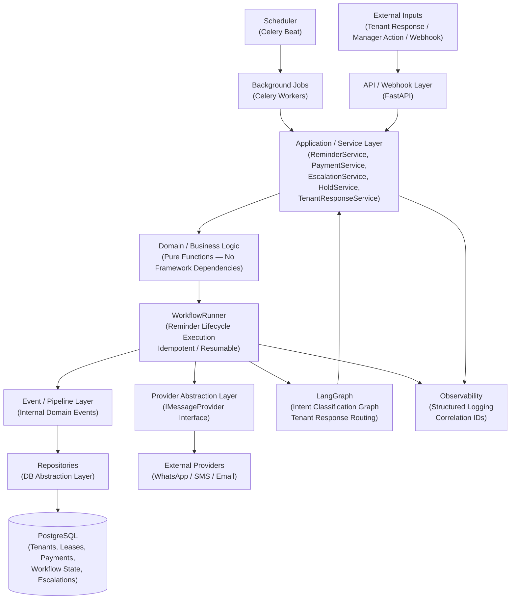

# Target Backend Architecture — Rent Reminder Workflow

> **Document Path:** `docs/SDD/02_Target_Backend_Architecture.md`
> **Version:** 1.0
> **Status:** Active
> **Related Documents:** [00_SDD_Master.md](./00_SDD_Master.md) | [01_Current_System_Architecture.md](./01_Current_System_Architecture.md)

---

## 1. Document Purpose

This document defines the **target backend architecture** for the Rent Reminder Workflow system — the architecture the system should reach after all planned stabilization, wiring, and hardening work is complete.

**Why this document exists:**
The current backend (documented in [01_Current_System_Architecture.md](./01_Current_System_Architecture.md)) has gaps, inconsistencies, and unverified areas that prevent safe production operation. This document defines what the backend *should* look like: clean layer boundaries, reliable workflow execution, provider abstraction, and safe human escalation — without inventing unnecessary complexity.

**Relationship to 00_SDD_Master.md:**
The master SDD defines the system goals, principles, and the complete SDD map. This document is the detailed specification that fulfills the target architecture described there.

**Relationship to 01_Current_System_Architecture.md:**
The current architecture document captures what exists now. This document defines where the system must arrive. The gap between the two drives the implementation phases.

**How to use this document:**
Implementation should move toward this architecture incrementally through the six defined phases ([Phase 1–6](./phases/)). No single phase is expected to deliver all of this at once. This document is the destination, not the day-one deliverable.

> ⚠️ **Note:** Because the repository could not be fully verified at authoring time, sections marked *"Not verified from repository"* must be confirmed against the actual codebase before implementation begins. See [01_Current_System_Architecture.md](./01_Current_System_Architecture.md) for current-state details.

---

## 2. Target Architecture Goals

### 2.1 Reliability
The system must reliably dispatch reminders, track payment state, and execute workflow steps — even under partial failures. Retries, idempotency keys, and dead-letter handling prevent data loss or duplicate actions.

### 2.2 Maintainability
Every component has a single, clearly bounded responsibility. A developer or AI coding agent unfamiliar with the codebase should be able to identify which layer, service, or module owns a given concern without ambiguity.

### 2.3 Testability
All layers are independently testable. External dependencies (database, providers, LangGraph) are injectable or mockable. No test requires a live provider connection to verify business logic.

### 2.4 Idempotency
Reminder dispatch, workflow state transitions, and event processing must be idempotent. Retrying a job or re-delivering a webhook must not produce duplicate reminders or corrupt workflow state.

### 2.5 Clean Layer Boundaries
The API layer contains no business logic. The service layer contains no SQL. The domain layer contains no provider SDK imports. Each layer depends only on abstractions from the layer below it.

### 2.6 Provider Abstraction
All external communication (WhatsApp, SMS, Email) is accessed through a provider abstraction layer. The business logic and workflow engine never depend on a specific provider SDK. Providers are swappable via configuration.

### 2.7 Reliable Workflow Execution
The WorkflowRunner executes reminder lifecycle steps deterministically. Workflow state is persisted in the database at every transition. A crashed process can resume from the last known state without duplicating actions.

### 2.8 Explicit Workflow State
Workflow state is never inferred from side effects. Current reminder stage, payment status, hold status, and escalation status are always explicitly stored in the database and readable at any time.

### 2.9 Safe Human Escalation
Escalation events reach property managers reliably. Manual holds are honored immediately and atomically. No automated workflow step may override a manager-set hold.

### 2.10 Observability
Every workflow step, state transition, reminder dispatch, provider call, and error produces a structured log entry with a correlation ID that allows full trace reconstruction. Failures are surfaced — not silently swallowed.

### 2.11 Background Scheduling
Celery-based background jobs trigger reminder events on the correct cadence without business logic duplication. The scheduler delegates to the service/workflow layer — it does not implement business rules itself.

### 2.12 LangGraph Where Genuinely Needed
LangGraph is used only for agentic, intent-driven behavior (tenant response classification and routing). It is not used for simple CRUD operations, scheduled jobs, or deterministic workflow steps that do not require graph-based reasoning.

### 2.13 AI-Agent-Friendly Architecture
The codebase and SDD structure are designed to be safely navigated by AI coding agents. Clear SDD ownership boundaries, explicit naming conventions, and no implicit state prevent agents from making destructive assumptions.

---

## 3. Current → Target Transition

> **Important:** Current State entries below are drawn from [01_Current_System_Architecture.md](./01_Current_System_Architecture.md). Items marked *"Not verified from repository"* must be confirmed before implementation.

| Area | Current State | Target State | Main Change |
|---|---|---|---|
| **Database** | Not verified from repository | Unified PostgreSQL schema: `tenants`, `leases`, `payments`, `workflow_runs`, `workflow_steps`, `escalations`, `manual_holds` with correct FK relationships and indexes | Define and migrate to unified schema via Phase 2 |
| **API** | Not verified from repository | FastAPI REST API with versioned routes (`/api/v1/`), Pydantic input validation, standardized error responses, webhook ingestion endpoints | Build clean API layer in Phase 4 |
| **Services** | Not verified from repository | Separated service classes: `ReminderService`, `PaymentService`, `EscalationService`, `TenantResponseService`, `HoldService` — each with a single bounded responsibility | Refactor/create service layer in Phase 3–4 |
| **Business Logic** | Not verified from repository | Pure domain functions with no framework, provider, or DB dependencies — expressing reminder eligibility, escalation criteria, payment state transitions | Extract and isolate domain logic in Phase 1–2 |
| **Event Pipeline** | Not verified from repository | Internal event bus routing domain events (`RentDueEvent`, `PaymentReceivedEvent`, `EscalationTriggeredEvent`) to registered handlers asynchronously | Implement event pipeline in Phase 5 |
| **WorkflowRunner** | Not verified from repository | Persistent WorkflowRunner executing reminder lifecycle steps with DB-backed state, idempotency keys, and resumable execution | Build WorkflowRunner in Phase 3–5 |
| **LangGraph** | Not verified from repository | LangGraph graph invoked only for tenant response intent classification; result feeds back into WorkflowRunner routing | Scope and integrate LangGraph in Phase 3 |
| **Providers** | Not verified from repository | Provider abstraction layer with `IMessageProvider` interface; concrete adapters for WhatsApp/SMS/Email injected via config | Build provider abstraction in Phase 5 |
| **Scheduling** | Not verified from repository | Celery beat scheduler with periodic tasks checking lease/payment state and dispatching reminder events; no business logic in task bodies | Implement scheduling in Phase 5 |
| **Error Handling** | Not verified from repository | Centralized error handler, retry with exponential backoff, dead-letter queue for failed provider calls, structured error responses from API | Implement in Phase 6 |
| **Logging** | Not verified from repository | Structured JSON logging across all layers with `workflow_run_id` correlation, log level configuration, and sink routing | Implement in Phase 6 |
| **Testing** | Not verified from repository | Unit tests per service and domain function; integration tests per workflow path; provider mocks in test fixtures; CI enforcement | Build test suite progressively Phase 1–6 |

---

## 4. Target High-Level Architecture



**Flow Explanation:**

| Step | Description |
|---|---|
| Scheduler triggers | Celery Beat fires periodic tasks to check lease/payment state |
| Background job delegates | Celery worker calls the service layer — no business logic in job body |
| External input arrives | Tenant response or manager action hits the FastAPI webhook/API endpoint |
| API validates and routes | FastAPI validates input via Pydantic, routes to appropriate service |
| Service orchestrates | Service layer enforces business rules and coordinates domain + workflow |
| Domain evaluates | Pure domain functions determine eligibility, transitions, criteria |
| WorkflowRunner executes | Reminder lifecycle steps are executed with persisted state transitions |
| Events dispatched | Domain events route through the pipeline to registered handlers |
| Repository persists | All state changes written atomically via repository layer |
| Provider dispatches | Reminder/escalation message dispatched through abstracted provider |
| LangGraph classifies | Tenant response intent classified; result returned to service layer |
| Observability records | Every significant step emits a structured log with correlation ID |

---

## 5. Architectural Layer Specifications

### 5.1 API / Webhook Layer

**Technology:** FastAPI

**Responsibilities:**
- Expose REST endpoints under `/api/v1/`
- Validate all inputs via Pydantic schemas
- Return standardized error responses (`4xx`, `5xx`)
- Ingest external webhooks (provider delivery receipts, tenant responses)
- Authenticate requests (API key or JWT — see [10_Security_And_Error_Handling.md](./10_Security_And_Error_Handling.md))
- Route to the appropriate service — no business logic here

**Must NOT:**
- Contain business logic
- Access the database directly
- Import provider SDKs
- Know about LangGraph

**Key Endpoints (Target):**

| Method | Path | Purpose |
|---|---|---|
| `POST` | `/api/v1/webhooks/provider` | Ingest provider delivery receipts / tenant replies |
| `POST` | `/api/v1/reminders/trigger` | Manually trigger reminder evaluation (admin/test) |
| `POST` | `/api/v1/holds` | Enable manual hold for a lease |
| `DELETE` | `/api/v1/holds/{lease_id}` | Release manual hold |
| `GET` | `/api/v1/workflow/{run_id}/status` | Get current workflow run status |
| `POST` | `/api/v1/escalations/{lease_id}/resolve` | Mark escalation resolved by manager |

> Detailed API contracts in [04_API_And_Service_Layer.md](./04_API_And_Service_Layer.md)

---

### 5.2 Application / Service Layer

**Responsibilities:**
- Orchestrate business operations across domain + repositories + workflow
- Enforce business rules that span multiple domain concerns
- Coordinate between WorkflowRunner, LangGraph, and Providers
- Serve as the single entry point for all application use cases

**Target Service Classes:**

| Service | Responsibility |
|---|---|
| `ReminderService` | Evaluate reminder eligibility, trigger WorkflowRunner steps |
| `PaymentService` | Update and query payment state, trigger workflow termination on payment |
| `EscalationService` | Trigger and record manager escalation, send escalation notifications |
| `HoldService` | Enable/disable manual holds, enforce hold state across workflow |
| `TenantResponseService` | Receive parsed tenant reply, invoke LangGraph, route result |

**Must NOT:**
- Contain SQL queries (use repositories)
- Import provider SDKs directly (use provider abstraction)
- Execute HTTP calls to LangGraph API (use LangGraph adapter)

> Detailed service contracts in [04_API_And_Service_Layer.md](./04_API_And_Service_Layer.md)

---

### 5.3 Domain / Business Logic

**Responsibilities:**
- Express pure business rules with zero external dependencies
- Determine: is a reminder due? Is escalation criteria met? Is rent overdue?
- Define reminder stage transitions
- Define escalation criteria
- Define payment state machine

**Must NOT:**
- Import FastAPI, SQLAlchemy, Celery, or any provider SDK
- Access the database
- Have side effects

**Target Domain Concepts:**

| Concept | Description |
|---|---|
| `ReminderEligibility` | Given lease + payment state, determine if a reminder should be sent |
| `ReminderStage` | Enum: `NONE`, `NORMAL`, `URGENT`, `ESCALATED`, `STOPPED` |
| `PaymentState` | Enum: `PENDING`, `PAID`, `OVERDUE` |
| `EscalationCriteria` | Pure function: given days overdue + payment state, return bool |
| `HoldState` | Whether a manual hold is active for a given lease |

> Business rules inform WorkflowRunner step logic — detailed in [06_WorkflowRunner_Architecture.md](./06_WorkflowRunner_Architecture.md)

---

### 5.4 WorkflowRunner

**Responsibilities:**
- Execute the reminder lifecycle step-by-step
- Persist workflow state at every transition
- Support resumption from the last persisted step after failure
- Enforce idempotency via run/step IDs
- Coordinate provider dispatch, LangGraph invocation, and event emission

**Target Workflow State Machine:**

```
INITIALIZED
    ↓
REMINDER_NORMAL_SENT       (~Day 30)
    ↓
AWAITING_PAYMENT
    ↓
 ┌──────────────────────────────────────┐
 │                                      │
PAID → WORKFLOW_STOPPED           REMINDER_URGENT_SENT   (~Day 35)
                                        ↓
                                  AWAITING_PAYMENT
                                        ↓
                                 ┌──────────────────────┐
                                 │                      │
                              PAID →             ESCALATED        (Day 36+)
                           WORKFLOW_STOPPED             ↓
                                              MANAGER_NOTIFIED
                                                        ↓
                                              HOLD / RESOLVED
```

**Idempotency:** Each workflow run has a `run_id`. Each step has a `step_id`. Re-executing a step with the same `step_id` is a no-op.

> Detailed WorkflowRunner design in [06_WorkflowRunner_Architecture.md](./06_WorkflowRunner_Architecture.md)

---

### 5.5 Event / Pipeline Layer

**Responsibilities:**
- Decouple workflow steps from downstream effects via internal domain events
- Route events to registered handlers without tight coupling
- Allow multiple handlers to respond to a single domain event

**Target Domain Events:**

| Event | Trigger | Handlers |
|---|---|---|
| `RentDueEvent` | Scheduler / WorkflowRunner | `ReminderService.evaluate` |
| `ReminderSentEvent` | WorkflowRunner | Logging handler, state update handler |
| `PaymentReceivedEvent` | PaymentService | WorkflowRunner termination handler |
| `EscalationTriggeredEvent` | WorkflowRunner | EscalationService, notification handler |
| `HoldActivatedEvent` | HoldService | WorkflowRunner pause handler |
| `TenantResponseReceivedEvent` | API webhook | TenantResponseService |

> Detailed pipeline design in [05_Event_And_Pipeline_Architecture.md](./05_Event_And_Pipeline_Architecture.md)

---

### 5.6 Repository / Data Access Layer

**Responsibilities:**
- Abstract all database access behind interface contracts
- Expose domain-oriented query methods (not raw SQL from service layer)
- Own all SQLAlchemy models and query logic

**Target Repositories:**

| Repository | Owns |
|---|---|
| `TenantRepository` | Tenant records |
| `LeaseRepository` | Lease records, due date queries |
| `PaymentRepository` | Payment records, payment state queries |
| `WorkflowRunRepository` | Workflow run records, step state |
| `EscalationRepository` | Escalation records |
| `HoldRepository` | Manual hold records |

> Detailed schema and repository design in [03_Database_Wiring.md](./03_Database_Wiring.md)

---

### 5.7 Database Layer

**Technology:** PostgreSQL

**Target Schema (Conceptual):**

| Table | Purpose |
|---|---|
| `tenants` | Tenant identity and contact information |
| `leases` | Lease records with due dates, linked to tenant + property |
| `payments` | Payment records and current payment state per lease |
| `workflow_runs` | One per reminder cycle per lease — tracks overall run state |
| `workflow_steps` | Individual step execution records with idempotency keys |
| `escalations` | Escalation records with manager contact and resolution state |
| `manual_holds` | Hold records with enabled/disabled state and timestamps |

> Detailed schema in [03_Database_Wiring.md](./03_Database_Wiring.md)

---

### 5.8 Provider / Integration Layer

**Responsibilities:**
- Abstract all external communication behind `IMessageProvider`
- Implement concrete adapters per provider (WhatsApp, SMS, Email)
- Handle provider-specific authentication, retry, and error translation
- Never expose provider SDK types to the business logic layer

**Target Interface (Conceptual):**

```python
class IMessageProvider(Protocol):
    async def send_message(
        self,
        recipient: str,
        message: str,
        metadata: dict
    ) -> MessageResult: ...
```

**Target Adapters:**

| Adapter | Provider |
|---|---|
| `WhatsAppAdapter` | WhatsApp Business API |
| `SMSAdapter` | Configured SMS provider |
| `EmailAdapter` | Configured email provider |

> Detailed provider design in [08_Integration_And_Provider_Layer.md](./08_Integration_And_Provider_Layer.md)

---

### 5.9 Background Jobs / Scheduling

**Technology:** Celery + Celery Beat

**Responsibilities:**
- Trigger lease/payment state evaluation on a defined cadence
- Dispatch jobs to Celery workers — no business logic in task bodies
- Support retry configuration per task type
- Dead-letter failed tasks for inspection

**Target Tasks:**

| Task | Trigger | Delegates To |
|---|---|---|
| `evaluate_due_reminders` | Celery Beat (daily) | `ReminderService.evaluate_all_due` |
| `process_escalation_check` | Celery Beat (daily) | `EscalationService.evaluate_pending` |
| `send_reminder_message` | WorkflowRunner | `ProviderLayer.send_message` |
| `notify_manager_escalation` | EscalationService | `ProviderLayer.send_message` |

> Detailed scheduling design in [09_Background_Jobs_And_Scheduling.md](./09_Background_Jobs_And_Scheduling.md)

---

### 5.10 LangGraph Integration

**Scope:** LangGraph is used **only** for tenant response intent classification and routing.

It is **not** used for:
- Scheduled reminder dispatch
- Payment state evaluation
- Escalation decisions (those are deterministic rules)
- Database reads/writes

**Target LangGraph Flow:**

```
Tenant Response Received
        ↓
[Node: Parse Response]
        ↓
[Node: Classify Intent]
  (PAID / DISPUTING / REQUESTING_EXTENSION / UNRELATED)
        ↓
[Node: Route]
        ↓
Return intent + routing decision to TenantResponseService
        ↓
TenantResponseService acts on result
```

**Integration Boundary:**
The WorkflowRunner/Service Layer calls a `LangGraphAdapter` — a thin wrapper that invokes the graph and returns a typed result. LangGraph internals do not leak into the service layer.

> Detailed LangGraph design in [07_LangGraph_Integration.md](./07_LangGraph_Integration.md)

---

### 5.11 Observability / Logging

**Responsibilities:**
- Emit structured JSON logs at every significant step
- Attach `workflow_run_id` as a correlation ID to all log entries within a run
- Log: workflow step entry/exit, provider call result, payment state change, escalation trigger, error with stack trace
- Surface errors without swallowing them

**Target Log Entry Shape (Conceptual):**

```json
{
  "timestamp": "ISO8601",
  "level": "INFO | WARNING | ERROR",
  "workflow_run_id": "uuid",
  "lease_id": "uuid",
  "event": "reminder_sent | payment_received | escalation_triggered | ...",
  "detail": "...",
  "error": null
}
```

> Detailed observability design in [11_Observability_And_Logging.md](./11_Observability_And_Logging.md)

---

## 6. Dependency Direction

Dependencies flow **strictly downward**. No lower layer imports from an upper layer.

```
API Layer (FastAPI routes)
    ↓
Service Layer (Application use cases)
    ↓
Domain Layer (Pure business rules)
    ↓
WorkflowRunner (Lifecycle execution)
    ↓
Repository Layer (DB abstraction)
    ↓
Infrastructure (PostgreSQL, Celery, Redis)

Provider Layer ← injected into Service Layer via IMessageProvider
LangGraph      ← invoked by WorkflowRunner/Service via LangGraphAdapter
Observability  ← called from any layer (write-only, no business logic coupling)
```

**Enforcement Rules:**
- The Domain Layer has zero imports from FastAPI, SQLAlchemy, Celery, or provider SDKs.
- The Service Layer calls `IMessageProvider` — never `WhatsAppClient` or any concrete SDK directly.
- The API Layer calls service methods — never repository methods or domain functions directly.
- Background job task bodies call service methods — no SQL, no provider SDK, no workflow logic.

---

## 7. Architectural Boundaries Summary

| Boundary | Rule |
|---|---|
| API ↔ Service | API passes validated Pydantic models; receives typed response objects |
| Service ↔ Domain | Service calls pure domain functions; domain returns typed results |
| Service ↔ Repository | Service calls repository interface methods; never writes raw SQL |
| Service ↔ Provider | Service calls `IMessageProvider`; never calls provider SDK directly |
| WorkflowRunner ↔ LangGraph | WorkflowRunner calls `LangGraphAdapter`; never imports graph internals |
| Scheduler ↔ Service | Celery task calls service method; task body contains zero business logic |
| Repository ↔ Database | Repository owns all SQLAlchemy models; database schema defined in migrations |

---

## 8. Non-Functional Requirements

| Requirement | Target |
|---|---|
| **Reminder dispatch latency** | Within the scheduled job window (daily cadence) |
| **Workflow state durability** | All state persisted in PostgreSQL — survives process restart |
| **Provider failure resilience** | Celery retry with exponential backoff; dead-letter on exhaustion |
| **Idempotency** | Re-running any workflow step with same IDs is a safe no-op |
| **Test coverage** | Unit tests for all service + domain logic; integration tests for workflow paths |
| **Log retention** | All workflow events logged with correlation ID; retention policy TBD per deployment |

---

## 9. What This Architecture Deliberately Excludes

| Excluded | Reason |
|---|---|
| Real-time websocket layer | Not required for reminder workflow |
| GraphQL API | REST is sufficient; GraphQL adds unnecessary complexity |
| Microservices / separate deployable services | Monolith is appropriate for current scale |
| LangGraph for deterministic steps | LangGraph scope is strictly limited to intent classification |
| Frontend / dashboard | Separate concern — out of backend scope |
| Payment gateway integration | Payment state is updated via webhook/API — no direct gateway integration in this backend |

---

## 10. Open Questions / Unverified Areas

> ⚠️ The following must be confirmed from the actual repository before Phase 1 begins.

| Question | Area | Priority |
|---|---|---|
| What tables currently exist in the database? | Database | High |
| Are there existing service classes — what are they named? | Services | High |
| Is there an existing WorkflowRunner or equivalent? | Workflow | High |
| What providers are currently integrated (if any)? | Providers | High |
| Is Celery currently configured? Any existing tasks? | Scheduling | High |
| Is LangGraph currently integrated? What graph exists? | LangGraph | Medium |
| What test framework is used? What tests exist? | Testing | Medium |
| What logging library is currently used? | Observability | Medium |

> Answers should be documented in [01_Current_System_Architecture.md](./01_Current_System_Architecture.md) before Phase 2 implementation begins.

---

## 11. Relationship to Implementation Phases

| Phase | What It Delivers Toward This Architecture |
|---|---|
| [Phase 1 — Stabilization](./phases/Phase_1_Stabilization.md) | Audits current code, resolves inconsistencies, establishes verified baseline |
| [Phase 2 — Database Unification](./phases/Phase_2_Database_Unification.md) | Delivers the unified PostgreSQL schema defined in Section 5.7 |
| [Phase 3 — Live Data Wiring](./phases/Phase_3_Live_Data_Wiring.md) | Wires live DB state into WorkflowRunner; integrates LangGraph |
| [Phase 4 — API Layer](./phases/Phase_4_API_Layer.md) | Delivers the clean FastAPI layer defined in Section 5.1 |
| [Phase 5 — Scheduling and Alerting](./phases/Phase_5_Scheduling_And_Alerting.md) | Delivers Celery scheduling and provider abstraction defined in Sections 5.8–5.9 |
| [Phase 6 — Hardening](./phases/Phase_6_Hardening.md) | Delivers error handling, structured logging, and full test coverage from Sections 5.11, 8 |

---

*This document defines the destination. Implementation moves toward it through the six phases. Do not implement beyond the current phase's scope without updating the relevant SDD documents first.*