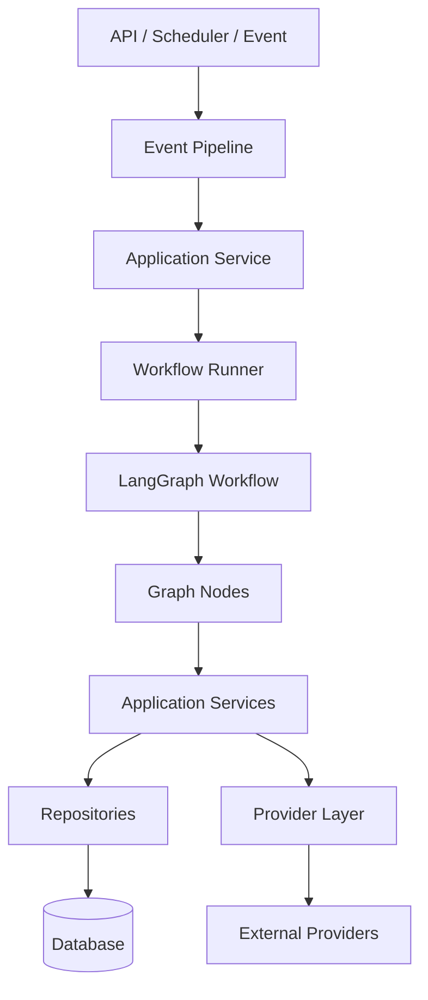
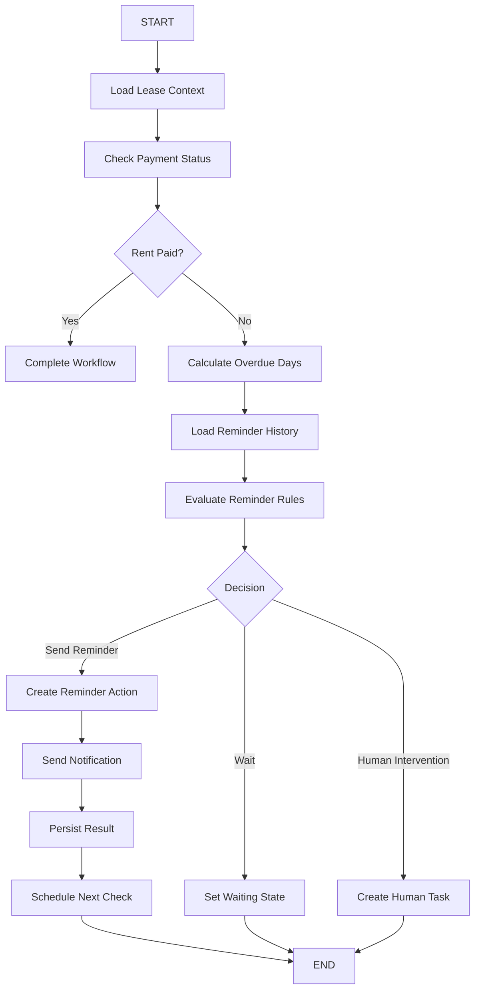
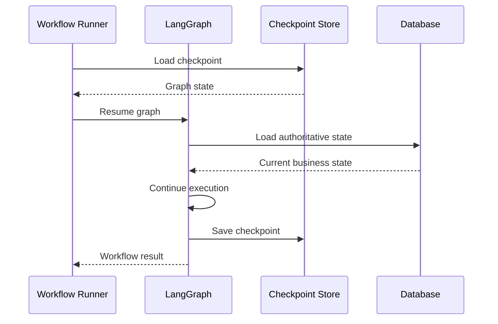
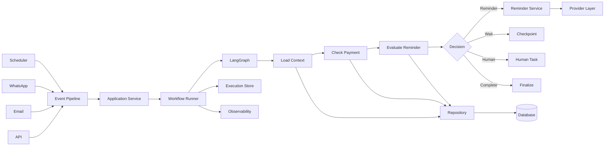

````markdown
# 07 — LangGraph Integration

## 1. Document Purpose

This document defines how LangGraph integrates with the Rent Reminder Workflow backend.

The purpose is to establish a clear boundary between:

- Event processing.
- Application services.
- Workflow execution.
- LangGraph orchestration.
- Business logic.
- Database access.
- External providers.

LangGraph should be used where stateful, multi-step, conditional, or agentic workflow orchestration provides value.

It should not become the entire backend architecture.

The core principle is:

> LangGraph is a workflow/orchestration component inside the application architecture, not the replacement for the API layer, database layer, event pipeline, or provider layer.

---

# 2. Architectural Goal

The target architecture should look like:

```text
API / Scheduler / Event
        ↓
Event Pipeline
        ↓
Application Service
        ↓
Workflow Runner
        ↓
LangGraph Workflow
        ↓
Workflow Nodes
        ↓
Services / Repositories / Tools
        ↓
Database / Providers
````

LangGraph should operate inside a controlled execution boundary managed by the Workflow Runner.

---

# 3. Why LangGraph Is Used

LangGraph is useful when the workflow requires:

* Multiple sequential steps.
* Conditional branching.
* Persistent state.
* Repeated evaluation.
* Tool usage.
* Human-in-the-loop.
* Recovery after interruption.
* Complex decision logic.
* Stateful agent behavior.

For simple CRUD operations, LangGraph should not be used unnecessarily.

Example:

```text
Create Tenant
    ↓
Database Insert
```

does not require LangGraph.

But:

```text
Check Rent Status
    ↓
Evaluate Reminder Rules
    ↓
Check Reminder History
    ↓
Decide Action
    ↓
Send Notification
    ↓
Wait
    ↓
Re-evaluate Later
```

may benefit from LangGraph.

---

# 4. LangGraph's Position

LangGraph belongs below the Workflow Runner.



The Workflow Runner controls execution.

LangGraph controls graph-based workflow progression.

---

# 5. Responsibility Boundaries

## Event Pipeline

Responsible for:

* Receiving events.
* Normalization.
* Validation.
* Routing.
* Idempotency.

## Application Service

Responsible for:

* Translating application requests into workflow executions.
* Coordinating domain services.

## Workflow Runner

Responsible for:

* Execution lifecycle.
* Workflow state.
* Retry.
* Resume.
* Pause.
* Execution locking.
* Workflow versioning.

## LangGraph

Responsible for:

* Graph execution.
* State transitions.
* Conditional routing.
* Node orchestration.
* Tool calls.
* Human-in-the-loop where required.

## Services

Responsible for:

* Business operations.
* Domain logic.
* External actions.

## Repositories

Responsible for:

* Database access.

## Provider Layer

Responsible for:

* WhatsApp.
* Email.
* SMS.
* Other external integrations.

---

# 6. LangGraph Should Not Own

LangGraph should not directly own:

* HTTP server lifecycle.
* API authentication.
* Database connection management.
* Raw SQL throughout nodes.
* Provider-specific webhook parsing.
* Global scheduling.
* Application configuration.
* Secrets management.
* Event ingestion.
* Global retry infrastructure.

These responsibilities belong to other architectural layers.

---

# 7. LangGraph State

Each graph should define an explicit state model.

Example:

```python
class RentReminderState(TypedDict):
    execution_id: str
    tenant_id: str
    property_id: str
    lease_id: str

    billing_period: str

    rent_status: str
    days_overdue: int

    reminder_count: int
    last_reminder_sent_at: str | None

    payment_received: bool
    reminder_required: bool

    human_intervention_required: bool

    next_action: str | None
```

The exact state schema should be implemented according to the actual application.

---

# 8. State Design Principles

LangGraph state should contain:

* Workflow execution information.
* Required identifiers.
* Intermediate decision state.
* Minimal information required by nodes.
* Explicit workflow decisions.

State should not unnecessarily contain:

* Large database records.
* Secrets.
* Full provider payloads.
* Redundant business data.
* Data that can easily be retrieved from the database.

The database remains authoritative.

---

# 9. State vs Database

A critical distinction must be maintained.

```text
LangGraph State
    ↓
Temporary / Workflow Execution State

Database
    ↓
Authoritative Business State
```

Example:

```text
LangGraph:
days_overdue = 5

Database:
rent_payment_status = unpaid
```

The LangGraph state is an execution snapshot.

The database is the source of truth.

---

# 10. Graph Structure

A typical LangGraph workflow should follow:

```text
START
  ↓
Load Context
  ↓
Check Payment
  ↓
Evaluate Reminder
  ↓
Decision
  ├── Paid → Complete
  ├── Reminder Required → Send Reminder
  ├── Wait → Schedule / Pause
  └── Human Required → Human Review
```

---

# 11. Rent Reminder Graph

Conceptual graph:



---

# 12. Graph Nodes

Nodes should have focused responsibilities.

Example structure:

```text
nodes/
├── load_context.py
├── check_payment.py
├── reminder_evaluation.py
├── reminder_action.py
├── notification.py
├── human_intervention.py
└── finalize.py
```

Each node should ideally perform one meaningful operation.

Avoid creating one giant node containing the entire workflow.

---

# 13. Node Responsibilities

## Load Context

Responsibilities:

* Validate identifiers.
* Load required business state.
* Populate graph state.

---

## Check Payment

Responsibilities:

* Query authoritative payment state.
* Determine whether rent has been paid.
* Update graph state.

---

## Reminder Evaluation

Responsibilities:

* Evaluate reminder rules.
* Check previous reminders.
* Determine whether a reminder is required.

---

## Reminder Action

Responsibilities:

* Create an idempotent reminder action.
* Prepare notification request.

---

## Notification

Responsibilities:

* Call the provider abstraction.
* Record delivery result.
* Update workflow state.

---

## Human Intervention

Responsibilities:

* Create human intervention task.
* Persist waiting state.
* Stop active execution.

---

## Finalize

Responsibilities:

* Determine final workflow status.
* Persist final state.
* Emit appropriate event if required.

---

# 14. Node Design Rules

Nodes should:

1. Have a single responsibility.
2. Accept explicit state.
3. Return explicit state updates.
4. Avoid hidden global state.
5. Avoid direct provider implementation details.
6. Avoid raw SQL where repository services exist.
7. Be independently testable.
8. Be safe to retry where possible.
9. Produce meaningful logs.
10. Preserve correlation information.

---

# 15. Services Inside Nodes

Nodes should call application/domain services rather than implementing infrastructure logic.

Preferred:

```text
LangGraph Node
      ↓
Application Service
      ↓
Repository
      ↓
Database
```

Avoid:

```text
LangGraph Node
      ↓
Raw SQL
```

and:

```text
LangGraph Node
      ↓
Direct HTTP request to WhatsApp API
```

---

# 16. Tool Usage

If LangGraph tools are required, tools should expose controlled application capabilities.

Example:

```text
get_lease()
get_payment_status()
get_reminder_history()
create_reminder()
send_notification()
create_human_task()
```

Tools should not expose unrestricted database access.

---

# 17. Tool Boundary

Preferred:

```text
LangGraph
   ↓
Tool
   ↓
Application Service
   ↓
Repository
   ↓
Database
```

Avoid:

```text
LangGraph
   ↓
Direct Database
```

This maintains architectural boundaries.

---

# 18. Deterministic vs Agentic Nodes

Not every node needs an LLM.

This is an important design rule.

## Deterministic Node

Use normal code when rules are deterministic.

Example:

```python
if days_overdue >= 5:
    reminder_required = True
```

## LLM Node

Use an LLM only when interpretation or reasoning is actually required.

Examples:

* Understanding tenant free-text.
* Classifying tenant intent.
* Summarizing a conversation.
* Extracting structured information.
* Deciding among ambiguous natural-language requests.

The rent reminder workflow should prefer deterministic rules for financial/business decisions.

---

# 19. LLM Usage Policy

LLMs should not independently decide critical financial state.

For example, an LLM should not determine:

```text
"Tenant probably paid rent."
```

Instead:

```text
Database
    ↓
Payment Status
    ↓
Deterministic Rule
    ↓
Workflow Decision
```

LLMs may assist with interpretation but authoritative financial decisions should come from structured application data and deterministic rules.

---

# 20. LangGraph and Workflow Runner

The Workflow Runner should treat LangGraph as an execution engine.

Conceptually:

```python
execution = workflow_runner.start(
    workflow_id="rent_reminder",
    context=context
)

result = langgraph_workflow.invoke(
    state
)
```

The actual implementation should be adapted to the project framework.

---

# 21. Execution Ownership

The Workflow Runner should own:

```text
execution_id
workflow_id
workflow_version
execution_status
retry_count
correlation_id
trigger_event_id
```

LangGraph should own:

```text
graph state
current graph position
node transitions
workflow-specific intermediate state
```

---

# 22. Checkpointing

Long-running workflows require state persistence.

LangGraph checkpointing may be used to persist graph state.

Conceptually:

```text
Graph Execution
      ↓
Checkpoint
      ↓
Worker Stops
      ↓
Resume
      ↓
Load Checkpoint
      ↓
Continue Graph
```

Checkpoint storage should be durable.

---

# 23. Checkpoint Identity

Checkpoint identity should be tied to workflow execution.

Example:

```text
execution_id = wf-exec-123
```

The graph checkpoint should be associated with that execution.

This prevents different workflow executions from sharing state accidentally.

---

# 24. Resume Flow



---

# 25. Human-in-the-Loop with LangGraph

LangGraph may pause execution when human input is required.

Example:

```text
Workflow
   ↓
Tenant Dispute Detected
   ↓
Human Review Node
   ↓
INTERRUPT / WAIT
   ↓
Human Decision
   ↓
Resume Graph
```

The human interaction should be persisted outside the in-memory process.

---

# 26. Human Intervention Architecture

```text
LangGraph
    ↓
Human Intervention Required
    ↓
Workflow Runner
    ↓
Persist WAITING_HUMAN
    ↓
Create Human Task
    ↓
Worker Released
```

Later:

```text
Human Decision
    ↓
Application Service
    ↓
Workflow Runner
    ↓
Resume LangGraph
```

---

# 27. LangGraph and Events

LangGraph should not directly consume arbitrary external webhooks.

Preferred:

```text
Webhook
   ↓
Event Ingestion
   ↓
Normalization
   ↓
Validation
   ↓
Event Router
   ↓
Application Service
   ↓
Workflow Runner
   ↓
LangGraph
```

This preserves a consistent entry path.

---

# 28. LangGraph and Scheduler

Scheduler should trigger the Workflow Runner.

Preferred:

```text
Scheduler
   ↓
rent.reminder.check.requested
   ↓
Workflow Runner
   ↓
LangGraph
```

Avoid:

```text
Scheduler
   ↓
Direct LangGraph Invocation
```

unless there is a clear architectural reason.

---

# 29. LangGraph and Provider Layer

LangGraph should never hard-code provider implementation details.

Preferred:

```text
LangGraph Node
      ↓
Notification Service
      ↓
Provider Interface
      ↓
WhatsApp / Email / SMS Provider
```

This allows providers to be replaced without rewriting graph logic.

---

# 30. Error Handling

LangGraph errors should be classified.

## Retryable

Examples:

* Temporary provider failure.
* Temporary database failure.
* Network timeout.

## Non-Retryable

Examples:

* Invalid workflow state.
* Missing required entity.
* Invalid configuration.

## Business Stop

Examples:

* Rent paid.
* Lease ended.
* Workflow cancelled.

---

# 31. Node Retry Safety

A node may be executed more than once.

Therefore nodes should be designed with retry safety.

Example:

```text
send_reminder()
```

must not blindly send the same reminder every time the node executes.

Use:

```text
execution_id
+
action_id
+
idempotency_key
```

to prevent duplicate actions.

---

# 32. External Side Effects

External side effects are the most dangerous part of workflow retries.

Examples:

* Sending WhatsApp message.
* Sending email.
* Creating maintenance ticket.
* Updating external CRM.

Preferred pattern:

```text
Graph
 ↓
Create Action Intent
 ↓
Persist
 ↓
Execute Action
 ↓
Persist Result
```

The exact implementation may use an outbox or action table.

---

# 33. Transaction Boundary

Do not keep a database transaction open while waiting for an LLM or external provider.

Avoid:

```text
BEGIN TRANSACTION
   ↓
LLM Call
   ↓
Provider Call
   ↓
COMMIT
```

Prefer:

```text
Transaction
   ↓
Persist Required State
   ↓
Commit
   ↓
External Call
   ↓
Persist Result
```

---

# 34. Database Access

LangGraph nodes should access business data through repositories/services.

Example:

```text
check_payment.py
       ↓
PaymentService
       ↓
PaymentRepository
       ↓
Database
```

This makes the node easier to test and prevents database logic from spreading across the graph.

---

# 35. Graph Compilation

The graph should be constructed in a dedicated module.

Conceptual structure:

```text
langgraph/
├── graph.py
├── state.py
├── nodes/
│   ├── load_context.py
│   ├── check_payment.py
│   ├── evaluate_reminder.py
│   ├── send_reminder.py
│   └── finalize.py
└── routing/
    └── conditions.py
```

The graph construction should not be mixed with API endpoint code.

---

# 36. Graph Definition

Conceptually:

```python
graph = StateGraph(RentReminderState)

graph.add_node("load_context", load_context)
graph.add_node("check_payment", check_payment)
graph.add_node("evaluate_reminder", evaluate_reminder)
graph.add_node("send_reminder", send_reminder)
graph.add_node("finalize", finalize)

graph.add_edge("START", "load_context")
graph.add_edge("load_context", "check_payment")

graph.add_conditional_edges(
    "check_payment",
    route_after_payment_check
)

graph.add_edge("send_reminder", "finalize")
```

The exact LangGraph API should follow the installed project version.

---

# 37. Conditional Routing

Conditional edges should represent business decisions.

Example:

```text
Check Payment
      ↓
      ├── Paid → Complete
      └── Unpaid → Evaluate Reminder
```

Routing conditions should be explicit and testable.

Avoid embedding complex business logic directly inside routing functions.

---

# 38. Graph Configuration

Graph configuration should be injected through controlled configuration.

Possible configuration:

```text
workflow_version
provider settings
timeouts
retry policy
feature flags
environment
```

Secrets must come from secure configuration mechanisms.

Do not hard-code API keys in graph code.

---

# 39. Dependency Injection

Nodes should receive required dependencies through controlled mechanisms.

Example:

```text
Node
 ↓
PaymentService
 ↓
PaymentRepository
```

This allows tests to provide mocks/fakes without changing workflow logic.

---

# 40. LangGraph Configuration by Environment

Different environments may use different providers/configuration.

```text
Development
    ↓
Mock Provider

Testing
    ↓
Fake Provider

Production
    ↓
Real Provider
```

The graph itself should remain mostly environment-independent.

---

# 41. LangGraph and Memory

Memory should be divided into:

## Workflow State

Temporary state required by the current workflow.

## Database State

Authoritative business information.

## Conversation State

Relevant conversational context where required.

Do not create an uncontrolled global memory store.

---

# 42. Conversation Workflows

If LangGraph is later used for tenant conversations, the architecture should be:

```text
Tenant Message
      ↓
Event Pipeline
      ↓
Conversation Service
      ↓
Workflow Runner
      ↓
LangGraph Conversation Workflow
      ↓
Tools / Services
      ↓
Provider
```

Conversation memory should remain scoped to the correct tenant/conversation.

---

# 43. Security

LangGraph workflows must:

* Never expose secrets to prompts unnecessarily.
* Validate tool inputs.
* Restrict database capabilities.
* Restrict provider capabilities.
* Prevent unauthorized tenant access.
* Avoid logging sensitive prompts/responses unnecessarily.
* Apply access control before executing privileged actions.

---

# 44. Prompt Management

If LLM nodes are used, prompts should be treated as application assets.

Recommended structure:

```text
langgraph/
├── prompts/
│   ├── tenant_intent.txt
│   ├── message_summary.txt
│   └── information_extraction.txt
```

Prompts should be version-controlled.

Critical prompts should be tested.

---

# 45. Structured LLM Output

When an LLM is used for structured decisions, use validated structured output.

Example:

```json
{
  "intent": "payment_dispute",
  "confidence": 0.92,
  "requires_human": true
}
```

The application should validate the result before acting on it.

Never assume an LLM response is valid simply because it is syntactically JSON.

---

# 46. LLM Guardrails

LLM outputs should not directly execute privileged operations.

Preferred:

```text
LLM
 ↓
Structured Output
 ↓
Validation
 ↓
Business Rules
 ↓
Allowed Action
```

Avoid:

```text
LLM
 ↓
Direct Provider API
```

---

# 47. Deterministic Rent Reminder Logic

The Rent Reminder Workflow should primarily use deterministic logic.

Example:

```text
Database
   ↓
Rent Payment Status
   ↓
Reminder History
   ↓
Due Date
   ↓
Deterministic Rules
   ↓
Reminder Decision
```

An LLM is not required for the core rent calculation.

This improves:

* Reliability.
* Predictability.
* Auditability.
* Cost.
* Testing.

---

# 48. Where LangGraph Adds Value

LangGraph becomes particularly useful when workflows become more complex.

Examples:

```text
Tenant Message
    ↓
Classify Intent
    ↓
Retrieve Context
    ↓
Determine Required Workflow
    ↓
Call Tools
    ↓
Human Review if Needed
    ↓
Respond
```

or:

```text
Maintenance Request
    ↓
Extract Issue
    ↓
Classify Severity
    ↓
Check Property Rules
    ↓
Create Ticket
    ↓
Notify Tenant
    ↓
Wait for Update
```

---

# 49. Workflow State Persistence

State should be persisted at meaningful checkpoints.

Potential checkpoint moments:

* After important business decisions.
* Before waiting.
* Before human intervention.
* After external side effects.
* After successful completion.

Do not checkpoint every trivial operation unless required.

---

# 50. Graph Recovery

If the worker crashes:

```text
Worker Crash
    ↓
Execution State Exists
    ↓
Checkpoint Exists
    ↓
Workflow Runner Resumes
    ↓
LangGraph Restores State
    ↓
Continue Execution
```

Recovery must be designed so that external side effects are not duplicated.

---

# 51. LangGraph Observability

Each graph execution should expose:

```text
workflow_id
execution_id
graph_version
node_name
node_start_time
node_end_time
correlation_id
event_id
status
error
```

Useful metrics:

```text
graph_execution_total
graph_execution_failed_total
graph_node_duration
graph_node_error_total
graph_resume_total
graph_interrupt_total
llm_call_total
llm_call_duration
llm_token_usage
```

---

# 52. LLM Cost Tracking

If LLM nodes are used, track:

* Model.
* Request count.
* Input tokens.
* Output tokens.
* Estimated cost.
* Latency.
* Failure rate.

This should be observable without exposing sensitive prompt content.

---

# 53. LLM Latency

LLM calls can be slow compared to deterministic functions.

Therefore:

* Avoid unnecessary LLM calls.
* Keep prompts focused.
* Use smaller models where appropriate.
* Cache where safe.
* Use asynchronous execution where needed.
* Do not hold database transactions open during LLM calls.

---

# 54. Testing Strategy

## Unit Tests

Test individual nodes.

Example:

```text
check_payment()
evaluate_reminder()
route_after_payment()
```

## Graph Tests

Test complete graph paths.

Examples:

```text
Paid → Complete

Unpaid + Reminder Required
→ Send Reminder

Unpaid + Not Due
→ Wait

Dispute
→ Human Intervention
```

## Integration Tests

Test:

```text
Graph
 ↓
Services
 ↓
Repositories
 ↓
Database
```

## LLM Tests

If LLM nodes exist:

* Validate structured output.
* Test malformed output.
* Test unexpected output.
* Test prompt regressions.
* Test safety/authorization boundaries.

---

# 55. Mocking LLM Providers

Tests should not depend on real LLM APIs unless specifically testing integration.

Preferred:

```text
Test
 ↓
Mock LLM
 ↓
Deterministic Response
```

This provides:

* Faster tests.
* Lower cost.
* Stable results.

---

# 56. LangGraph and Event Replay

Events may be replayed to reproduce workflow behavior.

Example:

```text
Stored Event
    ↓
Event Replay
    ↓
Workflow Runner
    ↓
LangGraph
    ↓
Reproduce Execution
```

Replay must respect idempotency and must not accidentally send duplicate external messages.

A replay mode may therefore need to disable external side effects or use simulated providers.

---

# 57. LangGraph and Workflow Versioning

Graph versions should correspond to workflow versions where behavior changes.

Example:

```text
rent_reminder:v1
rent_reminder:v2
```

Existing executions should continue with their assigned compatible version.

New executions may use the latest version.

---

# 58. Example Full Architecture



---

# 59. Example Rent Reminder Execution

```text
Scheduler
    ↓
rent.reminder.check.requested
    ↓
Event Pipeline
    ↓
Application Service
    ↓
Workflow Runner
    ↓
Rent Reminder LangGraph
    ↓
Load Lease
    ↓
Check Payment
    ↓
Payment Status = Unpaid
    ↓
Load Reminder History
    ↓
Evaluate Rules
    ↓
Reminder Required
    ↓
Create Idempotent Action
    ↓
Notification Service
    ↓
Provider
    ↓
Persist Result
    ↓
Schedule Next Check
    ↓
Checkpoint
```

---

# 60. Anti-Patterns

The following patterns should be avoided.

## Giant Graph Node

```text
one node
   ↓
500 lines of business logic
```

Prefer smaller nodes/services.

---

## Direct Database Access Everywhere

```text
Node
 ↓
Raw SQL
```

Prefer repositories/services.

---

## Direct Provider Calls

```text
Node
 ↓
WhatsApp API
```

Prefer provider abstraction.

---

## LLM for Deterministic Rules

```text
LLM
 ↓
"Did the tenant pay?"
```

Use database state.

---

## Uncontrolled Agent Behavior

The LLM should not be allowed to decide arbitrary actions without validation.

---

## In-Memory Workflow State Only

Do not rely exclusively on Python process memory for long-running workflows.

---

## Database Transaction Around LLM Call

Avoid holding database transactions while waiting for LLM responses.

---

# 61. Recommended Project Structure

A conceptual structure:

```text
app/
│
├── workflows/
│   ├── runner.py
│   ├── registry.py
│   ├── context.py
│   ├── execution.py
│   │
│   ├── rent_reminder/
│   │   ├── graph.py
│   │   ├── state.py
│   │   ├── nodes/
│   │   │   ├── load_context.py
│   │   │   ├── check_payment.py
│   │   │   ├── evaluate_reminder.py
│   │   │   ├── send_reminder.py
│   │   │   └── finalize.py
│   │   ├── routing.py
│   │   └── prompts/
│   │
│   └── tenant_support/
│       ├── graph.py
│       ├── state.py
│       └── nodes/
│
├── services/
├── repositories/
├── providers/
└── events/
```

The actual folder names should follow the existing project structure established by the other SDD documents.

---

# 62. Implementation Phases

## Phase 1 — Stabilization

First inspect:

* Existing LangGraph implementation.
* Existing nodes.
* Existing state.
* Existing tools.
* Existing graph construction.
* Existing workflow entry points.

Do not immediately rewrite existing code.

---

## Phase 2 — Database Unification

Ensure LangGraph nodes use the unified database/repository architecture.

Goals:

* Remove duplicate database access.
* Centralize repository logic.
* Ensure authoritative business state comes from the database.

---

## Phase 3 — Live Data Wiring

Connect:

```text
LangGraph
 ↓
Services
 ↓
Repositories
 ↓
Real Database
```

and:

```text
LangGraph
 ↓
Provider Service
 ↓
Real Provider
```

---

## Phase 4 — API Integration

Connect workflow execution to API endpoints through the Workflow Runner.

Do not expose LangGraph internals directly through API endpoints.

---

## Phase 5 — Scheduling and Alerting

Connect scheduled events to the Workflow Runner and LangGraph workflows.

Add:

* Persistent checkpoints.
* Resume.
* Retry.
* Timeout monitoring.
* Human intervention alerts.

---

## Phase 6 — Hardening

Add:

* Strong idempotency.
* Concurrency protection.
* Graph versioning.
* Structured LLM outputs.
* Prompt versioning.
* LLM observability.
* Cost tracking.
* Replay support.
* Comprehensive tests.

---

# 63. Architecture Rules

The LangGraph integration must follow these rules:

1. LangGraph is an orchestration component, not the entire backend.
2. Workflow execution is controlled by the Workflow Runner.
3. Business state remains authoritative in the database.
4. Nodes should use services/repositories instead of raw infrastructure access.
5. Providers must remain behind provider abstractions.
6. External events must enter through the event pipeline.
7. Scheduler triggers should pass through the Workflow Runner.
8. Every workflow execution must be traceable.
9. Graph state must be persistable for long-running workflows.
10. Nodes must be designed for retry safety.
11. External side effects must be idempotent.
12. LLMs should only be used where they provide meaningful value.
13. Deterministic financial/business rules should remain deterministic.
14. LLM outputs must be validated before action.
15. LLMs must not directly execute privileged operations.
16. Secrets must never be hard-coded into graph code.
17. Workflow versions must be tracked.
18. Human-in-the-loop states must be persistent.
19. Database transactions must not remain open during long external calls.
20. LangGraph state must not replace authoritative database state.

---

# 64. Current vs Target LangGraph Architecture

| Area              | Current State     | Target State                   |
| ----------------- | ----------------- | ------------------------------ |
| Graph execution   | Verify repository | Workflow Runner controlled     |
| State             | Verify repository | Explicit typed state           |
| Nodes             | Verify repository | Small focused nodes            |
| Database          | Verify repository | Repository/service abstraction |
| Providers         | Verify repository | Provider layer                 |
| Checkpointing     | Verify repository | Durable checkpointing          |
| Resume            | Verify repository | Persistent resume              |
| Idempotency       | Verify repository | Execution + action idempotency |
| LLM usage         | Verify repository | Only where useful              |
| Structured output | Verify repository | Validated schema               |
| Human loop        | Verify repository | Persistent interruption        |
| Observability     | Verify repository | Node + workflow tracing        |
| Versioning        | Verify repository | Versioned graphs               |

---

# 65. Final Architecture Principle

The final architecture should follow:

```text
                    EXTERNAL INPUT
                         │
                         ▼
                ┌──────────────────┐
                │  Event Pipeline  │
                └────────┬─────────┘
                         │
                         ▼
                ┌──────────────────┐
                │ Application Layer│
                └────────┬─────────┘
                         │
                         ▼
                ┌──────────────────┐
                │ Workflow Runner  │
                └────────┬─────────┘
                         │
                         ▼
                ┌──────────────────┐
                │    LangGraph     │
                └────────┬─────────┘
                         │
             ┌───────────┼───────────┐
             ▼           ▼           ▼
          Nodes       Services      Tools
             │           │           │
             └───────────┼───────────┘
                         ▼
                ┌──────────────────┐
                │   Repositories   │
                └────────┬─────────┘
                         │
                         ▼
                    DATABASE

                         +

                ┌──────────────────┐
                │  Provider Layer  │
                └────────┬─────────┘
                         │
                         ▼
                 External Providers
```

The fundamental principle is:

> **LangGraph should orchestrate complex stateful workflow logic, while the Workflow Runner controls execution, services control business operations, repositories control database access, and providers control external integrations.**

This separation keeps the Rent Reminder backend maintainable, testable, reliable, and extensible as additional workflows are introduced.

---

# 66. Document Status

**Document:** `07_LangGraph_Integration.md`

**Architecture Type:** LangGraph Integration Architecture

**Primary Purpose:** Define how LangGraph is integrated into the backend without violating the boundaries of the event, application, workflow, database, and provider layers.

**Related Documents:**

* `00_SDD_Master.md`
* `01_Current_System_Architecture.md`
* `02_Target_Backend_Architecture.md`
* `03_Database_Wiring.md`
* `04_API_And_Service_Layer.md`
* `05_Event_And_Pipeline_Architecture.md`
* `06_WorkflowRunner_Architecture.md`
* `08_Integration_And_Provider_Layer.md`
* `09_Background_Jobs_And_Scheduling.md`
* `10_Security_And_Error_Handling.md`
* `11_Observability_And_Logging.md`
* `12_Backend_Testing_Strategy.md`

**Status:** Architecture Definition

```
```
