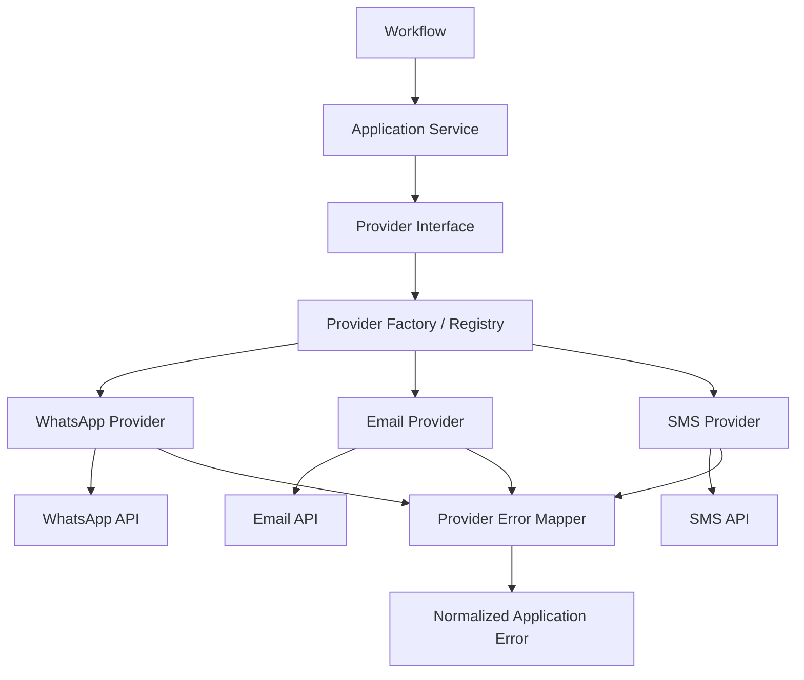
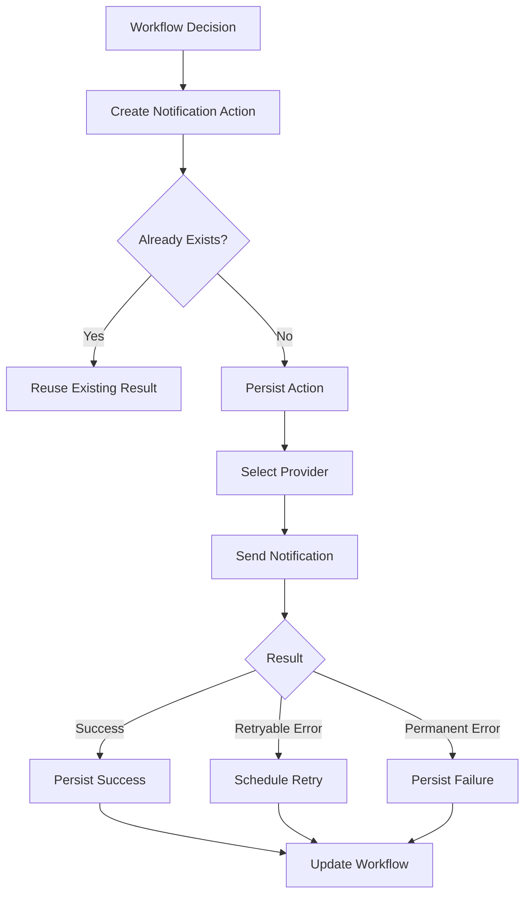
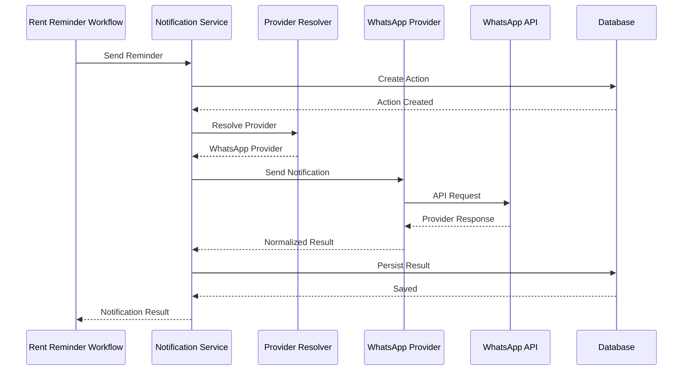
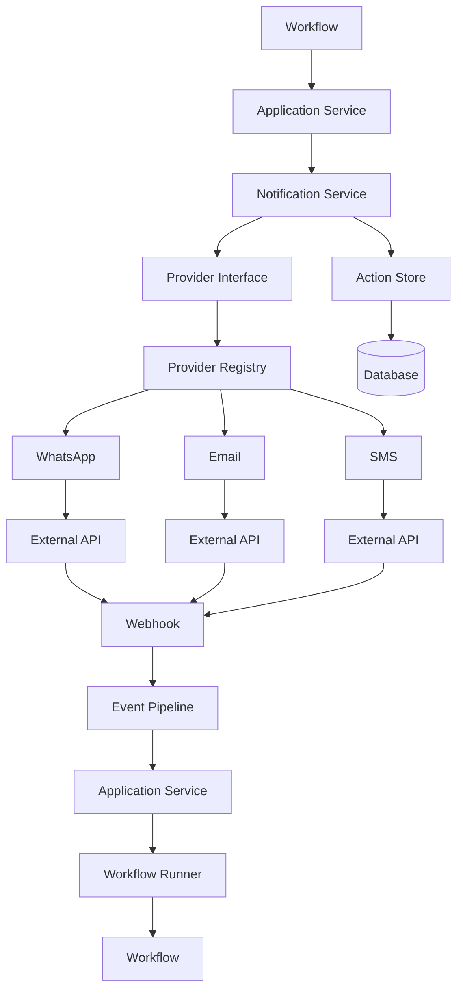

````markdown
# 08 — Integration And Provider Layer

## 1. Document Purpose

This document defines the architecture for external integrations and provider abstractions in the Rent Reminder Workflow backend.

The Provider Layer is responsible for communicating with external systems while keeping the rest of the application independent from provider-specific implementations.

The architecture must support multiple communication channels and external services without requiring workflow logic to change when a provider changes.

The primary goals are:

- Provider abstraction.
- Loose coupling.
- Replaceability.
- Testability.
- Retry safety.
- Idempotency.
- Centralized provider configuration.
- Consistent error handling.
- Observability.
- Secure credential management.

The core principle is:

> Business workflows should depend on application-level capabilities, not directly on external provider APIs.

---

# 2. Architectural Goal

The target architecture is:

```text
Workflow
    ↓
Application Service
    ↓
Provider Interface
    ↓
Provider Implementation
    ↓
External API
````

Example:

```text
Rent Reminder Workflow
        ↓
Notification Service
        ↓
Notification Provider Interface
        ↓
WhatsApp Provider
        ↓
WhatsApp API
```

The workflow should not know how the external provider works internally.

---

# 3. Why a Provider Layer Is Required

Without a Provider Layer, workflow code may become tightly coupled to external APIs.

Example of bad architecture:

```text
Rent Reminder
    ↓
Direct WhatsApp API
    ↓
Direct Email API
    ↓
Direct SMS API
```

This creates problems:

* Difficult provider replacement.
* Difficult testing.
* Provider-specific logic inside business workflows.
* Repeated authentication logic.
* Repeated retry logic.
* Difficult error handling.
* Increased maintenance cost.

Preferred:

```text
Rent Reminder
    ↓
Notification Service
    ↓
Provider Interface
    ↓
Selected Provider
```

---

# 4. Provider Layer Responsibilities

The Provider Layer is responsible for:

* External API communication.
* Authentication with external services.
* Request construction.
* Provider-specific payload formatting.
* Provider response normalization.
* Provider-specific error mapping.
* Provider timeout handling.
* Provider retry configuration.
* Provider request logging.
* Provider response metadata.
* Provider health checks.
* Provider-specific rate-limit handling.

The Provider Layer should not contain:

* Tenant business rules.
* Rent reminder rules.
* Workflow routing.
* Workflow state management.
* API endpoint logic.
* Database business logic.

---

# 5. Integration Categories

The system may integrate with several external categories.

```text
Communication Providers
    ├── WhatsApp
    ├── Email
    └── SMS

AI Providers
    ├── LLM
    ├── Embedding
    └── Speech

Property / Business Systems
    ├── Property Management APIs
    ├── CRM
    └── Accounting Systems

Infrastructure
    ├── Queue
    ├── Object Storage
    └── Monitoring
```

Only integrations actually required by the project should be implemented.

---

# 6. Provider Architecture



---

# 7. Provider Interface

Every provider category should expose an application-level interface.

Example:

```python
class NotificationProvider(Protocol):

    async def send(
        self,
        message: NotificationMessage,
        idempotency_key: str,
    ) -> NotificationResult:
        ...
```

The workflow should depend on:

```text
NotificationProvider
```

not:

```text
WhatsAppProvider
```

This makes provider replacement easier.

---

# 8. Provider Implementation

Concrete providers implement the interface.

Example:

```text
NotificationProvider
        │
        ├── WhatsAppProvider
        ├── EmailProvider
        └── SMSProvider
```

Each provider handles its own API-specific behavior.

---

# 9. Provider Registry

A Provider Registry maps provider names to implementations.

Example:

```text
whatsapp
    ↓
WhatsAppProvider

email
    ↓
EmailProvider

sms
    ↓
SMSProvider
```

The application can select a provider through configuration rather than hard-coded imports.

---

# 10. Provider Selection

Provider selection should happen outside the workflow's business logic.

Preferred:

```text
Workflow
    ↓
Notification Service
    ↓
Provider Resolver
    ↓
Configured Provider
```

Example configuration:

```json
{
  "notification": {
    "default_provider": "whatsapp"
  }
}
```

The exact configuration mechanism should follow the project's configuration architecture.

---

# 11. Provider Factory

A Provider Factory may be used to construct providers.

Conceptually:

```python
provider = provider_factory.get(
    provider_type="notification",
    provider_name="whatsapp"
)
```

The factory should:

* Validate provider configuration.
* Return the correct implementation.
* Avoid leaking provider internals.
* Reuse initialized clients where appropriate.

---

# 12. Provider Client Lifecycle

External SDK/API clients should not be recreated unnecessarily for every request.

Preferred:

```text
Application Startup
      ↓
Initialize Provider Client
      ↓
Reuse Client
      ↓
Shutdown
      ↓
Close Client
```

For asynchronous clients, connections should be managed according to the SDK's lifecycle requirements.

---

# 13. Notification Architecture

Rent reminders primarily require notification capabilities.

The notification architecture should be:

```text
Rent Reminder Workflow
        ↓
Notification Service
        ↓
Notification Provider Interface
        ↓
WhatsApp / Email / SMS
```

The workflow should only specify the intended notification.

Example:

```json
{
  "recipient": "tenant@example.com",
  "channel": "email",
  "template": "rent_reminder",
  "variables": {
    "tenant_name": "Tenant",
    "amount": 1200,
    "due_date": "2026-08-01"
  }
}
```

---

# 14. Notification Message Model

A normalized message model should be used.

Conceptual structure:

```python
class NotificationMessage:
    channel: str
    recipient: str
    template_id: str
    variables: dict
    metadata: dict
```

This prevents provider-specific payloads from leaking into workflow logic.

---

# 15. Provider-Specific Payload Conversion

Each provider converts the normalized message into its own format.

```text
Normalized Message
        ↓
WhatsApp Adapter
        ↓
WhatsApp Payload
```

or:

```text
Normalized Message
        ↓
Email Adapter
        ↓
Email Payload
```

The conversion belongs inside the provider implementation.

---

# 16. Provider Response Normalization

External providers may return completely different response structures.

Example:

```text
WhatsApp:
message_id

Email:
provider_message_id

SMS:
sid
```

The application should normalize these into:

```python
class NotificationResult:
    success: bool
    provider_message_id: str | None
    status: str
    provider: str
    metadata: dict
```

---

# 17. Provider Error Normalization

Provider-specific errors should not propagate directly into business logic.

Example:

```text
WhatsApp API Error
        ↓
WhatsApp Error Mapper
        ↓
ProviderTimeoutError
```

or:

```text
Email API 429
        ↓
RateLimitError
```

The application works with normalized errors.

---

# 18. Error Categories

Recommended provider-level error categories:

```text
ProviderAuthenticationError
ProviderAuthorizationError
ProviderValidationError
ProviderRateLimitError
ProviderTimeoutError
ProviderUnavailableError
ProviderTemporaryError
ProviderPermanentError
ProviderUnknownError
```

The exact exception hierarchy can be adapted to the project.

---

# 19. Retryable Provider Errors

Typical retryable conditions:

* Network timeout.
* Temporary provider outage.
* HTTP 429 rate limit.
* Temporary 5xx errors.
* Connection reset.

Typical non-retryable conditions:

* Invalid recipient.
* Invalid credentials.
* Invalid request.
* Unsupported operation.
* Permanently rejected message.

Provider implementations should expose enough normalized information for the Workflow Runner to determine retry behavior.

---

# 20. Provider Retry Policy

Retry policy should be controlled centrally where possible.

Example:

```text
Attempt 1
    ↓
Provider Timeout
    ↓
Wait 30 seconds

Attempt 2
    ↓
Provider Timeout
    ↓
Wait 2 minutes

Attempt 3
    ↓
Success
```

The provider should identify the error.

The Workflow Runner / job system should control the broader workflow retry lifecycle.

---

# 21. Exponential Backoff

Recommended retry behavior:

```text
delay = base_delay × exponential_factor
```

Example:

```text
30 seconds
1 minute
2 minutes
4 minutes
```

The exact values should be configurable.

Jitter should be considered to prevent many workers retrying simultaneously.

---

# 22. Rate Limiting

External providers may impose rate limits.

The provider layer should expose rate-limit information when available.

Example:

```text
Provider
   ↓
429 Too Many Requests
   ↓
Retry-After
   ↓
Normalized RateLimitError
   ↓
Scheduler / Retry Manager
```

Do not blindly retry immediately after a rate-limit response.

---

# 23. Provider Timeouts

Every external API request should have a timeout.

Avoid:

```python
await provider.send(...)
```

without a controlled timeout.

Conceptually:

```python
await provider.send(
    message,
    timeout=provider_timeout
)
```

The exact implementation depends on the HTTP client/SDK.

---

# 24. Circuit Breaker

For high-volume production integrations, a circuit breaker may be introduced.

Conceptually:

```text
Provider
   ↓
Repeated Failures
   ↓
Circuit Opens
   ↓
Requests Temporarily Blocked
   ↓
Recovery Test
   ↓
Circuit Closes
```

This should be introduced only when operational requirements justify it.

---

# 25. Idempotency

External actions must be idempotent whenever possible.

Example:

```text
execution_id:
wf-exec-123

action_id:
action-456

idempotency_key:
rent-reminder:lease-123:2026-08
```

If a worker retries the same action:

```text
Same Idempotency Key
        ↓
Provider / Action Store
        ↓
Existing Result
        ↓
Do Not Duplicate Action
```

---

# 26. Provider Idempotency vs Application Idempotency

These are different layers.

## Application Idempotency

The application ensures the same action is not created multiple times.

## Provider Idempotency

The external provider ensures repeated requests with the same idempotency key do not create duplicate external actions.

Both should be used where supported.

---

# 27. Action Persistence

For critical notifications, an action record should be persisted.

Conceptual structure:

```text
notification_action
-------------------
action_id
execution_id
channel
provider
recipient
template_id
idempotency_key
status
provider_message_id
attempt_count
created_at
completed_at
error_code
```

The exact schema belongs in:

`03_Database_Wiring.md`

---

# 28. Notification Lifecycle



---

# 29. Provider Security

Provider credentials must:

* Never be hard-coded.
* Never be committed to Git.
* Never be logged.
* Be loaded through secure configuration.
* Be rotated when required.
* Use minimum required permissions.

Examples:

```text
WHATSAPP_API_KEY
EMAIL_API_KEY
SMS_API_KEY
```

The actual secret names should follow the project's environment configuration.

---

# 30. Secrets Management

Development may use:

```text
.env
```

Production should use an appropriate secret-management mechanism.

The application should access secrets through configuration.

Example:

```python
settings.whatsapp_api_key
```

Provider implementations should not independently read arbitrary environment variables throughout the codebase.

---

# 31. Provider Configuration

Provider configuration should be centralized.

Example:

```yaml
providers:
  notification:
    default: whatsapp

  whatsapp:
    enabled: true
    timeout_seconds: 10

  email:
    enabled: true
    timeout_seconds: 10

  sms:
    enabled: false
```

Exact configuration format depends on the application.

---

# 32. Environment Configuration

Recommended separation:

```text
Development
    ↓
Mock / Sandbox Providers

Testing
    ↓
Fake Providers

Staging
    ↓
Sandbox / Test Providers

Production
    ↓
Real Providers
```

The same application-level interfaces should be used in every environment.

---

# 33. Mock Providers

For local development and tests, mock providers should be available.

Example:

```text
NotificationProvider
      ↓
MockNotificationProvider
```

The mock should record:

* Recipient.
* Message.
* Template.
* Idempotency key.
* Invocation count.

This makes automated testing easier.

---

# 34. Fake Provider Example

A fake provider may return:

```json
{
  "success": true,
  "provider_message_id": "fake-msg-123",
  "status": "sent",
  "provider": "fake"
}
```

No external network request should be required.

---

# 35. Provider Health Checks

Where supported, provider health should be observable.

Possible health statuses:

```text
HEALTHY
DEGRADED
UNAVAILABLE
UNKNOWN
```

Health checks should not unnecessarily send real tenant messages.

Use provider-specific lightweight health endpoints or safe test operations where available.

---

# 36. Provider Observability

Each provider call should produce structured telemetry.

Recommended fields:

```text
provider
operation
request_id
execution_id
action_id
correlation_id
duration_ms
status
error_code
retry_attempt
```

Avoid logging sensitive payloads.

---

# 37. Provider Metrics

Useful metrics:

```text
provider_requests_total
provider_success_total
provider_failure_total
provider_timeout_total
provider_rate_limit_total
provider_request_duration
provider_retry_total
provider_circuit_open_total
```

Metrics should be labeled carefully to prevent excessive cardinality.

---

# 38. Provider Logging

Example:

```text
INFO
provider=whatsapp
operation=send_message
action_id=action-123
execution_id=wf-exec-123
status=success
duration_ms=450
```

Do not log:

```text
api_key
authorization_header
full_sensitive_message
password
private_token
```

---

# 39. Provider Tracing

Provider requests should be associated with the workflow trace.

Example:

```text
Workflow Execution
      ↓
Notification Service
      ↓
Provider Call
```

All layers should share the same correlation/trace context where supported.

---

# 40. Provider Abstraction Example

Preferred:

```python
class NotificationService:

    def __init__(self, provider: NotificationProvider):
        self.provider = provider

    async def send(self, message, idempotency_key):
        return await self.provider.send(
            message,
            idempotency_key=idempotency_key
        )
```

Workflow:

```python
result = await notification_service.send(
    message,
    idempotency_key=action.idempotency_key
)
```

The workflow does not need to know whether the provider is WhatsApp, email, or SMS.

---

# 41. Multi-Provider Fallback

Provider fallback may be supported when business requirements justify it.

Example:

```text
Primary:
WhatsApp

        ↓ failure

Fallback:
SMS

        ↓ failure

Fallback:
Email
```

However, fallback must be carefully designed to avoid duplicate notifications.

For example, a timeout does not necessarily mean the first provider did not send the message.

Therefore fallback should consider:

* Provider response.
* Action state.
* Idempotency.
* Delivery status.
* Business rules.

---

# 42. Channel Selection

Channel selection should be determined by application/business configuration.

Example:

```text
Tenant Preferences
      ↓
Available Channels
      ↓
Notification Policy
      ↓
Selected Channel
      ↓
Provider
```

The provider layer should execute the selected channel, not decide business policy.

---

# 43. Notification Templates

Templates should be separated from provider code.

Example:

```text
templates/
├── rent_reminder/
│   ├── email.html
│   ├── whatsapp.txt
│   └── sms.txt
```

The notification service can resolve the appropriate template.

Provider implementation should receive already prepared normalized content.

---

# 44. Template Variables

Example:

```json
{
  "tenant_name": "John",
  "property_name": "Apartment 4B",
  "rent_amount": 1500,
  "due_date": "2026-08-01"
}
```

Templates should validate required variables before provider execution.

---

# 45. Provider Localization

If multilingual notifications are required:

```text
Tenant Preference
      ↓
Language
      ↓
Template Resolver
      ↓
Localized Message
      ↓
Provider
```

The provider should not decide the tenant's language.

---

# 46. Provider Webhooks

Some providers send asynchronous events.

Examples:

```text
Message Delivered
Message Failed
Message Read
Payment Confirmed
```

These should enter through the Event Pipeline.

Preferred:

```text
Provider Webhook
      ↓
Webhook Endpoint
      ↓
Validation
      ↓
Normalization
      ↓
Event
      ↓
Event Pipeline
      ↓
Application Service
      ↓
Workflow Runner
```

Do not put workflow business logic directly inside the webhook endpoint.

---

# 47. Webhook Verification

Provider webhooks must be verified before processing.

Depending on the provider, verification may include:

* Signature validation.
* Timestamp validation.
* Secret verification.
* Request authentication.
* Replay protection.

Invalid webhooks should be rejected safely.

---

# 48. Webhook Idempotency

Provider webhooks may be delivered more than once.

Example:

```text
Provider
    ↓
message.delivered
    ↓
Webhook

Provider retries
    ↓
message.delivered
    ↓
Webhook
```

The event pipeline should detect duplicate event IDs.

---

# 49. Provider Event Normalization

Provider-specific:

```json
{
  "provider_message_id": "abc123",
  "status": "delivered"
}
```

should become an application event such as:

```json
{
  "event_type": "notification.delivered",
  "action_id": "action-123",
  "provider": "whatsapp"
}
```

This keeps downstream workflows provider-independent.

---

# 50. Provider Adapter Pattern

Each external provider should be treated as an adapter.

```text
Application Interface
        ↓
Adapter
        ↓
External Provider
```

Example:

```text
NotificationProvider
        ↓
WhatsAppAdapter
        ↓
WhatsApp API
```

This isolates external API changes.

---

# 51. SDK Usage

If an external provider offers an official SDK, the SDK may be used inside the provider adapter.

The SDK should not leak into:

* Workflow code.
* Application services.
* Repositories.
* API handlers.

Example:

```text
WhatsApp SDK
     ↓
WhatsAppProvider
     ↓
NotificationProvider
     ↓
NotificationService
```

---

# 52. HTTP Client Standardization

If providers use HTTP APIs, the project should standardize:

* HTTP client.
* Timeout configuration.
* Connection pooling.
* Retry handling.
* Headers.
* Request IDs.
* Error mapping.

Avoid creating a new HTTP client implementation for every provider without a clear reason.

---

# 53. Provider Dependency Injection

Provider implementations should be injectable.

Example:

```text
Application
    ↓
NotificationService
    ↓
NotificationProvider
```

Production:

```text
NotificationProvider
    ↓
WhatsAppProvider
```

Testing:

```text
NotificationProvider
    ↓
MockNotificationProvider
```

---

# 54. Provider Testing

Each provider should have multiple testing levels.

## Unit Tests

Test:

* Payload transformation.
* Response transformation.
* Error mapping.
* Configuration validation.

## Integration Tests

Test:

* Authentication.
* Real API request.
* Provider response.
* Webhook handling.

Integration tests should use sandbox/test environments where available.

---

# 55. Contract Testing

The provider implementation should satisfy the application-level interface.

Example contract:

```text
send()
    ↓
NotificationResult
```

Every provider must return a compatible result.

This prevents one provider from introducing provider-specific assumptions into the application layer.

---

# 56. Provider Failure Scenarios

The system should handle:

```text
Provider timeout
Provider unavailable
Rate limit
Invalid recipient
Authentication failure
Malformed response
Unexpected response
Network failure
Webhook duplication
Webhook delay
Provider outage
```

Each scenario should map to a known application behavior.

---

# 57. Provider Failover Strategy

Failover should not automatically happen for every error.

Example:

```text
Authentication Error
    ↓
Do NOT immediately fallback
    ↓
Configuration problem
```

But:

```text
Temporary Provider Outage
    ↓
Fallback may be considered
```

Business rules should define when fallback is acceptable.

---

# 58. External Integration Boundary

All external integrations should follow:

```text
Internal Application
        │
        ▼
Application Interface
        │
        ▼
Provider Adapter
        │
        ▼
External System
```

No external provider should directly modify internal database state.

External events must return through the event pipeline.

---

# 59. Data Ownership

Provider responses should not become the authoritative source of core business state unless explicitly designed.

Example:

```text
Provider:
"Message delivered"

Database:
notification.status = delivered
```

The application records the provider result.

For rent/payment state:

```text
Payment Provider
      ↓
Verified Event
      ↓
Application Service
      ↓
Database
```

The business state is updated through controlled application logic.

---

# 60. Integration Transaction Boundary

Do not assume an external API call participates in the database transaction.

External systems generally operate outside the local transaction.

Preferred:

```text
Local Transaction
      ↓
Commit Action
      ↓
External Provider
      ↓
Persist Result
```

This must be combined with idempotency and recovery.

---

# 61. Outbox Integration

For critical external actions:

```text
Database Transaction
      ↓
Workflow State
+
Outbox Record
      ↓
Commit
      ↓
Background Worker
      ↓
Provider
      ↓
Persist Result
```

This ensures an intended action is not silently lost.

---

# 62. Inbox Pattern for Provider Events

For inbound provider events:

```text
Webhook
   ↓
Inbox/Event Store
   ↓
Deduplication
   ↓
Normalize
   ↓
Process
```

This can protect against duplicate webhook delivery.

---

# 63. Provider Versioning

External providers may change APIs.

Provider adapters should isolate version-specific code.

Example:

```text
WhatsAppProviderV1
WhatsAppProviderV2
```

The application interface should remain stable whenever possible.

---

# 64. Provider Deprecation

When replacing a provider:

```text
Old Provider
     ↓
Deprecation Period
     ↓
New Provider
     ↓
Migration
     ↓
Remove Old Provider
```

The workflow should not require major changes.

---

# 65. Provider Feature Flags

Feature flags may be used for gradual rollout.

Example:

```text
use_new_notification_provider = true
```

Possible rollout:

```text
10%
 ↓
25%
 ↓
50%
 ↓
100%
```

Feature flags should be controlled through centralized configuration.

---

# 66. Provider Configuration Validation

Application startup should validate required configuration.

Example:

```text
WhatsApp enabled
    ↓
API credentials required
```

If required production configuration is missing, the application should fail fast or mark the integration unavailable according to deployment requirements.

---

# 67. Provider Health and Readiness

Application health endpoints should distinguish:

```text
Application Healthy
Provider Healthy
Provider Degraded
Provider Unavailable
```

A temporary provider outage should not necessarily mean the entire application process is unhealthy.

---

# 68. Provider Security Boundaries

Provider credentials should only be accessible to the provider implementation/configuration layer.

Avoid:

```text
Workflow
   ↓
settings.whatsapp_api_key
```

Prefer:

```text
Workflow
   ↓
NotificationService
   ↓
WhatsAppProvider
   ↓
Provider Configuration
```

---

# 69. Provider Observability Example

A successful request:

```text
provider=whatsapp
operation=send_notification
execution_id=wf-exec-123
action_id=action-123
correlation_id=corr-123
status=success
duration_ms=420
```

A failed request:

```text
provider=whatsapp
operation=send_notification
execution_id=wf-exec-123
action_id=action-123
status=retryable_failure
error_code=TIMEOUT
attempt=2
```

---

# 70. Rent Reminder Integration Flow



---

# 71. Example End-to-End Failure

```text
Rent Reminder
      ↓
Notification Service
      ↓
WhatsApp Provider
      ↓
Timeout
      ↓
ProviderTimeoutError
      ↓
Action remains retryable
      ↓
Workflow Runner / Job Scheduler
      ↓
Retry
```

The workflow should not need to know the low-level HTTP error.

---

# 72. Recommended Project Structure

A conceptual structure:

```text
app/
│
├── providers/
│   ├── base/
│   │   ├── notification.py
│   │   ├── llm.py
│   │   └── storage.py
│   │
│   ├── notification/
│   │   ├── service.py
│   │   ├── registry.py
│   │   ├── models.py
│   │   └── errors.py
│   │
│   ├── whatsapp/
│   │   ├── provider.py
│   │   ├── client.py
│   │   ├── mapper.py
│   │   └── webhook.py
│   │
│   ├── email/
│   │   ├── provider.py
│   │   ├── client.py
│   │   └── mapper.py
│   │
│   └── sms/
│       ├── provider.py
│       ├── client.py
│       └── mapper.py
│
├── services/
├── repositories/
├── workflows/
└── events/
```

The exact structure should be adapted to the existing backend.

---

# 73. Implementation Phases

## Phase 1 — Stabilization

Inspect the existing codebase for:

* Provider integrations.
* External API clients.
* API keys.
* Notification services.
* Webhook handlers.
* Direct provider calls inside workflows.
* Existing retry logic.
* Existing error handling.

Do not rewrite stable integrations unnecessarily.

---

## Phase 2 — Database Unification

Ensure provider actions and results are consistently persisted.

Goals:

* Notification action records.
* Provider message IDs.
* Delivery status.
* Retry metadata.
* Idempotency keys.
* Webhook event records where required.

---

## Phase 3 — Live Data Wiring

Connect the Provider Layer to real:

* Notification services.
* Database.
* Provider credentials.
* External APIs.

---

## Phase 4 — API Layer

Expose provider-related functionality only through application services where necessary.

External provider APIs should never be exposed directly to frontend clients.

---

## Phase 5 — Scheduling and Alerting

Integrate:

* Provider retries.
* Rate-limit handling.
* Failed notification alerts.
* Provider outage alerts.
* Webhook processing.

---

## Phase 6 — Hardening

Add:

* Strong idempotency.
* Provider health checks.
* Circuit breakers where required.
* Provider failover where justified.
* Contract tests.
* Security hardening.
* Observability.
* Provider versioning.

---

# 74. Architecture Rules

The Provider Layer must follow these rules:

1. Workflows must not directly depend on external provider SDKs.
2. External integrations must be isolated behind provider interfaces.
3. Provider-specific payloads must not leak into business logic.
4. Provider responses must be normalized.
5. Provider errors must be normalized.
6. Provider credentials must remain isolated.
7. Provider calls must have controlled timeouts.
8. Retry behavior must distinguish retryable and permanent failures.
9. Critical external actions must be idempotent.
10. Provider webhooks must enter through the event pipeline.
11. Webhooks must support deduplication.
12. External providers must not directly modify the database.
13. Provider implementations must be replaceable.
14. Mock/fake providers must exist for automated testing.
15. Provider calls must be observable.
16. Sensitive provider data must not be logged.
17. Provider configuration must be centralized.
18. Database transactions must not remain open during external API calls.
19. Provider failures must not corrupt workflow state.
20. Business rules must remain outside provider implementations.

---

# 75. Current vs Target Provider Architecture

| Area           | Current State     | Target State                  |
| -------------- | ----------------- | ----------------------------- |
| Provider calls | Verify repository | Provider abstraction          |
| WhatsApp       | Verify repository | WhatsApp adapter              |
| Email          | Verify repository | Email adapter                 |
| SMS            | Verify repository | SMS adapter                   |
| Error handling | Verify repository | Normalized provider errors    |
| Retry          | Verify repository | Central retry strategy        |
| Idempotency    | Verify repository | Action + provider idempotency |
| Webhooks       | Verify repository | Event pipeline integration    |
| Configuration  | Verify repository | Central configuration         |
| Secrets        | Verify repository | Secure secret management      |
| Testing        | Verify repository | Mock/fake providers           |
| Observability  | Verify repository | Provider metrics + tracing    |
| Failover       | Verify repository | Controlled fallback           |
| Versioning     | Verify repository | Adapter isolation             |

---

# 76. Final Integration Architecture



---

# 77. Final Architectural Principle

The final responsibility boundary should be:

```text
Workflow
    ↓
"What action does the business process require?"

Application Service
    ↓
"How should the application perform that action?"

Provider Interface
    ↓
"What capability is required?"

Provider Adapter
    ↓
"How does this external provider implement that capability?"

External API
    ↓
"Execute the external operation."
```

The core principle is:

> **The Provider Layer isolates external systems from the application's business logic, allowing providers to be replaced, tested, monitored, retried, and secured without rewriting workflows.**

---

# 78. Document Status

**Document:** `08_Integration_And_Provider_Layer.md`

**Architecture Type:** Integration and Provider Architecture

**Primary Purpose:** Define how external APIs, communication channels, provider abstractions, webhooks, retries, idempotency, security, and provider observability are implemented within the Rent Reminder backend.

**Related Documents:**

* `00_SDD_Master.md`
* `01_Current_System_Architecture.md`
* `02_Target_Backend_Architecture.md`
* `03_Database_Wiring.md`
* `04_API_And_Service_Layer.md`
* `05_Event_And_Pipeline_Architecture.md`
* `06_WorkflowRunner_Architecture.md`
* `07_LangGraph_Integration.md`
* `09_Background_Jobs_And_Scheduling.md`
* `10_Security_And_Error_Handling.md`
* `11_Observability_And_Logging.md`
* `12_Backend_Testing_Strategy.md`

**Status:** Architecture Definition

```
```
