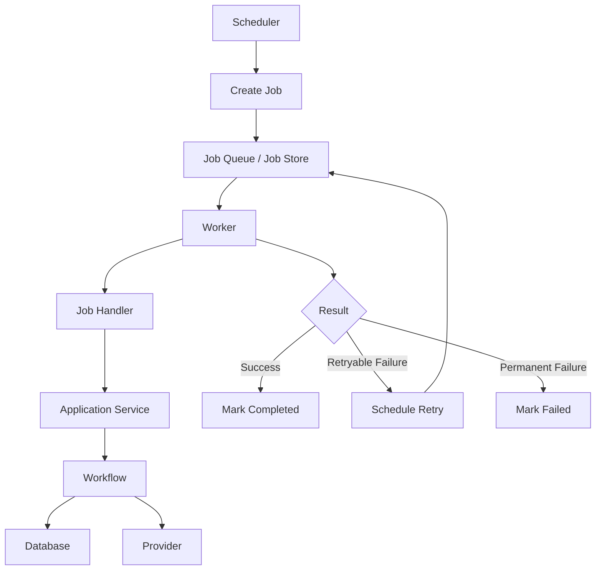
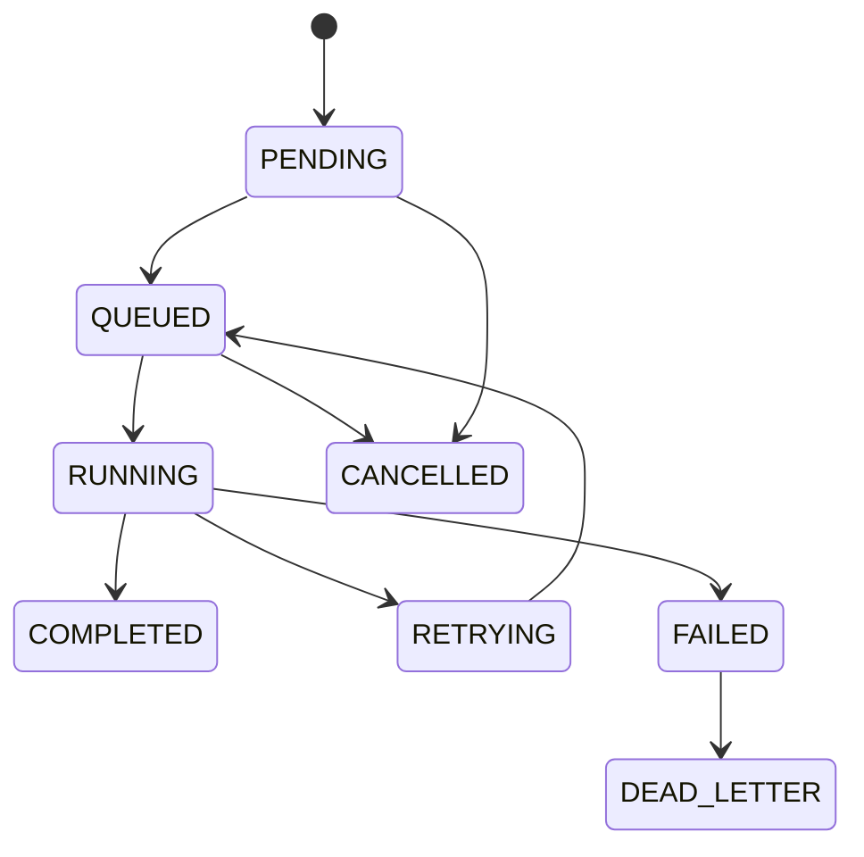
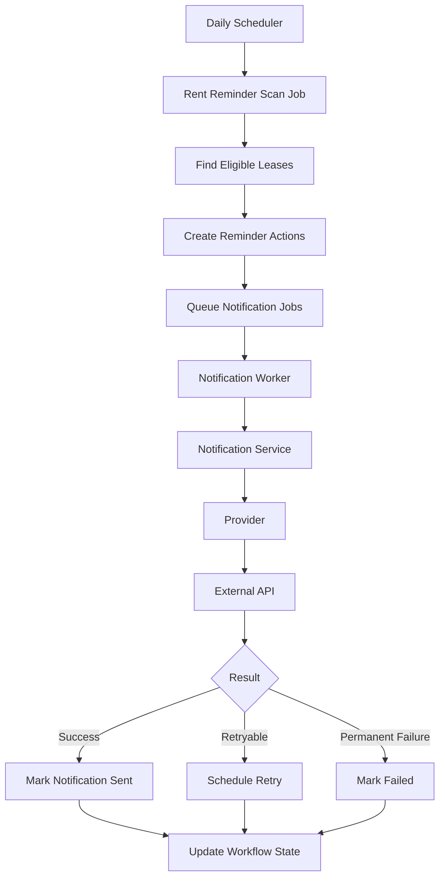
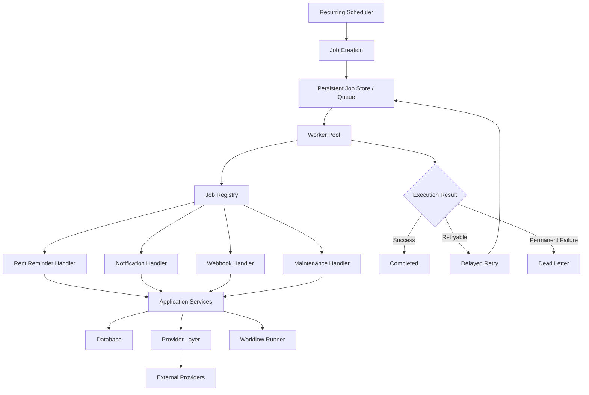

````markdown
# 09 — Background Jobs And Scheduling

## 1. Document Purpose

This document defines the architecture for background jobs, scheduled tasks, retries, delayed execution, and recurring workflows in the Rent Reminder backend.

The scheduling system is responsible for executing work that should not depend on a user's immediate API request.

Primary responsibilities include:

- Scheduled rent reminders.
- Recurring reminder checks.
- Delayed retries.
- Failed notification retries.
- Workflow execution.
- Provider retry handling.
- Periodic maintenance tasks.
- Stale workflow detection.
- Cleanup jobs.
- Operational health checks.

The core principle is:

> Time-based and long-running work must be executed asynchronously through a reliable background execution mechanism rather than inside HTTP request handlers.

---

# 2. Architectural Goal

The target architecture is:

```text
Scheduler
    ↓
Job
    ↓
Queue / Job Store
    ↓
Worker
    ↓
Application Service
    ↓
Workflow / Provider / Database
````

The scheduler should decide **when** work needs to happen.

The worker should decide **how** the work is executed.

Business logic should remain inside application services and workflows.

---

# 3. Why Background Jobs Are Required

The Rent Reminder system contains tasks that cannot reliably be executed inside normal API requests.

Examples:

```text
Check rent due dates
Send reminders
Retry failed messages
Process delayed workflow steps
Process provider webhooks
Clean old records
Generate alerts
```

Trying to execute these inside HTTP requests can cause:

* Request timeouts.
* Duplicate execution.
* Lost work.
* Poor reliability.
* Difficult retries.
* Poor scalability.

Therefore background execution is required.

---

# 4. Scheduling Responsibilities

The scheduling layer is responsible for:

* Determining when a job should run.
* Creating job records.
* Publishing jobs to the execution system.
* Supporting recurring schedules.
* Supporting delayed jobs.
* Preventing duplicate scheduling.
* Tracking execution status.
* Triggering retries.
* Handling failed jobs.

The scheduler should not contain rent business rules.

---

# 5. Worker Responsibilities

Workers are responsible for executing jobs.

A worker should:

1. Receive a job.
2. Validate the job.
3. Acquire execution ownership.
4. Execute the application service/workflow.
5. Record success or failure.
6. Schedule retry when appropriate.
7. Release/complete the job.

Example:

```text
Queue
  ↓
Worker
  ↓
Job Handler
  ↓
Application Service
  ↓
Workflow
```

---

# 6. Scheduling Architecture



---

# 7. Job Types

The system should distinguish different job categories.

Recommended categories:

```text
Scheduled Jobs
Delayed Jobs
Retry Jobs
Workflow Jobs
Notification Jobs
Maintenance Jobs
Webhook Processing Jobs
Cleanup Jobs
```

---

# 8. Rent Reminder Job

The primary scheduled job is the rent reminder process.

Conceptually:

```text
Daily Scheduler
      ↓
Rent Reminder Scan
      ↓
Find Eligible Leases
      ↓
Create Reminder Actions
      ↓
Queue Notifications
      ↓
Workers Send Notifications
```

The scheduler should not directly send tenant messages.

---

# 9. Rent Reminder Eligibility

The reminder workflow determines whether a tenant is eligible.

Example:

```text
Lease
  ↓
Rent Due Date
  ↓
Check Current Date
  ↓
Check Payment Status
  ↓
Check Reminder History
  ↓
Eligible?
```

Eligibility logic belongs to the workflow/application layer, not the scheduler.

---

# 10. Recurring Reminder Schedule

The recurring scheduler may execute a rent reminder scan periodically.

Example:

```text
Every day
    ↓
Find overdue/eligible leases
    ↓
Process reminders
```

The exact execution time should be configurable.

Example:

```text
rent_reminder_scan:
    schedule: daily
    time: 09:00
```

The actual timezone must be explicitly configured.

---

# 11. Timezone Handling

Scheduling must never rely blindly on server local time.

The system should define:

```text
Application Timezone
Tenant Timezone
Property Timezone
Scheduler Timezone
```

For a property-management system, business events should use the relevant business/property timezone where required.

Example:

```text
Property:
New York

Timezone:
America/New_York
```

The UTC timestamp should be stored for reliable persistence while local timezone is used for business scheduling.

---

# 12. UTC Storage

Recommended rule:

> Persist timestamps in UTC and convert to the required business timezone when evaluating schedules or displaying times.

Example:

```text
Database:
2026-08-15T13:00:00Z

Business timezone:
America/New_York

Local time:
09:00 AM
```

---

# 13. Job Model

A job should contain enough information to safely execute and recover.

Conceptual structure:

```text
job
-------------------------
job_id
job_type
status
payload
scheduled_at
started_at
completed_at
attempt_count
max_attempts
priority
locked_at
worker_id
last_error
created_at
updated_at
```

The exact database implementation belongs to:

`03_Database_Wiring.md`

---

# 14. Job Status

Recommended job states:

```text
PENDING
QUEUED
RUNNING
COMPLETED
RETRYING
FAILED
CANCELLED
DEAD_LETTER
```

Example lifecycle:

```text
PENDING
   ↓
QUEUED
   ↓
RUNNING
   ↓
COMPLETED
```

Failure:

```text
RUNNING
   ↓
RETRYING
   ↓
RUNNING
```

After maximum retries:

```text
RETRYING
   ↓
DEAD_LETTER
```

---

# 15. Job Lifecycle



---

# 16. Job Idempotency

Every important job should have an idempotency key.

Example:

```text
rent-reminder:
property=property-123:
lease=lease-456:
period=2026-08
```

The same logical job should not create duplicate actions.

Example:

```text
Scheduler runs twice
        ↓
Same idempotency key
        ↓
Existing job found
        ↓
Do not create duplicate job
```

---

# 17. Scheduling Idempotency

Schedulers can accidentally execute twice because of:

* Multiple application instances.
* Deployment overlap.
* Scheduler restart.
* Network problems.
* Clock issues.

Therefore recurring schedules must be idempotent.

Preferred:

```text
Schedule
   ↓
Generate deterministic job key
   ↓
Check existing job
   ↓
Create only if absent
```

---

# 18. Distributed Scheduler

If multiple application instances are running:

```text
Instance A → Scheduler
Instance B → Scheduler
Instance C → Scheduler
```

all three may attempt to create the same job.

The system must prevent duplicate scheduling through one or more mechanisms:

* Database uniqueness constraints.
* Distributed locks.
* Leader election.
* Queue-level deduplication.

Database-level uniqueness should be considered the final safety mechanism.

---

# 19. Distributed Locking

For jobs that must have only one active execution, a distributed lock may be used.

Conceptually:

```text
Worker A
   ↓
Acquire Lock
   ↓
Execute

Worker B
   ↓
Acquire Lock
   ↓
Rejected / Wait
```

Locks must have expiration/lease behavior to prevent permanently stuck jobs.

---

# 20. Worker Concurrency

Workers may process multiple jobs concurrently.

Example:

```text
Worker
 ├── Job 1
 ├── Job 2
 ├── Job 3
 └── Job 4
```

Concurrency should be configurable.

Do not allow unlimited concurrency because external providers and databases may become overloaded.

---

# 21. Queue Architecture

Preferred architecture:

```text
Scheduler
    ↓
Queue
    ↓
Worker Pool
    ↓
Job Handler
```

The queue provides:

* Buffering.
* Decoupling.
* Retry support.
* Horizontal scalability.
* Backpressure.

The actual queue technology should follow the project's selected infrastructure.

---

# 22. Queue vs Database Job Store

A database-backed job system may be sufficient during early stages.

Example:

```text
Database
   ↓
Pending Jobs
   ↓
Worker polls
```

At higher scale:

```text
Scheduler
   ↓
Message Queue
   ↓
Workers
```

The architecture should keep the application logic independent from the queue implementation.

---

# 23. Job Handler Pattern

Each job type should have a dedicated handler.

Example:

```text
Job
 ↓
Job Type
 ↓
Handler
```

Conceptually:

```python
class RentReminderJobHandler:
    async def handle(self, job):
        ...
```

Other handlers:

```text
NotificationRetryJobHandler
WebhookProcessingJobHandler
CleanupJobHandler
```

---

# 24. Job Registry

A Job Registry maps job types to handlers.

Example:

```text
rent_reminder_scan
    ↓
RentReminderJobHandler

notification_retry
    ↓
NotificationRetryJobHandler

cleanup
    ↓
CleanupJobHandler
```

This avoids large conditional statements inside the worker.

---

# 25. Job Payload

Job payloads should contain identifiers rather than large amounts of duplicated business data.

Preferred:

```json
{
  "lease_id": "lease-123"
}
```

Avoid:

```json
{
  "tenant_name": "...",
  "property_name": "...",
  "rent_amount": 1500,
  "entire_database_record": "..."
}
```

The handler should load current state from the database.

---

# 26. Job Payload Versioning

Job payloads may survive application deployments.

Therefore payloads should be versioned where necessary.

Example:

```json
{
  "version": 1,
  "lease_id": "lease-123"
}
```

Future versions can be:

```text
version=2
```

Workers should be able to handle jobs created by compatible previous versions.

---

# 27. Delayed Jobs

Delayed jobs are useful for:

* Retry after failure.
* Reminder after X days.
* Follow-up notification.
* Waiting for external confirmation.

Example:

```text
Reminder Sent
    ↓
Wait 5 days
    ↓
Check Payment
    ↓
Send Next Reminder
```

The delay should be represented as scheduling metadata, not as a sleeping worker process.

---

# 28. Never Sleep Inside Workers

Avoid:

```python
await asyncio.sleep(5 * 24 * 60 * 60)
```

This keeps a worker occupied for days.

Instead:

```text
Current Job
    ↓
Create delayed job
    ↓
Complete current job
    ↓
Scheduler wakes delayed job later
```

---

# 29. Retry Architecture

Retries should be controlled by job metadata.

Example:

```text
attempt_count = 1
max_attempts = 5
```

On failure:

```text
attempt_count += 1
```

If:

```text
attempt_count < max_attempts
```

schedule retry.

Otherwise:

```text
DEAD_LETTER
```

---

# 30. Retry Backoff

Recommended strategy:

```text
Attempt 1 → 30 sec
Attempt 2 → 1 min
Attempt 3 → 2 min
Attempt 4 → 5 min
Attempt 5 → 10 min
```

Exact values should be configurable.

Jitter should be added for distributed systems.

---

# 31. Retryable vs Permanent Errors

Retryable:

```text
Timeout
Network error
Temporary provider outage
HTTP 429
HTTP 500
HTTP 502
HTTP 503
HTTP 504
```

Permanent:

```text
Invalid tenant
Invalid recipient
Invalid configuration
Authentication failure
Invalid payload
Unsupported operation
```

The exact classification should be implemented consistently across the provider/application layers.

---

# 32. Dead Letter Jobs

Jobs that cannot successfully complete after maximum retries should enter a dead-letter state.

```text
Job
 ↓
Retry
 ↓
Retry
 ↓
Retry
 ↓
Max Attempts
 ↓
DEAD_LETTER
```

Dead-letter jobs should remain inspectable.

They should not simply disappear.

---

# 33. Dead Letter Recovery

Operators should be able to:

* Inspect failed jobs.
* View failure reason.
* Correct configuration/data.
* Retry the job manually.
* Cancel the job.

Manual retry should generate a controlled new execution rather than blindly duplicating an old action.

---

# 34. Job Cancellation

Jobs may need cancellation when:

* Lease is terminated.
* Tenant is no longer active.
* Reminder is no longer required.
* Workflow is manually cancelled.

Cancellation should be checked before executing important actions.

Example:

```text
Queued Job
   ↓
Lease cancelled
   ↓
Worker picks job
   ↓
Check current state
   ↓
Cancel execution
```

---

# 35. Stale Job Detection

A worker can crash while executing a job.

Example:

```text
Job = RUNNING
Worker crashes
```

The job may remain stuck indefinitely.

Therefore jobs should have:

```text
started_at
heartbeat / lease
locked_at
```

A watchdog can detect stale jobs.

---

# 36. Worker Lease

A worker may acquire a temporary execution lease.

```text
Worker A
   ↓
Acquire lease
   ↓
Execute
   ↓
Renew lease
   ↓
Complete
```

If the worker disappears:

```text
Lease expires
   ↓
Job becomes recoverable
```

---

# 37. Job Timeout

Long-running jobs should have execution limits.

Example:

```text
job_timeout = 5 minutes
```

If the timeout is exceeded:

```text
RUNNING
   ↓
TIMEOUT
   ↓
Retry / Failure
```

Timeout values should depend on job type.

---

# 38. Priority

Jobs may have priorities.

Example:

```text
HIGH
NORMAL
LOW
```

Possible priority:

```text
Provider webhook processing → HIGH
Rent reminder → NORMAL
Cleanup → LOW
```

Do not introduce priority unless the queue infrastructure supports it cleanly.

---

# 39. Backpressure

If the number of jobs increases significantly:

```text
Jobs Produced
     ↓
Queue grows
     ↓
Workers process at controlled rate
```

Workers should not attempt unlimited parallel execution.

Backpressure protects:

* Database.
* Provider APIs.
* CPU.
* Memory.
* Network.

---

# 40. Provider Rate Limits

Background jobs must respect external provider limits.

Example:

```text
1000 reminders
      ↓
Provider limit = 10 requests/sec
      ↓
Worker throttles requests
```

The scheduling layer should cooperate with provider rate limiting.

---

# 41. Rent Reminder Pipeline

The recommended rent reminder execution is:



---

# 42. Five-Day Reminder Example

The business requirement may be:

```text
Rent period ends
      ↓
Reminder
      ↓
Wait 5 days
      ↓
Check payment
      ↓
If unpaid → reminder
      ↓
Wait 5 days
      ↓
Check payment again
```

The system should NOT keep a worker alive for five days.

Instead:

```text
Reminder Job
    ↓
Create delayed follow-up job
    ↓
Complete
```

Then later:

```text
Delayed Job becomes available
    ↓
Worker executes
```

---

# 43. Payment Check Before Reminder

A delayed reminder must re-check current database state.

Example:

```text
5-day delayed job
      ↓
Load lease
      ↓
Check payment status
      ↓
Paid?
 ┌────┴────┐
Yes       No
 ↓         ↓
Stop     Send Reminder
```

Do not rely only on the state stored when the job was originally created.

---

# 44. Scheduling Race Conditions

Possible race:

```text
Worker A:
checks payment = unpaid

Worker B:
records payment

Worker A:
sends reminder
```

To reduce this risk:

* Re-check current state immediately before sending.
* Use appropriate transaction boundaries.
* Use action idempotency.
* Consider locking for highly sensitive operations.
* Respect authoritative payment state.

---

# 45. Transaction Boundaries

Do not keep a database transaction open while waiting for an external API.

Bad:

```text
BEGIN
 ↓
Read lease
 ↓
Call WhatsApp API
 ↓
Wait
 ↓
COMMIT
```

Preferred:

```text
BEGIN
 ↓
Create notification action
 ↓
COMMIT

External API call
 ↓
Persist result
```

---

# 46. Scheduler Failure Recovery

If the scheduler crashes:

```text
Scheduler Down
     ↓
Scheduled jobs not created
```

The system should recover through:

* Persistent schedule definitions.
* Idempotent scans.
* Missed-job detection.
* Scheduler restart recovery.

A recurring job should not rely on in-memory state.

---

# 47. Missed Schedule Handling

Example:

```text
Daily scan:
09:00

Server down:
08:30 → 11:00
```

When the scheduler returns at 11:00, it should determine whether the scheduled execution was missed.

The recovery strategy should be explicitly defined:

```text
Run immediately
OR
Skip missed execution
OR
Create recovery job
```

For rent reminders, running a recovery scan may be preferable to silently skipping eligible tenants.

---

# 48. Scheduler Clock Safety

Scheduler behavior should account for:

* Daylight saving time.
* Timezone changes.
* Clock drift.
* Server restarts.
* Duplicate scheduler instances.

Business schedules should be based on timezone-aware timestamps.

---

# 49. Periodic Maintenance Jobs

Possible maintenance jobs:

```text
Cleanup expired jobs
Archive old execution records
Clean temporary data
Detect stale jobs
Check provider health
Refresh provider tokens
Generate operational reports
```

Maintenance jobs should use lower priority where appropriate.

---

# 50. Cleanup Policy

Cleanup should never remove active workflow state.

Example:

```text
Completed Job
    ↓
Retention period
    ↓
Archive/Delete
```

The retention period should be configurable and aligned with operational/audit requirements.

---

# 51. Job Observability

Every job should expose:

```text
job_id
job_type
status
attempt_count
scheduled_at
started_at
completed_at
duration
worker_id
error_code
```

This allows operators to understand execution behavior.

---

# 52. Job Metrics

Recommended metrics:

```text
jobs_created_total
jobs_started_total
jobs_completed_total
jobs_failed_total
jobs_retried_total
jobs_dead_letter_total
jobs_cancelled_total
job_execution_duration
job_queue_depth
job_retry_count
stale_jobs_total
```

Metrics should be labeled carefully.

---

# 53. Worker Metrics

Useful worker metrics:

```text
worker_jobs_processed
worker_jobs_failed
worker_active_jobs
worker_utilization
worker_execution_duration
worker_errors
```

---

# 54. Scheduler Metrics

Useful scheduler metrics:

```text
scheduler_runs_total
scheduler_failures_total
scheduler_jobs_created_total
scheduler_duplicate_jobs_total
scheduler_missed_runs_total
scheduler_duration
```

---

# 55. Structured Logging

Example:

```text
INFO
job_id=job-123
job_type=rent_reminder_scan
status=started
```

Completion:

```text
INFO
job_id=job-123
job_type=rent_reminder_scan
status=completed
duration_ms=820
```

Failure:

```text
ERROR
job_id=job-123
job_type=notification_retry
status=failed
attempt=3
error_code=PROVIDER_TIMEOUT
```

---

# 56. Correlation IDs

A job should preserve correlation information.

Example:

```text
HTTP Request
    ↓
Workflow Execution
    ↓
Job
    ↓
Notification
    ↓
Provider Request
```

The same correlation/trace context should be propagated where supported.

---

# 57. Job Security

Job payloads may contain sensitive identifiers.

Therefore:

* Do not log entire payloads blindly.
* Validate payloads.
* Authenticate administrative job operations.
* Restrict manual retry access.
* Avoid putting secrets in job payloads.

Never place API keys in job payloads.

---

# 58. Job Validation

Before execution:

```text
Job received
   ↓
Validate job type
   ↓
Validate payload schema
   ↓
Validate required IDs
   ↓
Validate execution state
   ↓
Execute
```

Invalid jobs should fail safely.

---

# 59. Job Version Compatibility

During deployments:

```text
Old Worker
     ↓
Old Job

New Worker
     ↓
New Job
```

If rolling deployments are used, workers may temporarily process jobs created by an older application version.

Therefore backward compatibility should be considered for persistent job payloads.

---

# 60. Graceful Worker Shutdown

During deployment:

```text
Shutdown signal
      ↓
Stop accepting new jobs
      ↓
Finish safe current jobs
      ↓
Release leases
      ↓
Shutdown
```

Do not terminate workers in a way that loses job ownership information.

---

# 61. Horizontal Scaling

Workers should be horizontally scalable.

Example:

```text
Queue
 ├── Worker 1
 ├── Worker 2
 ├── Worker 3
 └── Worker 4
```

Jobs should be distributed among workers.

Correctness must not depend on a specific worker instance.

---

# 62. Scheduler Scaling

Ideally, scheduling should have one logical scheduler.

If multiple instances run scheduler code:

```text
Instance A
Instance B
Instance C
```

they must coordinate through:

* Distributed lock.
* Leader election.
* Database uniqueness.
* Queue deduplication.

---

# 63. Workflow Integration

Background jobs should invoke workflows through the same application-level interfaces used elsewhere.

Example:

```text
Job Handler
    ↓
Workflow Service
    ↓
LangGraph Workflow
```

The worker should not contain the workflow's business logic.

---

# 64. LangGraph Integration

If LangGraph is used for workflow execution:

```text
Scheduler
    ↓
Workflow Job
    ↓
WorkflowRunner
    ↓
LangGraph
    ↓
Workflow Nodes
```

The scheduler should only trigger execution.

It should not directly call individual LangGraph nodes.

---

# 65. Background Job and API Interaction

An API request may create a job.

Example:

```text
POST /reminders
      ↓
Validate Request
      ↓
Create Job
      ↓
Return 202 Accepted
      ↓
Worker Processes Job
```

This prevents the API request from waiting for long-running work.

---

# 66. Asynchronous API Response

For long-running operations, the API may return:

```json
{
  "job_id": "job-123",
  "status": "queued"
}
```

The client can later query:

```text
GET /jobs/{job_id}
```

if such an endpoint is required.

---

# 67. Job Status API

If exposed through the API layer, the response should be normalized:

```json
{
  "job_id": "job-123",
  "type": "rent_reminder",
  "status": "completed",
  "created_at": "...",
  "completed_at": "..."
}
```

Do not expose internal worker details unnecessarily.

---

# 68. Scheduling Configuration

Configuration should include:

```text
scheduler_enabled
scheduler_timezone
rent_reminder_schedule
worker_concurrency
job_timeout
retry_policy
max_attempts
cleanup_interval
```

Exact configuration names should follow the project's existing settings architecture.

---

# 69. Development Environment

Development should support simple execution.

Example:

```text
API Server
Worker
Scheduler
Database
```

Each may run as a separate process/container depending on project architecture.

---

# 70. Production Deployment

A production deployment may contain:

```text
                ┌─────────────┐
                │ API Servers │
                └──────┬──────┘
                       │
                       ▼
                   Database
                       ▲
                       │
                ┌──────┴──────┐
                │    Queue    │
                └──────┬──────┘
                       │
            ┌──────────┼──────────┐
            ▼          ▼          ▼
         Worker 1   Worker 2   Worker 3

                 Scheduler
                    │
                    ▼
                  Queue
```

---

# 71. Failure Scenarios

The scheduling system must handle:

```text
Scheduler crash
Worker crash
Database unavailable
Queue unavailable
Provider unavailable
Job timeout
Duplicate scheduler execution
Duplicate job delivery
Stale job
Malformed job
Deployment interruption
Clock/timezone issue
```

Each failure must have a recovery strategy.

---

# 72. Failure Recovery Matrix

| Failure          | Expected Behavior                             |
| ---------------- | --------------------------------------------- |
| Scheduler crash  | Recover on restart                            |
| Worker crash     | Job lease expires and job becomes recoverable |
| Provider timeout | Retry if retryable                            |
| Provider 429     | Backoff and retry                             |
| Invalid payload  | Permanent failure                             |
| Database outage  | Retry infrastructure operation where safe     |
| Duplicate job    | Idempotency prevents duplicate action         |
| Stale job        | Watchdog recovers job                         |
| Deployment       | Graceful worker shutdown                      |
| Missed schedule  | Recovery scan according to policy             |

---

# 73. Testing Strategy

Background job testing should include:

## Unit Tests

Test:

* Job handlers.
* Retry calculations.
* Schedule calculations.
* Payload validation.
* Idempotency key generation.

## Integration Tests

Test:

* Scheduler → queue.
* Queue → worker.
* Worker → database.
* Worker → provider.
* Retry flow.

## Failure Tests

Test:

* Worker crash.
* Provider timeout.
* Duplicate job.
* Duplicate webhook.
* Stale job.
* Max retry exceeded.

---

# 74. Scheduler Test Example

Scenario:

```text
Given:
Lease rent is overdue

When:
Rent reminder scan runs

Then:
Reminder job is created
```

Running the scheduler again:

```text
When:
Rent reminder scan runs again

Then:
No duplicate reminder job is created
```

---

# 75. Retry Test Example

Scenario:

```text
Provider returns timeout
```

Expected:

```text
Job status:
RETRYING
```

After maximum attempts:

```text
Job status:
DEAD_LETTER
```

---

# 76. Payment State Test

Scenario:

```text
Reminder follow-up job becomes available
```

Database:

```text
rent_status = PAID
```

Expected:

```text
No reminder sent.
Job completed.
```

This verifies that delayed jobs always re-check current state.

---

# 77. Recommended Implementation Order

Implementation should proceed in this order:

```text
1. Job Model
      ↓
2. Job Repository
      ↓
3. Job Handler Interface
      ↓
4. Worker
      ↓
5. Scheduler
      ↓
6. Retry System
      ↓
7. Idempotency
      ↓
8. Rent Reminder Job
      ↓
9. Provider Notification Job
      ↓
10. Monitoring
      ↓
11. Dead Letter Handling
      ↓
12. Hardening
```

---

# 78. Architecture Rules

The scheduling system must follow these rules:

1. Long-running work must not execute inside normal HTTP requests.
2. Workers must execute jobs asynchronously.
3. Schedulers must be idempotent.
4. Jobs must have stable identifiers.
5. Critical jobs must have idempotency keys.
6. Jobs must be persistently recoverable.
7. Worker crashes must not permanently lose jobs.
8. Retryable and permanent failures must be distinguished.
9. Retries must use controlled backoff.
10. Jobs must have maximum retry limits.
11. Failed jobs must enter a recoverable dead-letter state.
12. Workers must not sleep for long delays.
13. Delayed work must use scheduled jobs.
14. Business rules must remain outside the scheduler.
15. Workers should call application services rather than implementing business logic.
16. Database transactions must not remain open during external API calls.
17. Scheduled timestamps must be timezone-aware.
18. UTC should be used for persistent timestamps.
19. Multiple scheduler instances must not create duplicate work.
20. Job payloads must not contain secrets.
21. Job execution must be observable.
22. Workers must support graceful shutdown.
23. Job handlers must be testable independently.
24. Background execution must remain independent from a specific queue technology where practical.

---

# 79. Current vs Target Architecture

| Area              | Current State     | Target State               |
| ----------------- | ----------------- | -------------------------- |
| Scheduling        | Verify repository | Central scheduler          |
| Workers           | Verify repository | Dedicated worker process   |
| Job storage       | Verify repository | Persistent job records     |
| Queue             | Verify repository | Queue abstraction          |
| Retry             | Verify repository | Central retry policy       |
| Idempotency       | Verify repository | Deterministic job keys     |
| Rent reminders    | Verify repository | Scheduled workflow jobs    |
| Delayed reminders | Verify repository | Delayed jobs               |
| Failed jobs       | Verify repository | Dead-letter handling       |
| Worker crash      | Verify repository | Lease/recovery             |
| Timezone          | Verify repository | Explicit timezone handling |
| Observability     | Verify repository | Job/worker metrics         |
| Scaling           | Verify repository | Horizontal workers         |

---

# 80. Final Background Execution Architecture



---

# 81. Final Architectural Principle

The scheduling system should maintain a clear separation:

```text
Scheduler
    ↓
WHEN should work happen?

Queue
    ↓
WHERE should pending work wait?

Worker
    ↓
WHO executes the work?

Job Handler
    ↓
WHICH application operation should execute?

Application Service
    ↓
HOW should the application perform the operation?

Workflow
    ↓
WHAT business decision should be made?
```

The core principle is:

> **The Background Job and Scheduling Layer provides reliable, asynchronous, retryable, observable execution of time-based and long-running work without embedding business logic inside schedulers or workers.**

---

# 82. Document Status

**Document:** `09_Background_Jobs_And_Scheduling.md`

**Architecture Type:** Background Jobs, Scheduling, Worker, Retry, and Asynchronous Execution Architecture

**Primary Purpose:** Define how recurring tasks, delayed jobs, retries, workers, queues, scheduling, job recovery, and rent reminder execution operate within the backend.

**Related Documents:**

* `00_SDD_Master.md`
* `01_Current_System_Architecture.md`
* `02_Target_Backend_Architecture.md`
* `03_Database_Wiring.md`
* `04_API_And_Service_Layer.md`
* `05_Event_And_Pipeline_Architecture.md`
* `06_WorkflowRunner_Architecture.md`
* `07_LangGraph_Integration.md`
* `08_Integration_And_Provider_Layer.md`
* `10_Security_And_Error_Handling.md`
* `11_Observability_And_Logging.md`
* `12_Backend_Testing_Strategy.md`

**Phase Mapping:**

* Phase 1 — Stabilization
* Phase 2 — Database Unification
* Phase 3 — Live Data Wiring
* Phase 5 — Scheduling and Alerting
* Phase 6 — Hardening

**Status:** Architecture Definition

```
```
