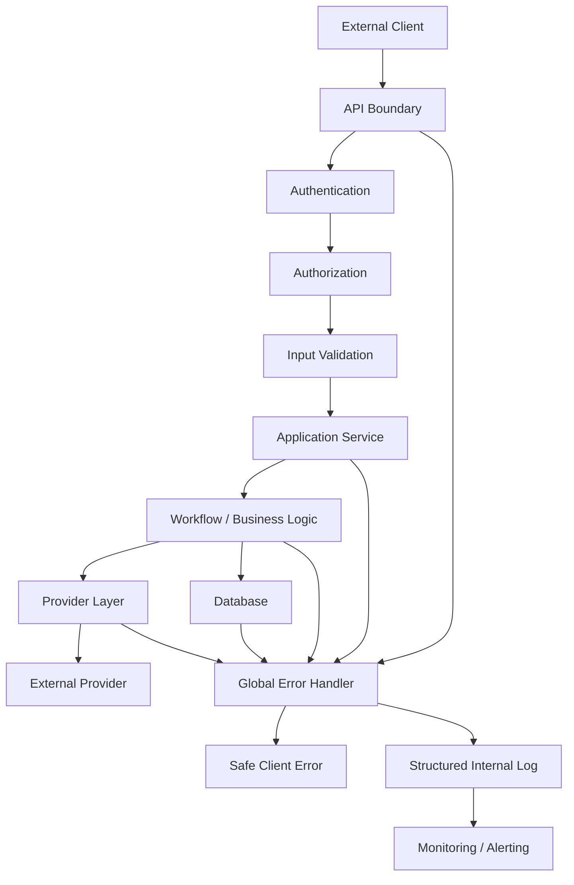

````markdown
# 10 — Security And Error Handling

## 1. Document Purpose

This document defines the security architecture and error-handling strategy for the Rent Reminder backend.

The purpose of this document is to establish consistent rules for:

- Authentication
- Authorization
- Input validation
- Data protection
- Secrets management
- API security
- Provider security
- Database security
- Error classification
- Exception handling
- Retry behavior
- Logging of failures
- Security monitoring
- Safe failure and recovery

This document describes the target architecture.

Where the existing implementation has not been verified from the repository, the document explicitly marks the item as:

`TO BE VERIFIED FROM REPOSITORY`

No implementation detail should be treated as existing unless it is confirmed in the codebase.

---

# 2. Security Objectives

The backend should protect:

1. Tenant information.
2. Property information.
3. Lease information.
4. Rent and payment information.
5. Communication information.
6. Authentication credentials.
7. Provider credentials.
8. Internal system configuration.
9. Workflow state.
10. Operational logs.

The primary security objectives are:

```text
Confidentiality
Integrity
Availability
Authentication
Authorization
Auditability
````

---

# 3. Security Principles

The system should follow these principles:

1. Least privilege.
2. Deny by default.
3. Validate all external input.
4. Never trust client-provided authorization claims without verification.
5. Never expose secrets through API responses.
6. Never log credentials or sensitive tokens.
7. Keep authentication and authorization separate.
8. Keep security logic centralized where practical.
9. Use structured application errors.
10. Do not expose internal stack traces to clients.
11. Fail safely.
12. Make security-sensitive actions auditable.
13. Use secure defaults.
14. Keep dependencies updated.
15. Separate development and production secrets.
16. Treat external provider responses as untrusted input.

---

# 4. Current Security Implementation

The exact security mechanisms currently implemented in the repository must be verified before modifying this section.

The following items require repository verification:

```text
Authentication mechanism
Authorization mechanism
User/role model
API authentication middleware
Token mechanism
Session mechanism
Password handling
Secret storage
CORS configuration
Rate limiting
Request validation
Database access controls
Provider credential handling
Audit logging
Security headers
```

Do not assume that any of the above already exists.

---

# 5. Target Security Architecture

The target request flow is:

```text
Client
  ↓
API Gateway / Application
  ↓
Authentication
  ↓
Authorization
  ↓
Input Validation
  ↓
Application Service
  ↓
Database / Workflow / Provider
  ↓
Response
```

Security checks should occur before protected business operations are executed.

---

# 6. Authentication

Authentication answers:

> "Who is making this request?"

The backend must verify the identity of a caller before allowing access to protected resources.

The exact authentication mechanism is:

```text
TO BE VERIFIED FROM REPOSITORY
```

Possible mechanisms should not be selected in this document without confirming the project's actual requirements and implementation.

---

# 7. Authentication Failure

When authentication fails, the API should return a generic authentication error.

Example:

```json
{
  "error": {
    "code": "AUTHENTICATION_REQUIRED",
    "message": "Authentication is required."
  }
}
```

Do not expose:

```text
Internal token validation details
Signing configuration
Secret values
Token contents
Stack traces
```

---

# 8. Authorization

Authorization answers:

> "Is this authenticated user allowed to perform this operation?"

Authentication and authorization must remain separate concepts.

Example:

```text
Authenticated User
       ↓
Authorization Check
       ↓
Allowed?
   ┌───┴───┐
  Yes      No
   ↓        ↓
Continue   403
```

---

# 9. Resource-Level Authorization

Authorization must not only check whether a user is authenticated.

It must also verify access to the requested resource.

Example:

```text
GET /properties/{property_id}
```

The backend should verify that the authenticated actor is allowed to access that specific property.

The exact ownership/tenant relationship must be derived from the actual data model.

---

# 10. Role-Based Access

If the project contains multiple user roles, authorization should be defined around explicit permissions.

Example conceptual roles:

```text
ADMIN
PROPERTY_MANAGER
STAFF
TENANT
```

These are examples only.

The actual roles must be:

```text
TO BE VERIFIED FROM REPOSITORY
```

Do not introduce roles into the implementation unless required by the product and confirmed by the existing architecture.

---

# 11. Least Privilege

Each actor should receive only the permissions required to perform its responsibilities.

Examples:

```text
Tenant
  ↓
Own lease / permitted tenant operations

Property Manager
  ↓
Managed properties / permitted management operations

System Worker
  ↓
Only required background-job operations

Provider Integration
  ↓
Only required external API access
```

---

# 12. Internal Service Authorization

Background workers and internal services should not automatically receive unrestricted database or application access.

Each internal component should have only the permissions required for its operation.

Example:

```text
Notification Worker
    ↓
Notification-related operations
```

rather than:

```text
Notification Worker
    ↓
Full unrestricted system access
```

---

# 13. Input Validation

All external input must be validated before reaching business logic.

External input includes:

```text
HTTP request bodies
Query parameters
Path parameters
Headers
Webhook payloads
Provider responses
Background job payloads
Imported data
```

Validation should include:

* Required fields.
* Data types.
* String lengths.
* Allowed values.
* Identifier formats.
* Date/time formats.
* Numeric ranges.
* Nested object structure.

---

# 14. Validation Boundary

The preferred flow is:

```text
External Input
      ↓
Schema Validation
      ↓
Normalized Input
      ↓
Application Service
```

Invalid input should be rejected before business logic is executed.

---

# 15. SQL Injection Protection

Database queries must not be constructed by concatenating untrusted input.

Avoid:

```text
"SELECT * FROM leases WHERE id = " + user_input
```

Use the project's database abstraction or parameterized query mechanisms.

The exact database library must be:

```text
TO BE VERIFIED FROM REPOSITORY
```

---

# 16. Command Injection Protection

User-controlled input must never be directly passed into operating-system commands.

If an external command is unavoidable:

* Validate input.
* Use a safe argument API.
* Avoid shell interpolation.
* Apply least privilege.

---

# 17. Path Traversal Protection

If the application handles files or paths, user input must not be allowed to arbitrarily access filesystem locations.

Reject unsafe path patterns and resolve paths against an approved base directory.

If file handling is not part of the current system:

```text
TO BE VERIFIED FROM REPOSITORY
```

---

# 18. Sensitive Data

Potentially sensitive application data may include:

```text
Tenant identity information
Contact information
Lease information
Rent information
Payment information
Communication history
Authentication information
Provider credentials
Internal identifiers
```

Only the minimum required information should be returned to clients or stored in logs.

---

# 19. Secrets Management

Secrets must never be hard-coded into source code.

Examples:

```text
API keys
Access tokens
Database passwords
Provider credentials
Encryption keys
Signing secrets
Webhook secrets
```

Secrets should be supplied through an appropriate environment/configuration secret mechanism.

The exact production secret-management platform is:

```text
TO BE VERIFIED FROM DEPLOYMENT CONFIGURATION
```

---

# 20. Environment Separation

Development, testing, staging, and production environments should use separate credentials.

Example:

```text
Development
    ↓
Development credentials

Testing
    ↓
Test credentials

Production
    ↓
Production credentials
```

Production credentials must not be committed to the repository.

---

# 21. `.env` Files

If `.env` files are used locally, they should not be committed when they contain secrets.

A safe pattern is:

```text
.env
.env.local
```

with appropriate entries in `.gitignore`.

A non-secret example configuration may be provided through:

```text
.env.example
```

The actual repository configuration must be verified.

---

# 22. Secret Logging

Never log:

```text
API keys
Access tokens
Passwords
Private keys
Webhook signing secrets
Authorization headers
Session secrets
```

If a secret must be referenced in diagnostics, use a safe redacted representation.

Example:

```text
provider_key=***REDACTED***
```

---

# 23. Authentication Header Logging

Request logging must not record complete authorization headers.

Unsafe:

```text
Authorization: Bearer <full-token>
```

Safe:

```text
Authorization: [REDACTED]
```

---

# 24. API Security

The API layer should enforce:

```text
Authentication
Authorization
Input validation
Request size limits
Rate limiting where required
Safe error responses
Security headers where applicable
```

The exact API framework must be:

```text
TO BE VERIFIED FROM REPOSITORY
```

---

# 25. Rate Limiting

Rate limiting should be considered for endpoints that can be abused or cause expensive operations.

Examples:

```text
Authentication endpoints
Message sending endpoints
Webhook endpoints
Public APIs
Expensive search operations
Administrative endpoints
```

The exact rate-limiting implementation is:

```text
TO BE VERIFIED FROM REPOSITORY
```

---

# 26. Request Size Limits

The API should restrict request sizes to reduce abuse and resource exhaustion.

Limits should be appropriate to the actual payloads accepted by each endpoint.

Do not apply unnecessarily large limits.

---

# 27. CORS

Cross-Origin Resource Sharing should be explicitly configured.

Production should not automatically allow every origin.

Example principle:

```text
Allowed Origins
    ↓
Explicitly configured
```

The current CORS configuration is:

```text
TO BE VERIFIED FROM REPOSITORY
```

---

# 28. Security Headers

Where applicable, the HTTP layer should provide appropriate security headers.

Examples may include:

```text
Content-Security-Policy
X-Content-Type-Options
Referrer-Policy
Strict-Transport-Security
```

Exact headers depend on the deployment architecture.

The currently configured headers are:

```text
TO BE VERIFIED FROM REPOSITORY
```

---

# 29. HTTPS

Production traffic containing sensitive application information should use encrypted transport.

The deployment must ensure:

```text
Client
  ↓
HTTPS
  ↓
Backend
```

HTTP-to-HTTPS behavior depends on the deployment/reverse-proxy architecture.

---

# 30. Database Security

Database access should follow least privilege.

Application credentials should not automatically have administrative database privileges.

The database user should have only the permissions required by the application.

---

# 31. Database Credentials

Database credentials must not be embedded in source code.

They should be supplied through the application's secure configuration mechanism.

Exact configuration must be:

```text
TO BE VERIFIED FROM REPOSITORY
```

---

# 32. Data Integrity

The backend must protect important business state from invalid transitions.

Examples:

```text
Lease state
Payment state
Reminder state
Notification state
Workflow state
Job state
```

State changes should occur through controlled application services rather than arbitrary direct updates.

---

# 33. Transaction Safety

Transactions should be used where multiple database operations must succeed or fail together.

Example:

```text
BEGIN
    Create reminder action
    Update workflow state
COMMIT
```

If an operation fails:

```text
ROLLBACK
```

Transactions should not remain open while waiting for external network calls.

---

# 34. External Provider Security

External providers must be treated as untrusted external systems.

Examples include:

```text
Messaging providers
Email providers
LLM providers
Payment providers
Webhook sources
```

The exact providers must be verified from the project's provider configuration.

---

# 35. Provider Credentials

Provider credentials should:

* Be stored securely.
* Never be returned through API responses.
* Never be logged.
* Be isolated by environment.
* Be rotated when necessary.

---

# 36. Provider Response Validation

External provider responses must not automatically be trusted.

Validate:

```text
HTTP status
Response structure
Required fields
Expected identifiers
Error payload
```

Unexpected provider responses should be handled safely.

---

# 37. Webhook Security

If the system receives webhooks, webhook authenticity must be verified before processing.

Possible mechanisms include:

```text
Signature verification
Shared secret
Provider-specific verification
```

The exact webhook mechanism must be:

```text
TO BE VERIFIED FROM REPOSITORY
```

Never process sensitive webhook actions solely because a request reached the endpoint.

---

# 38. Webhook Replay Protection

If the provider supports event IDs or timestamps, webhook processing should prevent replay attacks.

Conceptually:

```text
Webhook Event ID
      ↓
Already processed?
   ┌──┴──┐
  Yes    No
   ↓      ↓
Ignore  Process
```

The exact implementation depends on the provider and existing event architecture.

---

# 39. Background Job Security

Background jobs must be treated as untrusted persisted input.

Before execution:

```text
Job
 ↓
Validate Type
 ↓
Validate Payload
 ↓
Verify Authorization Context
 ↓
Check Current State
 ↓
Execute
```

Job payloads must not contain secrets.

---

# 40. Job Ownership

Administrative operations involving jobs should be protected.

Examples:

```text
Retry job
Cancel job
Inspect job
Replay job
Move dead-letter job
```

Only authorized operators/services should be able to perform these operations.

---

# 41. Error Handling Objectives

The error-handling system should:

1. Prevent crashes from exposing internal details.
2. Return predictable API responses.
3. Preserve useful diagnostic information internally.
4. Distinguish client and server errors.
5. Support retries where appropriate.
6. Avoid duplicate side effects.
7. Maintain transaction integrity.
8. Make failures observable.
9. Support operational recovery.

---

# 42. Error Classification

Errors should be classified into categories.

Recommended categories:

```text
Validation Error
Authentication Error
Authorization Error
Not Found Error
Conflict Error
Rate Limit Error
Provider Error
Database Error
Workflow Error
Job Error
Internal Error
```

---

# 43. HTTP Error Mapping

A consistent mapping should be used.

| Error Category            |                  HTTP Status |
| ------------------------- | ---------------------------: |
| Validation Error          |                          400 |
| Authentication Error      |                          401 |
| Authorization Error       |                          403 |
| Not Found                 |                          404 |
| Conflict                  |                          409 |
| Rate Limited              |                          429 |
| Internal Server Error     |                          500 |
| Provider/Upstream Failure | 502/503 depending on context |

Exact endpoint behavior should be verified against the API implementation.

---

# 44. Standard Error Response

The API should use a consistent structure.

Example:

```json
{
  "error": {
    "code": "VALIDATION_ERROR",
    "message": "Invalid request.",
    "details": []
  }
}
```

The response should not expose internal stack traces.

---

# 45. Error Codes

Error codes should be stable machine-readable identifiers.

Examples:

```text
VALIDATION_ERROR
AUTHENTICATION_REQUIRED
FORBIDDEN
RESOURCE_NOT_FOUND
RESOURCE_CONFLICT
RATE_LIMITED
PROVIDER_UNAVAILABLE
PROVIDER_TIMEOUT
DATABASE_ERROR
WORKFLOW_ERROR
INTERNAL_ERROR
```

The final set should be maintained centrally.

---

# 46. Client Message vs Internal Error

Client-facing message:

```text
"Unable to process the reminder at this time."
```

Internal diagnostic:

```text
provider_timeout
provider=...
request_id=...
job_id=...
exception=...
```

Internal diagnostics must remain outside the public response.

---

# 47. Global Exception Handling

The application should have a centralized mechanism for converting unexpected exceptions into safe API responses.

Conceptually:

```text
Request
   ↓
Application
   ↓
Exception
   ↓
Global Error Handler
   ↓
Safe API Response
   ↓
Structured Log
```

The exact framework mechanism is:

```text
TO BE VERIFIED FROM REPOSITORY
```

---

# 48. Unexpected Exceptions

Unexpected exceptions should:

1. Be caught at the appropriate application boundary.
2. Be logged with context.
3. Generate a correlation/request identifier where available.
4. Return a generic server error to the client.
5. Avoid exposing implementation details.

Example:

```json
{
  "error": {
    "code": "INTERNAL_ERROR",
    "message": "An unexpected error occurred."
  }
}
```

---

# 49. Database Errors

Database failures should be handled without exposing database internals.

Do not return:

```text
SQL query
Database connection string
Database username
Database schema internals
Raw database exception
```

Instead:

```text
Client:
"Unable to process the request."

Internal logs:
Database error + context
```

---

# 50. Provider Errors

Provider errors should be normalized before reaching higher layers.

Example:

```text
Provider
   ↓
Provider Adapter
   ↓
Normalized Provider Error
   ↓
Application Service
```

The application should not depend directly on provider-specific error structures.

---

# 51. Provider Error Categories

Useful categories include:

```text
PROVIDER_TIMEOUT
PROVIDER_RATE_LIMIT
PROVIDER_AUTHENTICATION_ERROR
PROVIDER_INVALID_REQUEST
PROVIDER_UNAVAILABLE
PROVIDER_UNKNOWN_ERROR
```

The actual provider mappings should be implemented inside the provider/integration layer.

---

# 52. Retryable Errors

Retryable errors may include:

```text
Temporary network failure
Timeout
Temporary provider outage
HTTP 429
HTTP 5xx
Transient database failure
```

Retry decisions must be made carefully to avoid duplicate side effects.

---

# 53. Non-Retryable Errors

Examples:

```text
Invalid input
Invalid recipient
Invalid resource
Unauthorized request
Unsupported operation
Malformed payload
Permanent provider rejection
```

These should normally fail without repeated retries.

---

# 54. Error Handling and Idempotency

Retries must not create duplicate business actions.

Example:

```text
Send Reminder
     ↓
Provider times out
     ↓
Did provider receive it?
     ↓
Retry
```

Because the result may be uncertain, the system should use idempotency mechanisms wherever the provider/business operation supports them.

---

# 55. Error Handling in Workflows

Workflow errors should be represented explicitly.

Example:

```text
Workflow
   ↓
Node Failure
   ↓
Workflow Error
   ↓
WorkflowRunner
   ↓
Application Error / Job Retry
```

The workflow should not silently swallow errors.

---

# 56. LangGraph Error Handling

If LangGraph is used, the integration layer should handle:

```text
Graph execution errors
Node errors
Tool errors
Timeouts
External provider failures
Invalid state
```

The exact error propagation strategy should follow the implementation described in:

`07_LangGraph_Integration.md`

---

# 57. Node-Level Errors

A node should not expose internal exceptions directly to users.

Instead:

```text
Node Exception
     ↓
Normalized Workflow Error
     ↓
WorkflowRunner
     ↓
Application Layer
```

---

# 58. Partial Workflow Failure

If a workflow performs multiple operations and one fails, the system must define whether:

```text
Retry entire workflow
OR
Resume from failed step
OR
Compensate previous actions
```

The correct strategy depends on the workflow.

For rent reminders, state and notification actions should be designed to prevent duplicate notifications during retries.

---

# 59. Error Recovery

Every important error should have a defined recovery strategy.

| Error             | Recovery                           |
| ----------------- | ---------------------------------- |
| Validation        | Correct request                    |
| Authentication    | Re-authenticate                    |
| Authorization     | Request appropriate access         |
| Not Found         | Verify resource                    |
| Conflict          | Resolve current state              |
| Provider timeout  | Retry                              |
| Provider 429      | Backoff                            |
| Provider 5xx      | Retry                              |
| Database outage   | Retry/recover infrastructure       |
| Workflow failure  | Retry/resume according to workflow |
| Permanent failure | Manual intervention if required    |

---

# 60. Logging Requirements

Logs should contain enough context to diagnose failures.

Recommended fields:

```text
timestamp
level
service
environment
request_id
correlation_id
job_id
workflow_id
event_id
error_code
operation
duration
```

Do not log sensitive payloads by default.

---

# 61. Structured Logging

Logs should preferably use structured fields rather than unstructured strings.

Example:

```json
{
  "level": "ERROR",
  "operation": "send_rent_reminder",
  "job_id": "job-123",
  "error_code": "PROVIDER_TIMEOUT"
}
```

---

# 62. Sensitive Data Redaction

Sensitive fields should be redacted before logging.

Examples:

```text
password
token
api_key
authorization
secret
payment credentials
private keys
```

Where contact information is sensitive, logging should be minimized or masked according to application requirements.

---

# 63. Error Correlation

An error should be traceable across layers.

Example:

```text
HTTP Request
    ↓
request_id
    ↓
Application Service
    ↓
workflow_id
    ↓
job_id
    ↓
provider request
```

This allows operators to reconstruct failures without exposing sensitive data.

---

# 64. Audit Logging

Security-sensitive actions should be auditable where required.

Examples:

```text
User permission changes
Administrative actions
Manual job retries
Manual job cancellation
Sensitive configuration changes
Authentication/security events
```

The exact audit-log implementation is:

```text
TO BE VERIFIED FROM REPOSITORY
```

---

# 65. Security Event Categories

Potential security events include:

```text
Authentication failure
Authorization failure
Suspicious request pattern
Repeated rate-limit violation
Invalid webhook signature
Administrative action
Credential/configuration change
```

The system should log these events without exposing secrets.

---

# 66. Dependency Security

Application dependencies should be regularly reviewed for known security vulnerabilities.

The project should:

* Keep dependencies reasonably current.
* Review security advisories.
* Remove unused dependencies.
* Avoid unnecessary packages.
* Pin versions where appropriate for reproducibility.

The exact dependency management strategy is:

```text
TO BE VERIFIED FROM REPOSITORY
```

---

# 67. Configuration Security

Configuration should distinguish between:

```text
Public configuration
Private configuration
Environment-specific configuration
Secrets
```

Secrets must not be placed in source-controlled configuration files.

---

# 68. Error Handling in Background Workers

Worker errors should not crash the entire worker process unless the failure is intentionally considered fatal.

Preferred:

```text
Job A fails
    ↓
Record failure
    ↓
Retry / Dead Letter
    ↓
Worker continues
    ↓
Job B executes
```

---

# 69. Fatal Infrastructure Errors

Some infrastructure failures may require worker restart or orchestration-level recovery.

Examples:

```text
Unrecoverable initialization failure
Corrupted runtime configuration
Critical dependency unavailable during startup
```

These cases should be distinguishable from ordinary job failures.

---

# 70. Graceful Failure

When an external dependency is unavailable:

```text
Provider unavailable
       ↓
Do not crash entire application
       ↓
Record failure
       ↓
Retry where appropriate
       ↓
Alert if persistent
```

---

# 71. Security and Background Scheduling

Scheduled jobs must not bypass security boundaries merely because they are internally generated.

A job should still:

* Validate its payload.
* Verify its target resource.
* Check current state.
* Use authorized application services.
* Avoid unrestricted database operations.

---

# 72. Reminder-Specific Security

Rent reminder workflows should ensure:

```text
Correct lease
Correct tenant
Correct property
Correct reminder state
Correct communication channel
```

The system must not send a reminder to a recipient merely because an old job contains that recipient's information.

The current database state should be validated before sending.

---

# 73. Recipient Protection

Before sending a reminder:

```text
Load current lease
      ↓
Validate tenant relationship
      ↓
Validate communication target
      ↓
Validate reminder eligibility
      ↓
Send
```

The exact recipient model must be verified from the database implementation.

---

# 74. Tenant Data Isolation

Tenant-related data should not be exposed across unauthorized users or properties.

Example:

```text
Tenant A
   ↓
Tenant A's permitted data

Tenant B
   ↓
Tenant B's permitted data
```

Cross-tenant access must be explicitly prevented by authorization and resource-level checks.

---

# 75. Error Response Security

Avoid revealing:

```text
Whether a sensitive resource exists
Internal database structure
Provider credentials
Stack traces
File paths
Framework internals
Infrastructure topology
```

Responses should reveal only information necessary for the client.

---

# 76. Development Error Handling

Development environments may provide more detailed debugging information to developers.

However:

```text
Development ≠ Production
```

Detailed stack traces must not be exposed to production users.

---

# 77. Production Error Handling

Production should use:

```text
Generic client-facing errors
Detailed internal logs
Correlation IDs
Structured diagnostics
Monitoring/alerting
```

---

# 78. Error Monitoring

The application should monitor:

```text
5xx rate
Authentication failures
Authorization failures
Provider failures
Job failures
Retry volume
Dead-letter jobs
Database errors
Workflow errors
```

The exact monitoring platform is:

```text
TO BE VERIFIED FROM REPOSITORY / DEPLOYMENT
```

---

# 79. Alerting

Alerts should focus on actionable failures.

Examples:

```text
Large increase in 5xx errors
Provider outage
Large dead-letter queue
Repeated job failures
Database unavailable
Authentication failure spike
Webhook verification failures
```

Alerts should avoid exposing sensitive information.

---

# 80. Security Testing

Security testing should include:

```text
Authentication tests
Authorization tests
Input validation tests
Resource isolation tests
Webhook verification tests
Secret exposure tests
Error response tests
Rate-limit tests where implemented
Dependency vulnerability checks
```

---

# 81. Error Handling Testing

Test at minimum:

```text
Invalid request
Missing required field
Invalid identifier
Unauthorized request
Forbidden resource
Missing resource
Database failure
Provider timeout
Provider 429
Provider 5xx
Workflow failure
Job failure
Retry exhaustion
Duplicate job
Malformed webhook
```

---

# 82. Security Regression Tests

Security-sensitive bugs should result in regression tests.

Example:

```text
Bug discovered:
Tenant A could access Tenant B's property.

Fix:
Authorization check added.

Regression test:
Tenant A request → 403.
```

---

# 83. Operational Recovery

When a failure occurs, operators should be able to determine:

```text
What failed?
When did it fail?
Which request/job caused it?
Which workflow was involved?
Which provider was involved?
Was it retried?
What was the final state?
Can it be safely retried?
```

This is why structured logging, correlation IDs, job IDs, and normalized errors are important.

---

# 84. Security Boundaries

The system should maintain these boundaries:

```text
External Client
      ↓
API Security Boundary
      ↓
Application Layer
      ↓
Database / Workflow
      ↓
Provider Boundary
```

Each boundary validates the data crossing it.

---

# 85. Trust Model

The system should treat these sources as untrusted until validated:

```text
Client requests
Webhook payloads
Provider responses
Job payloads
Imported data
External API data
```

Internal data is still subject to integrity checks because stale or inconsistent state can exist.

---

# 86. Error Handling Rules

The backend must follow these rules:

1. Never expose stack traces to production clients.
2. Never expose secrets in errors.
3. Never log credentials.
4. Never trust external input.
5. Validate requests before business logic.
6. Validate webhook authenticity before processing.
7. Normalize provider errors.
8. Use stable error codes.
9. Distinguish retryable and permanent failures.
10. Use controlled retry policies.
11. Preserve transaction integrity.
12. Avoid network calls inside open database transactions.
13. Use idempotency for operations that may be retried.
14. Log failures with correlation context.
15. Redact sensitive data from logs.
16. Apply resource-level authorization.
17. Use least privilege.
18. Keep production error messages generic.
19. Make security-sensitive actions auditable where required.
20. Treat background job payloads as untrusted persisted input.

---

# 87. Security Architecture Summary



---

# 88. Security + Error Handling Relationship

Security and error handling must work together.

Example:

```text
Unauthorized Request
        ↓
Authorization Failure
        ↓
403 Response
        ↓
Security Event Log
```

Provider failure:

```text
Provider Timeout
        ↓
Normalized Provider Error
        ↓
Retry Decision
        ↓
Job Retry
        ↓
Structured Log
```

Unexpected exception:

```text
Unexpected Exception
        ↓
Global Error Handler
        ↓
Generic 500 Response
        ↓
Detailed Internal Log
        ↓
Alert if required
```

---

# 89. Implementation Boundaries

The following responsibilities should remain separated:

```text
API Layer
    ↓
Authentication / request validation

Authorization Layer
    ↓
Access control

Service Layer
    ↓
Business operations

Provider Layer
    ↓
External provider communication

Workflow Layer
    ↓
Workflow decisions

Job Layer
    ↓
Asynchronous execution

Error Handling Layer
    ↓
Exception normalization

Observability Layer
    ↓
Logging / metrics / tracing
```

The exact folder/module structure should follow the implementation documented in the other SDD files.

---

# 90. Items Requiring Repository Verification

Before implementation, verify the following against the actual codebase:

```text
[ ] Authentication mechanism
[ ] Authorization mechanism
[ ] User model
[ ] Role model
[ ] API framework
[ ] Middleware
[ ] Request validation
[ ] CORS
[ ] Rate limiting
[ ] Database technology
[ ] Database access layer
[ ] Transaction implementation
[ ] Provider implementations
[ ] Provider authentication
[ ] Webhook endpoints
[ ] Webhook verification
[ ] Background worker implementation
[ ] Job model
[ ] Retry mechanism
[ ] Error classes
[ ] Global exception handling
[ ] Logging implementation
[ ] Monitoring
[ ] Audit logging
[ ] Deployment configuration
[ ] Secret management
```

No undocumented existing behavior should be assumed from this SDD.

---

# 91. Final Security Principle

The backend should follow this principle:

> Security checks must happen at system boundaries, business operations must enforce authorization, external data must be validated, secrets must remain protected, and failures must be handled in a predictable way without exposing internal implementation details.

The error-handling principle is:

> Every failure should have a defined classification, a safe client-facing response, an internal diagnostic record, and—where appropriate—a controlled recovery or retry path.

---

# 92. Document Status

**Document:** `10_Security_And_Error_Handling.md`

**Architecture Area:** Security, Error Handling, Failure Recovery

**Purpose:** Define security boundaries, authorization, validation, secret handling, error classification, safe API responses, provider failures, workflow failures, background-job failures, and operational recovery.

**Related Documents:**

* `00_SDD_Master.md`
* `01_Current_System_Architecture.md`
* `02_Target_Backend_Architecture.md`
* `03_Database_Wiring.md`
* `04_API_And_Service_Layer.md`
* `05_Event_And_Pipeline_Architecture.md`
* `06_WorkflowRunner_Architecture.md`
* `07_LangGraph_Integration.md`
* `08_Integration_And_Provider_Layer.md`
* `09_Background_Jobs_And_Scheduling.md`
* `11_Observability_And_Logging.md`
* `12_Backend_Testing_Strategy.md`

**Phase Mapping:**

* Phase 1 — Stabilization
* Phase 2 — Database Unification
* Phase 3 — Live Data Wiring
* Phase 4 — API Layer
* Phase 5 — Scheduling and Alerting
* Phase 6 — Hardening

**Status:** Architecture Definition

```

