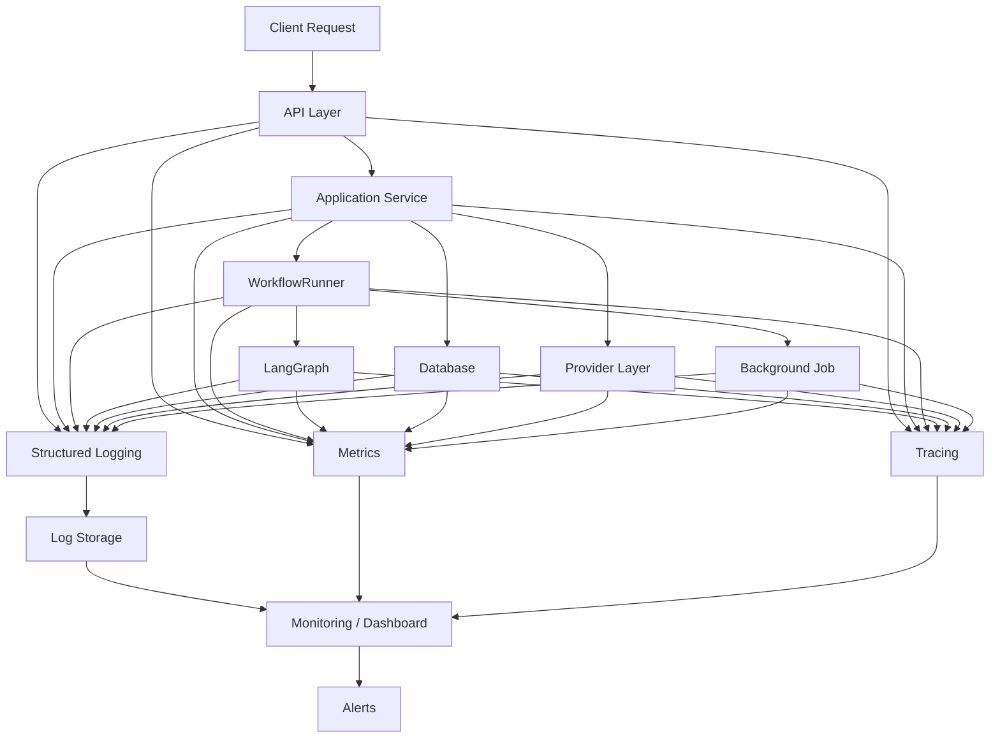

# 11 — Observability And Logging

## 1. Document Purpose

This document defines the observability and logging architecture for the Rent Reminder backend.

The purpose is to make the system:

- Observable
- Debuggable
- Traceable
- Measurable
- Operationally recoverable

The observability system should allow the engineering team to answer:

```text
What happened?
When did it happen?
Where did it happen?
Why did it happen?
Which request caused it?
Which workflow was involved?
Which job was involved?
Which provider was involved?
Was the operation successful?
How long did it take?
Was it retried?
What was the final state?
````

This document defines the target observability architecture.

Where the existing implementation has not been verified from the repository, it is explicitly marked:

`TO BE VERIFIED FROM REPOSITORY`

No existing logging or monitoring behavior should be assumed without verification.

---

# 2. Observability Objectives

The backend observability system should provide visibility into:

```text
API Requests
Application Services
Database Operations
Workflows
WorkflowRunner
Background Jobs
Scheduling
External Providers
Events
Errors
Retries
Security Events
System Health
Performance
```

The primary objectives are:

1. Detect failures.
2. Diagnose failures.
3. Trace operations across layers.
4. Measure system performance.
5. Monitor background jobs.
6. Monitor provider reliability.
7. Detect abnormal behavior.
8. Support incident investigation.
9. Support production debugging.
10. Provide actionable operational information.

---

# 3. Observability Pillars

The observability architecture consists of three primary pillars:

```text
              Observability
                   │
        ┌──────────┼──────────┐
        ↓          ↓          ↓
      Logs      Metrics     Traces
```

### Logs

Describe individual events.

### Metrics

Measure system behavior over time.

### Traces

Connect one operation across multiple components.

---

# 4. Target Observability Architecture



---

# 5. Current Observability Implementation

The following must be verified from the repository:

```text
Logging framework
Log format
Log destinations
Log levels
Request IDs
Correlation IDs
Metrics implementation
Tracing implementation
Monitoring platform
Alerting platform
Health endpoints
Background job monitoring
Provider monitoring
Error tracking
```

Current implementation:

```text
TO BE VERIFIED FROM REPOSITORY
```

---

# 6. Logging Strategy

The backend should use structured logging.

Logs should preferably be represented as structured records rather than arbitrary text strings.

Example:

```json
{
  "timestamp": "2026-08-15T10:00:00Z",
  "level": "INFO",
  "service": "rent-reminder-backend",
  "operation": "send_rent_reminder",
  "request_id": "req-123",
  "job_id": "job-456",
  "workflow_id": "workflow-789",
  "status": "success"
}
```

The exact logging library is:

```text
TO BE VERIFIED FROM REPOSITORY
```

---

# 7. Log Levels

The system should use consistent log levels.

Recommended levels:

```text
DEBUG
INFO
WARNING
ERROR
CRITICAL
```

---

# 8. DEBUG Level

DEBUG logs are intended for development and detailed troubleshooting.

Examples:

```text
Workflow node started
Provider adapter selected
Database operation started
Job payload validated
```

DEBUG logging should generally be restricted or reduced in production.

---

# 9. INFO Level

INFO logs represent normal operational events.

Examples:

```text
Request received
Workflow started
Workflow completed
Job started
Job completed
Reminder successfully sent
Provider request completed
```

---

# 10. WARNING Level

WARNING represents an abnormal but recoverable situation.

Examples:

```text
Retry scheduled
Provider rate limit encountered
Job retry count increased
Slow database operation
Fallback provider selected
Non-critical configuration issue
```

---

# 11. ERROR Level

ERROR represents a failed operation that requires investigation or recovery.

Examples:

```text
Provider request failed
Database operation failed
Workflow node failed
Job failed
API request failed
Webhook processing failed
```

---

# 12. CRITICAL Level

CRITICAL represents a severe system-level failure.

Examples:

```text
Application cannot initialize
Critical configuration missing
Database unavailable during startup
Essential infrastructure unavailable
```

Critical events should trigger operational alerting where appropriate.

---

# 13. Log Structure

A standard log record should contain, where applicable:

```text
timestamp
level
service
environment
module
operation
request_id
correlation_id
workflow_id
job_id
event_id
provider
duration_ms
status
error_code
message
```

Not every log event requires every field.

---

# 14. Request ID

Every incoming API request should have a request identifier where practical.

Example:

```text
request_id = req-123456
```

The request ID should be propagated through relevant application layers.

---

# 15. Correlation ID

A correlation ID connects related operations that may span multiple requests or asynchronous jobs.

Example:

```text
Initial Request
      ↓
correlation_id
      ↓
Workflow
      ↓
Background Job
      ↓
Provider Call
```

This makes multi-step operations easier to investigate.

---

# 16. Request Flow Logging

A typical API request should produce useful lifecycle information.

```text
Request Started
      ↓
Authentication
      ↓
Authorization
      ↓
Validation
      ↓
Service Operation
      ↓
Database / Workflow / Provider
      ↓
Request Completed
```

Avoid creating excessive logs for every internal function call.

---

# 17. API Request Metrics

The API layer should measure:

```text
Request count
Success count
Error count
Request duration
Status code distribution
Endpoint usage
```

Recommended dimensions:

```text
method
route
status_code
```

Avoid using unrestricted user-controlled values as metric labels.

---

# 18. API Request Logging

A successful request may be logged as:

```json
{
  "level": "INFO",
  "operation": "api_request",
  "method": "POST",
  "route": "/reminders",
  "status_code": 201,
  "duration_ms": 125,
  "request_id": "req-123"
}
```

The exact API routes must be verified from the actual API implementation.

---

# 19. Slow Request Detection

The system should identify unusually slow API requests.

Conceptually:

```text
Request Duration
       ↓
Below Threshold → Normal
       ↓
Above Threshold → Warning / Metric
```

The threshold should be configurable rather than hard-coded into the SDD.

---

# 20. Application Service Observability

Application services should expose useful operational information.

Examples:

```text
Operation started
Operation completed
Operation failed
Operation duration
Resource identifier
Result state
```

Do not log entire sensitive domain objects unnecessarily.

---

# 21. Database Observability

Database operations should be observable at the appropriate level.

Useful metrics include:

```text
Query duration
Transaction duration
Connection errors
Connection pool exhaustion
Transaction failures
Database availability
```

---

# 22. Database Query Logging

Raw SQL logging should be used carefully.

Do not log sensitive values.

Avoid:

```text
Full SQL + personal data + credentials
```

Prefer:

```text
operation=fetch_lease
duration_ms=32
status=success
```

Detailed query logging, if required, should be controlled by environment/configuration.

---

# 23. Database Failure Logging

Database failures should include useful context:

```text
operation
error_code
request_id
workflow_id
job_id
duration
```

Do not expose:

```text
database password
connection string
sensitive query parameters
```

---

# 24. Workflow Observability

Every important workflow execution should be observable.

Recommended events:

```text
workflow_started
workflow_completed
workflow_failed
workflow_retry_scheduled
workflow_cancelled
```

---

# 25. Workflow Metrics

Useful workflow metrics include:

```text
Workflow execution count
Workflow success count
Workflow failure count
Workflow duration
Workflow retry count
Workflow completion rate
```

Dimensions may include:

```text
workflow_type
status
```

Avoid high-cardinality labels such as unrestricted tenant names.

---

# 26. Workflow ID

Each workflow execution should have a unique identifier where practical.

Example:

```text
workflow_id = wf-123456
```

This identifier should appear in related logs.

---

# 27. Workflow Step Observability

Important workflow steps should produce lifecycle information.

Example:

```text
Workflow Started
      ↓
Eligibility Check
      ↓
Reminder Decision
      ↓
Notification Preparation
      ↓
Provider Call
      ↓
State Update
      ↓
Workflow Completed
```

Do not log every trivial internal operation.

---

# 28. LangGraph Observability

If LangGraph is used, observability should cover:

```text
Graph execution
Node execution
Node duration
Node failures
Tool calls
State transitions
External calls
```

The exact LangGraph instrumentation must be:

```text
TO BE VERIFIED FROM REPOSITORY
```

---

# 29. LangGraph Node Metrics

Useful metrics include:

```text
Node execution count
Node success count
Node failure count
Node duration
Node retry count
```

Example:

```text
node = property_search
status = success
duration_ms = 150
```

---

# 30. Workflow State Logging

Workflow state should not automatically be logged in full.

Instead, log only useful metadata.

Example:

```json
{
  "workflow_id": "wf-123",
  "state": "REMINDER_ELIGIBLE",
  "operation": "eligibility_check"
}
```

Avoid logging sensitive tenant or payment information unnecessarily.

---

# 31. Background Job Observability

Every important background job should have lifecycle visibility.

Recommended events:

```text
job_created
job_started
job_completed
job_failed
job_retry_scheduled
job_dead_lettered
job_cancelled
```

---

# 32. Job Metrics

Recommended job metrics:

```text
Jobs created
Jobs started
Jobs completed
Jobs failed
Jobs retried
Jobs dead-lettered
Job execution duration
Queue depth
Job age
```

---

# 33. Job ID

Each job should have a unique identifier.

Example:

```text
job_id = job-123456
```

The job ID should appear in:

```text
Job logs
Workflow logs
Provider logs
Error logs
Retry logs
```

---

# 34. Retry Observability

Every retry should record:

```text
job_id
attempt_number
error_code
retry_reason
next_attempt_at
```

Example:

```json
{
  "event": "job_retry_scheduled",
  "job_id": "job-123",
  "attempt": 2,
  "reason": "PROVIDER_TIMEOUT"
}
```

---

# 35. Dead-Letter Observability

When a job reaches its retry limit:

```text
Job
 ↓
Retry
 ↓
Retry
 ↓
Retry Limit
 ↓
Dead Letter
```

The event should be clearly recorded.

Example:

```text
job_dead_lettered
```

---

# 36. Scheduling Observability

Scheduled jobs should be observable.

Track:

```text
Schedule triggered
Schedule execution time
Number of records selected
Jobs created
Schedule duration
Schedule failures
```

---

# 37. Rent Reminder Observability

The rent reminder workflow should provide enough information to determine:

```text
How many leases were checked?
How many were eligible?
How many reminders were created?
How many were sent?
How many failed?
How many were retried?
How many reached manual intervention?
```

---

# 38. Reminder Metrics

Recommended metrics:

```text
rent_reminders_checked_total
rent_reminders_eligible_total
rent_reminders_created_total
rent_reminders_sent_total
rent_reminders_failed_total
rent_reminders_retried_total
rent_reminders_manual_intervention_total
```

Metric names are recommendations and must be aligned with the actual metrics implementation.

---

# 39. Provider Observability

Every external provider integration should be observable.

Useful information:

```text
Provider name
Operation
Request duration
Success/failure
Status category
Retry count
Timeout count
Rate-limit events
```

---

# 40. Provider Metrics

Recommended metrics:

```text
provider_requests_total
provider_request_errors_total
provider_request_duration
provider_timeouts_total
provider_rate_limits_total
```

---

# 41. Provider Privacy

Do not log full provider payloads by default.

Especially avoid logging:

```text
Authentication tokens
API keys
Personal messages
Sensitive tenant data
Payment information
Full authorization headers
```

If payload logging is temporarily required for debugging, it should be controlled and sanitized.

---

# 42. Provider Failure Classification

Provider failures should be categorized.

Example:

```text
timeout
rate_limit
authentication_error
validation_error
server_error
network_error
unknown_error
```

This makes monitoring and retry decisions more reliable.

---

# 43. Event Observability

Events should have identifiers where practical.

Example:

```text
event_id
event_type
created_at
source
correlation_id
```

Events should be traceable from creation to processing.

---

# 44. Event Processing Metrics

Useful metrics include:

```text
Events published
Events consumed
Events processed successfully
Events failed
Events retried
Events dead-lettered
Event processing duration
```

---

# 45. Event Failure Logging

An event failure should include:

```text
event_id
event_type
consumer
error_code
attempt_number
correlation_id
```

Do not log sensitive event payloads in full.

---

# 46. Error Observability

All normalized application errors should contain enough context for diagnosis.

Recommended fields:

```text
error_code
operation
request_id
correlation_id
workflow_id
job_id
event_id
provider
```

Only fields relevant to the operation need to be included.

---

# 47. Error Metrics

Recommended error metrics:

```text
errors_total
api_errors_total
workflow_errors_total
job_errors_total
provider_errors_total
database_errors_total
```

Errors should also be categorized by stable error code.

---

# 48. Exception Tracking

Unexpected exceptions should be captured by the application's error-monitoring mechanism where available.

The exact error tracking system is:

```text
TO BE VERIFIED FROM REPOSITORY / DEPLOYMENT
```

---

# 49. Trace Architecture

Distributed tracing may be used to connect:

```text
API Request
    ↓
Service
    ↓
Workflow
    ↓
Database
    ↓
Provider
```

Example:

```text
Trace
 ├── API Span
 ├── Service Span
 ├── Workflow Span
 ├── Database Span
 └── Provider Span
```

The actual tracing technology is:

```text
TO BE VERIFIED FROM REPOSITORY
```

---

# 50. Trace IDs

When distributed tracing is implemented, trace IDs should be correlated with logs.

Example:

```text
trace_id
request_id
workflow_id
job_id
```

This allows engineers to move between:

```text
Trace
  ↕
Logs
  ↕
Metrics
```

---

# 51. Metrics Architecture

Metrics should measure system behavior rather than individual users.

Recommended metric categories:

```text
Traffic
Latency
Errors
Jobs
Workflows
Providers
Database
Infrastructure
```

---

# 52. RED Metrics

For APIs, the RED methodology can be used:

```text
Rate
Errors
Duration
```

Example:

```text
Request Rate
Error Rate
Request Duration
```

---

# 53. USE Metrics

For infrastructure components, the USE methodology can be applied:

```text
Utilization
Saturation
Errors
```

This is particularly useful for:

```text
CPU
Memory
Database connections
Queue workers
```

---

# 54. Health Checks

The backend should expose appropriate health information.

Conceptually:

```text
/health
```

Possible checks:

```text
Application alive
Database reachable
Critical dependency available
```

The exact health endpoint must be:

```text
TO BE VERIFIED FROM REPOSITORY
```

---

# 55. Liveness

Liveness answers:

> "Is the application process running?"

A liveness check should be lightweight and should not depend on every external provider.

---

# 56. Readiness

Readiness answers:

> "Can this application currently serve requests?"

Readiness may check required dependencies depending on deployment architecture.

---

# 57. Health Check Security

Health endpoints should not expose sensitive configuration.

Do not return:

```text
Database credentials
API keys
Environment secrets
Internal connection strings
```

---

# 58. Monitoring Dashboard

A production dashboard should provide high-level visibility into:

```text
API traffic
API errors
API latency
Workflow execution
Job queues
Job failures
Provider health
Database health
System errors
```

---

# 59. Suggested Dashboard Sections

```text
┌──────────────────────────────┐
│ System Health                │
├──────────────────────────────┤
│ API                          │
│ Requests / Errors / Latency  │
├──────────────────────────────┤
│ Workflows                    │
│ Success / Failure / Duration │
├──────────────────────────────┤
│ Background Jobs              │
│ Queue / Failures / Retries   │
├──────────────────────────────┤
│ Providers                    │
│ Success / Failure / Latency  │
├──────────────────────────────┤
│ Database                     │
│ Errors / Connections / Latency│
└──────────────────────────────┘
```

---

# 60. Alerting Strategy

Alerts should be based on meaningful operational conditions.

Examples:

```text
High API error rate
High provider failure rate
Database unavailable
Large queue backlog
Large dead-letter count
Repeated workflow failures
High latency
Repeated authentication failures
```

---

# 61. Alert Severity

Recommended severity levels:

```text
INFO
WARNING
CRITICAL
```

Not every logged error should generate an alert.

---

# 62. Alert Fatigue

The system should avoid generating excessive alerts.

Prefer:

```text
Alert on sustained abnormal behavior
```

rather than:

```text
Alert on every individual failure
```

---

# 63. Observability During Retries

Retries should remain visible.

Example:

```text
Initial Attempt
      ↓
Failure
      ↓
Retry #1
      ↓
Failure
      ↓
Retry #2
      ↓
Success
```

The logs and metrics should make this lifecycle clear.

---

# 64. Observability During Partial Failure

For operations involving multiple components:

```text
API
 ↓
Database
 ↓
Workflow
 ↓
Provider
```

If the provider fails after the database operation succeeds, observability must make the partial state visible.

This is especially important for reminder sending because duplicate notifications must be avoided.

---

# 65. Idempotency Observability

When an idempotent operation is detected, the system may record:

```text
operation
idempotency_key
result
```

Do not log sensitive idempotency values if they contain sensitive information.

---

# 66. Security Logging

Security events should be observable.

Examples:

```text
Authentication failures
Authorization failures
Invalid webhook signatures
Rate-limit violations
Suspicious request patterns
Administrative operations
```

Security logging must follow the rules in:

`10_Security_And_Error_Handling.md`

---

# 67. Sensitive Data Rules

The following must never be logged in plaintext:

```text
Passwords
API keys
Access tokens
Private keys
Authorization headers
Webhook secrets
Database passwords
```

Sensitive business data should also be minimized.

---

# 68. PII Logging

Personally identifiable information should not be logged unless there is a clear operational requirement.

If logging is required:

```text
Minimize
Mask
Redact
Restrict access
Define retention
```

---

# 69. Log Retention

Log retention should be defined according to:

```text
Operational requirements
Security requirements
Compliance requirements
Storage cost
Data sensitivity
```

The exact retention period is:

```text
TO BE VERIFIED FROM DEPLOYMENT / OPERATIONS REQUIREMENTS
```

---

# 70. Log Access Control

Logs may contain sensitive operational information.

Access should therefore be restricted to authorized personnel and systems.

---

# 71. Environment-Specific Logging

Recommended behavior:

```text
Development
    ↓
More detailed logs

Testing
    ↓
Test-focused logs

Production
    ↓
Structured + controlled logs
```

Production should avoid excessive DEBUG logging.

---

# 72. Sampling

For high-volume systems, tracing or verbose logging may require sampling.

Sampling decisions should preserve enough information for:

```text
Errors
Slow requests
Important workflows
Critical operations
```

The exact sampling strategy is:

```text
TO BE VERIFIED FROM DEPLOYMENT
```

---

# 73. Performance Considerations

Observability must not significantly degrade application performance.

Avoid:

```text
Logging huge payloads
Synchronous expensive logging
Excessive database logging
High-cardinality metrics
Unnecessary trace spans
```

---

# 74. High-Cardinality Metric Labels

Avoid metric labels such as:

```text
tenant_id
user_id
email
phone_number
full_property_address
```

for general-purpose metrics.

These values can create excessive metric cardinality.

Use logs or traces for detailed entity-level investigation instead.

---

# 75. Observability for Scheduled Rent Checks

A scheduled rent-check operation should expose:

```text
schedule_id / execution_id
started_at
completed_at
records_checked
eligible_records
jobs_created
failures
duration
```

Exact identifiers depend on the implementation.

---

# 76. Observability for Reminder Sending

A reminder send operation should make it possible to determine:

```text
Reminder ID
Lease ID
Job ID
Workflow ID
Provider
Attempt
Result
Failure reason
Duration
```

Sensitive tenant information should not be included unnecessarily.

---

# 77. Example Successful Reminder Flow

```text
Scheduled Check
      ↓
Eligibility Check
      ↓
Reminder Job Created
      ↓
Job Started
      ↓
Workflow Started
      ↓
Provider Request
      ↓
Provider Success
      ↓
State Updated
      ↓
Job Completed
```

Each major lifecycle stage should be observable.

---

# 78. Example Failed Reminder Flow

```text
Reminder Job
      ↓
Job Started
      ↓
Workflow Started
      ↓
Provider Request
      ↓
Timeout
      ↓
Provider Error
      ↓
Retry Scheduled
      ↓
Retry
      ↓
Success / Dead Letter
```

The complete lifecycle should be traceable.

---

# 79. Observability Data Model

Conceptually, the system works with:

```text
Request
   │
   ├── request_id
   │
   └── correlation_id
          │
          ├── workflow_id
          │      │
          │      └── job_id
          │
          └── event_id
```

The exact persistence requirements depend on the system architecture.

---

# 80. Operational Investigation Workflow

When an incident occurs:

```text
1. Identify alert
        ↓
2. Find timestamp
        ↓
3. Find request/correlation ID
        ↓
4. Inspect logs
        ↓
5. Inspect workflow/job
        ↓
6. Inspect provider/database events
        ↓
7. Identify root cause
        ↓
8. Apply recovery
        ↓
9. Verify system recovery
        ↓
10. Add regression protection
```

---

# 81. Root Cause Analysis

For important incidents, record:

```text
Incident
Impact
Start time
End time
Root cause
Affected component
Recovery action
Preventive action
```

---

# 82. Observability Testing

Observability itself should be tested.

Tests should verify:

```text
Request IDs are generated
Correlation IDs propagate
Errors are logged
Sensitive fields are redacted
Metrics increment correctly
Workflow failures are visible
Job retries are visible
Dead-letter events are visible
Provider failures are classified
Health checks behave correctly
```

---

# 83. Logging Test Example

Given:

```text
Provider timeout
```

Expected:

```text
ERROR log
error_code=PROVIDER_TIMEOUT
job_id present
workflow_id present where applicable
provider identified
sensitive data absent
```

---

# 84. Metric Test Example

Given:

```text
Reminder successfully sent
```

Expected:

```text
rent_reminders_sent_total
```

should increase by one, according to the actual metrics implementation.

---

# 85. Trace Test Example

Given:

```text
API → Workflow → Provider
```

The trace should allow engineers to identify the relationship between these operations if distributed tracing is enabled.

---

# 86. Observability Failure Handling

Observability failures should not normally cause business operations to fail.

For example:

```text
Application Operation
       ↓
Logging Failure
       ↓
Business Operation should continue
```

unless the architecture explicitly requires durable audit logging for a security-critical operation.

---

# 87. Logging Architecture Boundary

Logging should remain separate from business logic.

Prefer:

```text
Business Logic
      ↓
Log Event
      ↓
Logging Infrastructure
```

Avoid embedding logging-specific behavior into every business decision.

---

# 88. Monitoring Architecture Boundary

Monitoring should consume operational signals from the application.

```text
Application
    ↓
Logs / Metrics / Traces
    ↓
Observability Platform
    ↓
Dashboard / Alerts
```

The application should not contain hard-coded assumptions about a specific monitoring dashboard.

---

# 89. Current Implementation Verification Checklist

Before implementation, verify:

```text
[ ] Logging library
[ ] Logging configuration
[ ] Log format
[ ] Log destination
[ ] Request ID support
[ ] Correlation ID support
[ ] Error tracking
[ ] Metrics library
[ ] Metrics endpoint
[ ] Tracing library
[ ] Trace propagation
[ ] Health endpoint
[ ] Background job metrics
[ ] Workflow metrics
[ ] Provider metrics
[ ] Database metrics
[ ] Monitoring platform
[ ] Alerting platform
[ ] Log retention
[ ] Log redaction
[ ] PII handling
```

---

# 90. Recommended Observability Events

The following event names may be used as a conceptual standard:

```text
api_request_started
api_request_completed
api_request_failed

workflow_started
workflow_completed
workflow_failed
workflow_retry_scheduled

job_created
job_started
job_completed
job_failed
job_retry_scheduled
job_dead_lettered

provider_request_started
provider_request_completed
provider_request_failed
provider_timeout
provider_rate_limited

event_published
event_processed
event_failed

database_operation_failed

security_authentication_failed
security_authorization_failed
security_webhook_verification_failed
```

Actual event names should be aligned with the existing implementation.

---

# 91. Recommended Metrics Summary

```text
API
├── request_count
├── error_count
└── request_duration

Workflow
├── execution_count
├── failure_count
├── retry_count
└── duration

Jobs
├── created
├── completed
├── failed
├── retried
├── dead_lettered
└── duration

Providers
├── requests
├── failures
├── timeouts
├── rate_limits
└── duration

Database
├── errors
├── connection_failures
├── query_duration
└── transaction_failures

Security
├── authentication_failures
├── authorization_failures
└── webhook_verification_failures
```

---

# 92. Observability Golden Signals

The backend should prioritize:

```text
Latency
Traffic
Errors
Saturation
```

For the Rent Reminder system, this can be extended with:

```text
Workflow Success
Job Backlog
Provider Reliability
Reminder Delivery Success
```

---

# 93. Production Observability Minimum

Before production deployment, the system should have at minimum:

```text
Structured application logs
Error logging
Request/correlation identifiers
Health checks
API error metrics
Workflow failure visibility
Job failure visibility
Provider failure visibility
Sensitive-data redaction
Basic alerting
```

Advanced tracing and dashboards can be introduced according to system complexity and operational requirements.

---

# 94. Final Observability Principle

The system should follow this principle:

> Every important operation should produce enough observable information to understand its lifecycle, diagnose failures, measure performance, and safely recover without exposing sensitive information.

The observability architecture should connect:

```text
Logs
  +
Metrics
  +
Traces
  +
Errors
  +
Workflow State
  +
Job State
```

into a coherent operational picture.

---

# 95. Document Status

**Document:** `11_Observability_And_Logging.md`

**Architecture Area:** Observability, Logging, Metrics, Tracing, Monitoring

**Purpose:** Define how the Rent Reminder backend records, measures, traces, monitors, and investigates system behavior.

**Related Documents:**

* `00_SDD_Master.md`
* `01_Current_System_Architecture.md`
* `02_Target_Backend_Architecture.md`
* `03_Database_Wiring.md`
* `04_API_And_Service_Layer.md`
* `05_Event_And_Pipeline_Architecture.md`
* `06_WorkflowRunner_Architecture.md`
* `07_LangGraph_Integration.md`
* `08_Integration_And_Provider_Layer.md`
* `09_Background_Jobs_And_Scheduling.md`
* `10_Security_And_Error_Handling.md`
* `12_Backend_Testing_Strategy.md`

**Phase Mapping:**

* Phase 1 — Stabilization
* Phase 2 — Database Unification
* Phase 3 — Live Data Wiring
* Phase 4 — API Layer
* Phase 5 — Scheduling and Alerting
* Phase 6 — Hardening

**Status:** Architecture Definition

```

