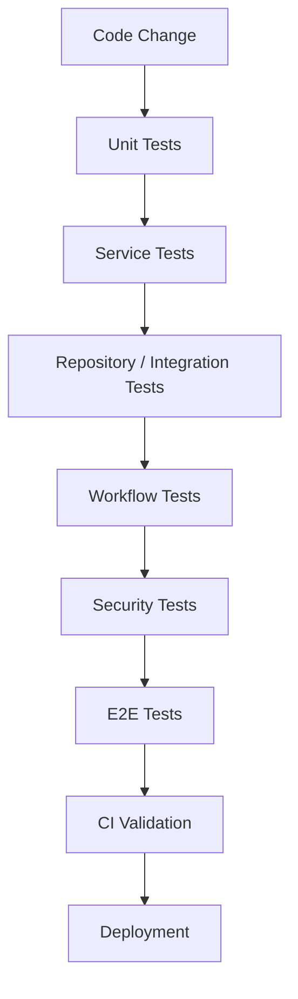
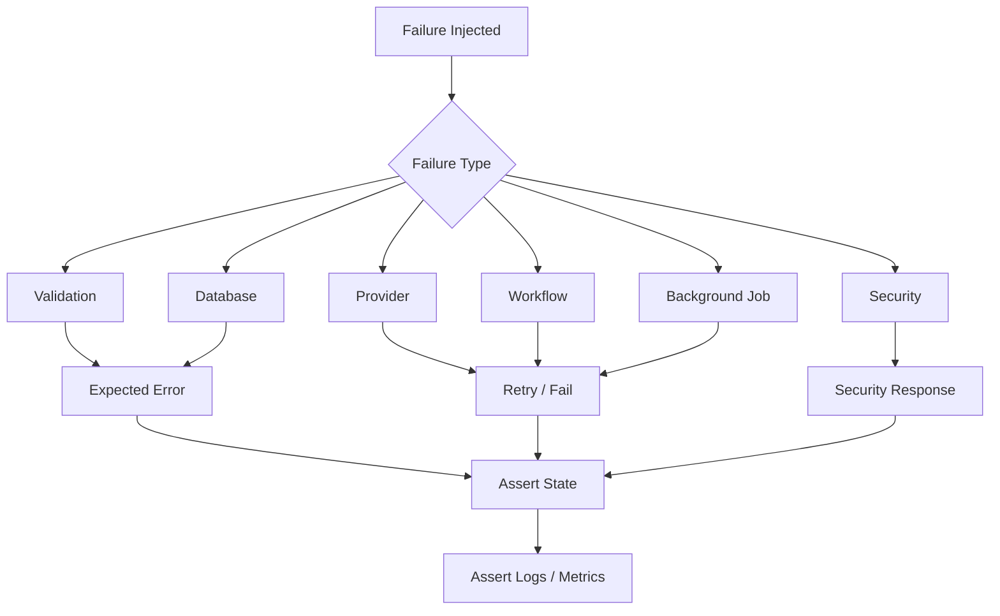

# 12 — Backend Testing Strategy

## 1. Document Purpose

This document defines the testing strategy for the Rent Reminder backend.

The purpose is to establish a consistent approach for testing:

- Database access
- Repository layer
- Service layer
- API layer
- Event processing
- WorkflowRunner
- LangGraph integration
- Provider integrations
- Background jobs
- Scheduling
- Error handling
- Security boundaries
- Idempotency
- Retry behavior
- End-to-end business workflows

The objective is to ensure that backend changes are:

- Correct
- Safe
- Testable
- Maintainable
- Regression-resistant
- Production-ready

This document defines the target testing architecture.

Where the existing implementation has not been verified from the repository, it is explicitly marked:

`TO BE VERIFIED FROM REPOSITORY`

No testing framework, directory, fixture, or test behavior should be assumed to already exist without repository verification.

---

# 2. Testing Objectives

The backend testing strategy should verify:

```text
Correctness
Data Integrity
Business Logic
API Behavior
Workflow Behavior
Provider Integration
Failure Handling
Security
Idempotency
Scheduling
Background Jobs
Regression Safety
````

The testing strategy should provide confidence at multiple levels rather than relying only on end-to-end tests.

---

# 3. Testing Pyramid

The recommended testing model is:

```text
                    E2E Tests
                   /         \
              Integration Tests
             /                 \
          Service / Workflow Tests
         /                       \
              Unit Tests
```

The majority of tests should be fast lower-level tests.

Higher-level tests should be fewer and focused on critical system behavior.

---

# 4. Testing Layers

The backend should use the following conceptual testing layers:

```text
1. Unit Tests
2. Repository Tests
3. Service Tests
4. API Tests
5. Workflow Tests
6. Integration Tests
7. Provider Tests
8. Background Job Tests
9. End-to-End Tests
10. Security Tests
11. Regression Tests
```

---

# 5. Current Testing Implementation

The following must be verified from the actual repository:

```text
Testing framework
Test runner
Test directory
Test configuration
Fixtures
Factories
Mocks
Stubs
Integration test setup
Database test setup
API test setup
Workflow test setup
Provider mocks
Coverage configuration
CI test execution
```

Current implementation:

```text
TO BE VERIFIED FROM REPOSITORY
```

---

# 6. Testing Principles

The backend tests should follow these principles:

1. Test behavior rather than implementation details.
2. Keep unit tests fast.
3. Keep tests deterministic.
4. Avoid unnecessary external dependencies.
5. Isolate tests from production data.
6. Use realistic test fixtures.
7. Test both success and failure paths.
8. Test important edge cases.
9. Test idempotency.
10. Test retry behavior.
11. Test authorization boundaries.
12. Keep tests independent.
13. Avoid test order dependencies.
14. Make failures easy to diagnose.
15. Add regression tests for fixed bugs.

---

# 7. Test Isolation

Each test should be isolated from other tests.

Avoid:

```text
Test A modifies shared state
        ↓
Test B depends on Test A
```

Prefer:

```text
Test A
 ↓
Clean State

Test B
 ↓
Clean State
```

---

# 8. Deterministic Testing

Tests should produce the same result when executed repeatedly under the same conditions.

Avoid uncontrolled dependencies on:

```text
Current time
Random values
External APIs
Network availability
Production databases
Environment-specific state
```

Where necessary, use controlled test values or dependency injection.

---

# 9. Unit Testing

Unit tests should verify isolated business logic.

Examples:

```text
Rent eligibility calculation
Reminder interval calculation
Reminder state transitions
Input normalization
Error classification
Retry decision
Idempotency decision
Date/time calculations
```

Unit tests should not require real external services.

---

# 10. Unit Test Characteristics

A good unit test should generally:

```text
Arrange
   ↓
Act
   ↓
Assert
```

Example:

```text
Arrange:
Lease is eligible for reminder.

Act:
Run reminder eligibility function.

Assert:
Result = eligible.
```

---

# 11. Domain Logic Testing

Important business rules should have direct tests.

Examples:

```text
Rent due
Rent overdue
Reminder eligible
Reminder not eligible
Reminder already sent
Payment received
Manual intervention required
```

The exact business rules must follow the actual product requirements and implementation.

---

# 12. Date and Time Testing

Time-dependent logic requires special attention.

Tests should cover:

```text
Exact due date
Before due date
After due date
Reminder interval boundary
Month boundaries
Year boundaries
Timezone behavior
Daylight-saving behavior where applicable
```

The system's official timezone strategy must be verified from the architecture and deployment configuration.

---

# 13. Database Testing

Database tests should verify:

```text
Schema behavior
CRUD operations
Relationships
Constraints
Indexes where relevant
Transactions
Queries
Repository behavior
Data integrity
```

---

# 14. Database Test Isolation

Tests should not modify production data.

Preferred approach:

```text
Test
 ↓
Dedicated Test Database
```

or another isolated database strategy appropriate to the technology.

The exact database testing mechanism is:

```text
TO BE VERIFIED FROM REPOSITORY
```

---

# 15. Repository Testing

Repository tests should verify database access behavior.

Examples:

```text
Create lease
Fetch lease
Update lease
Fetch eligible leases
Create reminder
Fetch reminder state
Update reminder state
```

Tests should verify returned domain data rather than internal implementation details wherever possible.

---

# 16. Repository Error Testing

Test failures such as:

```text
Database unavailable
Connection failure
Constraint violation
Missing record
Transaction failure
Invalid data
```

The repository should translate low-level failures into appropriate application-level errors where required.

---

# 17. Transaction Testing

Transaction behavior must be tested when multiple database operations form one atomic business operation.

Example:

```text
BEGIN
   Create reminder
   Update workflow state
COMMIT
```

If one operation fails:

```text
ROLLBACK
```

Expected test:

```text
No partial state remains.
```

---

# 18. Transaction Boundary Testing

Tests should verify that transaction boundaries are correctly placed.

Particularly important:

```text
Database transaction
      ↓
Do not hold transaction open
while waiting for external provider
```

External provider calls should normally occur outside long-running database transactions.

---

# 19. Service Layer Testing

Service tests should verify business operations that combine:

```text
Repositories
Validation
Business Rules
Workflow
Providers
Transactions
```

Examples:

```text
Create reminder
Process reminder
Send reminder
Handle payment update
Handle reminder failure
```

---

# 20. Service Success Tests

Every important service method should have at least one successful execution test.

Example:

```text
Valid lease
    ↓
Eligible reminder
    ↓
Reminder created
    ↓
Expected state returned
```

---

# 21. Service Failure Tests

Services should also be tested against:

```text
Invalid input
Missing resource
Unauthorized operation
Conflict
Database failure
Provider failure
Workflow failure
Unexpected dependency failure
```

---

# 22. API Testing

API tests should verify the external contract.

Test:

```text
HTTP method
URL
Request body
Headers
Authentication
Authorization
Validation
Status code
Response structure
Error response
```

---

# 23. API Success Testing

Example:

```text
POST /reminders
      ↓
Valid request
      ↓
Expected status
      ↓
Expected response
```

Exact API routes must be verified from:

`04_API_And_Service_Layer.md`

and the actual repository.

---

# 24. API Validation Testing

Test invalid requests such as:

```text
Missing required field
Wrong data type
Invalid identifier
Invalid date
Invalid enum value
Malformed request body
Oversized input where limits exist
```

Expected behavior:

```text
Request rejected
No business operation executed
Safe validation error returned
```

---

# 25. API Authentication Testing

Protected endpoints should be tested with:

```text
No credentials
Invalid credentials
Expired credentials
Valid credentials
```

Expected behavior should match the implemented authentication mechanism.

---

# 26. API Authorization Testing

Test:

```text
Authorized actor
Unauthorized actor
Wrong resource owner
Insufficient role/permission
```

Example:

```text
User A
   ↓
Requests User B's resource
   ↓
403 / appropriate authorization failure
```

---

# 27. API Error Testing

Verify consistent error responses for:

```text
400
401
403
404
409
429
500
502 / 503 where applicable
```

Exact mappings must follow the API implementation.

---

# 28. API Contract Testing

API tests should ensure that response structures remain stable.

Example:

```json
{
  "error": {
    "code": "VALIDATION_ERROR",
    "message": "Invalid request."
  }
}
```

The exact response schema should follow the API specification.

---

# 29. Workflow Testing

Workflows should be tested independently from the HTTP layer where practical.

Tests should verify:

```text
Workflow entry
Decision logic
State transitions
Node execution
Success path
Failure path
Retry path
Completion state
```

---

# 30. Workflow Success Test

Example:

```text
Eligible Lease
      ↓
Eligibility Node
      ↓
Reminder Decision
      ↓
Notification
      ↓
State Update
      ↓
Workflow Completed
```

Expected:

```text
Correct final state
No duplicate reminder
Expected event/job generated
```

---

# 31. Workflow Failure Test

Example:

```text
Eligible Lease
      ↓
Provider Failure
      ↓
Workflow Failure
      ↓
Retry / Recovery
```

Verify:

```text
Failure recorded
State remains consistent
Retry behavior is correct
No duplicate business action
```

---

# 32. Workflow State Testing

Each important state transition should be tested.

Conceptually:

```text
PENDING
   ↓
ELIGIBLE
   ↓
PROCESSING
   ↓
SENT
```

Failure example:

```text
PROCESSING
   ↓
FAILED
   ↓
RETRY
```

Exact state names must be verified from the actual implementation.

---

# 33. WorkflowRunner Testing

The WorkflowRunner should be tested for:

```text
Workflow selection
Workflow execution
Input validation
Error propagation
Retry handling
State handling
Completion handling
```

---

# 34. WorkflowRunner Failure Tests

Test:

```text
Unknown workflow
Invalid workflow input
Workflow execution failure
Workflow timeout
Provider failure
Unexpected exception
```

Expected behavior:

```text
Error normalized
Execution marked appropriately
No silent failure
Recovery path triggered where applicable
```

---

# 35. LangGraph Testing

If LangGraph is used, test:

```text
Graph initialization
Graph execution
Node behavior
State transitions
Tool invocation
Node failure
External dependency failure
Final state
```

The exact graph structure must follow:

`07_LangGraph_Integration.md`

---

# 36. LangGraph Node Tests

Each important node should have focused tests.

Example:

```text
Intent Node
Property/Search Node
CRM Node
Appointment Node
Lead Qualification Node
Summary Node
```

Only nodes actually present in the project should be tested.

The current node list must be verified from the repository.

---

# 37. LangGraph State Testing

Tests should verify that nodes:

```text
Read required state
Modify only expected state
Preserve required state
Return valid state
Handle missing state safely
```

---

# 38. Tool Testing

If LangGraph nodes invoke tools, test:

```text
Valid tool input
Invalid tool input
Successful tool result
Empty result
Tool failure
Timeout
Unexpected response
```

---

# 39. Provider Integration Testing

Provider integrations should be tested separately from core business logic.

Examples:

```text
Messaging provider
Email provider
LLM provider
Payment provider
Other external APIs
```

The actual provider list must be verified from:

`08_Integration_And_Provider_Layer.md`

---

# 40. Provider Mocking

Unit and service tests should generally mock external providers.

Example:

```text
Application
   ↓
Provider Interface
   ↓
Mock Provider
```

This prevents tests from depending on:

```text
Internet
Provider availability
Provider costs
Provider rate limits
Real credentials
```

---

# 41. Provider Integration Tests

Where practical, a small number of integration tests may interact with real provider environments.

These should:

```text
Use test credentials
Use test data
Be isolated
Be controlled
Avoid production side effects
```

---

# 42. Provider Failure Testing

Simulate:

```text
Timeout
429
5xx
Invalid response
Authentication failure
Malformed response
Network failure
```

Verify that provider errors are normalized correctly.

---

# 43. Provider Retry Testing

Test:

```text
Retryable provider failure
      ↓
Retry
      ↓
Success
```

and:

```text
Permanent provider failure
      ↓
No unnecessary retry
```

---

# 44. Idempotency Testing

Idempotency is critical for reminder workflows.

Test:

```text
Same request twice
Same job twice
Same event twice
Retry after timeout
Duplicate webhook
Duplicate scheduling execution
```

Expected:

```text
No unintended duplicate business action.
```

---

# 45. Duplicate Reminder Test

Example:

```text
Reminder Job A
      ↓
Send Reminder
      ↓
Retry / Duplicate Job A
      ↓
System detects already processed operation
      ↓
No duplicate reminder
```

The exact idempotency mechanism must follow the implementation.

---

# 46. Background Job Testing

Background jobs should be tested independently.

Test:

```text
Job creation
Job validation
Job execution
Job success
Job failure
Retry
Retry exhaustion
Dead-letter handling
Cancellation
```

---

# 47. Job Payload Testing

Test:

```text
Valid payload
Missing fields
Invalid IDs
Invalid state
Malformed payload
Unexpected values
```

Invalid job payloads should fail safely.

---

# 48. Job Retry Testing

Verify:

```text
Attempt 1
 ↓
Failure
 ↓
Retry
 ↓
Attempt 2
 ↓
Success
```

Also verify:

```text
Failure
 ↓
Maximum retries
 ↓
Dead letter / manual intervention
```

---

# 49. Scheduling Testing

Scheduled workflows should be tested for:

```text
Correct execution time
Correct selection criteria
Duplicate execution protection
Job creation
Failure handling
```

---

# 50. Rent Reminder Scheduling Tests

Example:

```text
Scheduler executes
      ↓
Find eligible leases
      ↓
Create reminder jobs
      ↓
Jobs execute
```

Verify that:

```text
Only eligible leases are selected.
```

---

# 51. Scheduler Duplicate Execution

Test the scenario where a scheduler runs more than once unexpectedly.

Example:

```text
Scheduler Run #1
      ↓
Reminder Job Created

Scheduler Run #2
      ↓
Same lease detected
      ↓
Duplicate prevented
```

---

# 52. Event Testing

If the system uses events, test:

```text
Event creation
Event validation
Event publication
Event consumption
Event processing
Event failure
Event retry
Duplicate event
```

---

# 53. Event Idempotency

The same event may potentially be delivered more than once.

Test:

```text
Event A
Event A again
```

Expected:

```text
Business operation executed once
```

where the event represents an idempotent operation.

---

# 54. Webhook Testing

If webhooks exist, test:

```text
Valid signature
Invalid signature
Missing signature
Malformed payload
Duplicate event
Old/replayed event
Provider error
```

---

# 55. Security Testing

Security tests should verify:

```text
Authentication
Authorization
Resource isolation
Input validation
Secret protection
Webhook verification
Rate limiting where implemented
Error information disclosure
```

---

# 56. Tenant/Resource Isolation Testing

Where the system supports multiple tenants/users/resources:

```text
Tenant A
   ↓
Access Tenant B data
   ↓
Denied
```

This is a high-priority security test.

---

# 57. Sensitive Data Testing

Tests should ensure that sensitive information is not returned or logged unintentionally.

Verify:

```text
Passwords absent
API keys absent
Tokens absent
Authorization headers absent
Sensitive provider credentials absent
```

---

# 58. Error Handling Testing

Test the behavior described in:

`10_Security_And_Error_Handling.md`

including:

```text
Validation error
Authentication error
Authorization error
Not found
Conflict
Provider error
Database error
Workflow error
Job error
Unexpected exception
```

---

# 59. Error Response Testing

Verify that production-facing errors:

```text
Have stable error codes
Have safe messages
Do not expose stack traces
Do not expose secrets
Do not expose internal paths
```

---

# 60. Observability Testing

Tests should verify the requirements from:

`11_Observability_And_Logging.md`

including:

```text
Request ID
Correlation ID
Structured logs
Error logs
Workflow logs
Job logs
Provider failure logs
Metrics
Health checks
Sensitive-data redaction
```

---

# 61. Logging Redaction Test

Example:

```text
Input:
Authorization: Bearer SECRET_TOKEN
```

Expected log:

```text
Authorization: [REDACTED]
```

The actual redaction mechanism must be verified from the implementation.

---

# 62. Health Check Testing

If health endpoints exist, test:

```text
Application healthy
Database healthy
Required dependency unavailable
```

Expected response should reflect the deployment architecture.

---

# 63. Integration Testing

Integration tests verify interactions between real application components.

Examples:

```text
API + Service
Service + Repository
Repository + Database
Workflow + Service
Workflow + Provider Adapter
Job + Workflow
Scheduler + Job
```

---

# 64. Integration Test Database

Integration tests should use an isolated test database.

Never run destructive integration tests against production.

The exact database strategy is:

```text
TO BE VERIFIED FROM REPOSITORY
```

---

# 65. End-to-End Testing

End-to-end tests should validate complete business flows.

They should be fewer than unit tests but cover critical workflows.

---

# 66. Rent Reminder E2E Test

A core E2E test should conceptually verify:

```text
Lease exists
   ↓
Rent period becomes eligible
   ↓
Scheduler executes
   ↓
Reminder job created
   ↓
Job executes
   ↓
Workflow executes
   ↓
Provider sends reminder
   ↓
Reminder state updated
   ↓
Final state verified
```

The exact implementation path must follow the actual backend architecture.

---

# 67. Rent Reminder Failure E2E Test

Test:

```text
Eligible lease
   ↓
Scheduler
   ↓
Reminder job
   ↓
Provider failure
   ↓
Retry
   ↓
Successful send
```

Verify:

```text
No duplicate reminder
Correct retry count
Correct final state
Correct observability signals
```

---

# 68. Manual Intervention E2E Test

If the workflow supports manual intervention:

```text
Reminder attempt
      ↓
Repeated failure
      ↓
Retry limit reached
      ↓
Manual intervention state
```

Verify that the final state is correct and the event is observable.

---

# 69. Regression Testing

Every fixed production or development bug should result in a regression test where practical.

Process:

```text
Bug
 ↓
Root Cause
 ↓
Fix
 ↓
Regression Test
```

This prevents the same bug from returning.

---

# 70. Test Naming

Test names should describe behavior.

Prefer:

```text
test_creates_reminder_for_eligible_lease
```

over:

```text
test_service_method_1
```

The exact naming convention should match the repository's testing style.

---

# 71. Test Fixtures

Fixtures should provide reusable test data.

Examples:

```text
Tenant fixture
Property fixture
Lease fixture
Reminder fixture
Job fixture
Event fixture
```

Fixtures should avoid unnecessary complexity.

---

# 72. Test Factories

Factories may be used when many test variations are required.

Example:

```text
LeaseFactory
    ↓
eligible=True
```

or:

```text
LeaseFactory
    ↓
eligible=False
```

The exact factory pattern depends on the chosen testing framework.

---

# 73. Mocking Strategy

Mock external boundaries, not the entire application.

Good candidates:

```text
External APIs
Messaging providers
Email providers
LLM providers
External services
System clock where necessary
```

Avoid excessive mocking of internal business logic because it can make tests validate mocks instead of real behavior.

---

# 74. Fake vs Mock

Use a fake when a lightweight functional implementation is useful.

Use a mock when verifying a specific interaction is important.

Example:

```text
Fake Provider
    ↓
Returns controlled provider response
```

Mock:

```text
Verify provider.send() was called once
```

---

# 75. Time Control

Time-dependent tests should use a controlled clock/time abstraction where practical.

Avoid relying directly on the machine's current time in business-rule tests.

---

# 76. Randomness Control

If randomness exists in the application:

```text
Use deterministic test seeds
```

or inject a controlled random source.

---

# 77. External Network Testing

Normal unit tests should not require internet access.

Network-dependent tests should be explicitly classified as integration tests.

---

# 78. Test Data Privacy

Test data should be synthetic.

Do not use real tenant/customer information in test fixtures.

---

# 79. Production Data Protection

Tests must never automatically connect to production databases.

Production credentials must not be present in test configuration.

---

# 80. Coverage Strategy

Code coverage should be used as a signal rather than the only quality metric.

The goal is not:

```text
100% coverage at any cost
```

The goal is:

```text
High confidence in critical business behavior
```

---

# 81. Critical Coverage Areas

Higher testing priority should be given to:

```text
Rent eligibility
Reminder scheduling
Reminder state transitions
Idempotency
Retry behavior
Database transactions
Authorization
Provider failures
Workflow failures
Background jobs
```

---

# 82. Coverage Reporting

If coverage tooling is used, track:

```text
Overall coverage
Critical module coverage
Branch coverage where useful
Regression coverage
```

The exact coverage tool is:

```text
TO BE VERIFIED FROM REPOSITORY
```

---

# 83. CI Testing

The CI pipeline should execute appropriate tests automatically.

Recommended flow:

```text
Code Push
   ↓
Lint / Static Checks
   ↓
Unit Tests
   ↓
Integration Tests
   ↓
Build
   ↓
Optional E2E Tests
```

The actual CI provider and workflow configuration must be verified from the repository.

---

# 84. Pull Request Testing

A pull request should not be considered ready if relevant tests fail.

For changes to:

```text
Database
API
Workflow
Provider
Scheduler
Background jobs
Security
```

the corresponding tests should be updated.

---

# 85. Test Categories

Tests should be clearly categorized where useful:

```text
unit
integration
e2e
security
slow
external
```

The exact tagging mechanism depends on the testing framework.

---

# 86. Fast Test Suite

The fast test suite should contain tests that can execute quickly and reliably.

Primarily:

```text
Unit tests
Service tests
Pure workflow logic
Validation tests
Error classification tests
```

---

# 87. Slow Test Suite

Slow tests may include:

```text
Database integration tests
Provider integration tests
E2E tests
Full workflow tests
```

These can be separated when needed for developer productivity.

---

# 88. Flaky Test Management

Flaky tests should not simply be ignored.

Process:

```text
Flaky Test
    ↓
Identify Cause
    ↓
Fix Test/System
    ↓
Verify Stability
```

Do not permanently hide unstable tests without investigation.

---

# 89. Test Failure Diagnostics

When a test fails, the output should help identify:

```text
Test name
Input
Expected result
Actual result
Relevant IDs
Error code
Failure location
```

Sensitive data must remain redacted.

---

# 90. Contract Testing

Where external providers or APIs have stable contracts, contract tests may verify:

```text
Request structure
Response structure
Required fields
Error structure
```

This is especially useful for provider adapters.

---

# 91. Provider Contract Testing

Provider adapters should ensure that external provider changes do not silently break the application.

Conceptually:

```text
Provider Contract
       ↓
Adapter Test
       ↓
Normalized Internal Response
```

---

# 92. Database Migration Testing

Every database migration should be tested where practical.

Verify:

```text
Migration applies successfully
Schema is correct
Existing data remains valid
Rollback behavior where supported
Application works after migration
```

---

# 93. Migration Regression Testing

For important migrations:

```text
Existing Test Database
      ↓
Apply Migration
      ↓
Run Application Tests
      ↓
Verify Data Integrity
```

---

# 94. Concurrency Testing

Where multiple workers can operate on the same lease/reminder, test concurrent execution.

Example:

```text
Worker A
   ↓
Reminder Lease A

Worker B
   ↓
Reminder Lease A
```

Expected:

```text
No duplicate business action
```

The exact concurrency control mechanism must be verified from the database/job implementation.

---

# 95. Race Condition Testing

Important race conditions may occur around:

```text
Reminder creation
Reminder sending
Payment updates
Job retries
Scheduler execution
Duplicate events
```

Tests should reproduce important race conditions where practical.

---

# 96. Load Testing

Load testing should be performed before production scaling decisions.

Potential targets:

```text
API throughput
Database load
Workflow throughput
Job queue throughput
Provider request volume
Scheduler performance
```

Load testing should use synthetic data and controlled environments.

---

# 97. Stress Testing

Stress testing can identify system limits.

Test behavior when:

```text
Large number of reminders
Large job backlog
Provider outage
Database slowdown
High API traffic
```

The objective is to determine failure behavior rather than merely maximum throughput.

---

# 98. Recovery Testing

The system should be tested after failures.

Examples:

```text
Database temporarily unavailable
Provider temporarily unavailable
Worker restarted
Application restarted
Job interrupted
Network failure
```

Verify that the system can recover without corrupting business state.

---

# 99. Restart Testing

Background workers should be tested for safe restart behavior.

Example:

```text
Job Processing
      ↓
Worker Restart
      ↓
Job Recovery
```

Verify that jobs are not silently lost or duplicated.

---

# 100. Failure Injection

Controlled failure injection may be used in non-production environments.

Examples:

```text
Provider timeout
Database failure
Workflow exception
Network failure
Worker termination
```

This helps validate recovery behavior.

---

# 101. Testing Security + Observability Together

Security and observability should be tested together.

Example:

```text
Unauthorized Request
      ↓
403
      ↓
Security Event Logged
      ↓
No sensitive information exposed
```

---

# 102. Testing Error + Retry Together

Example:

```text
Provider Timeout
      ↓
Normalized Error
      ↓
Retry Decision
      ↓
Job Retry
      ↓
Observability Event
```

All stages should be testable.

---

# 103. Testing Idempotency + Retry Together

This is a critical test for reminder workflows.

Example:

```text
Attempt 1
   ↓
Provider timeout
   ↓
Unknown delivery state
   ↓
Retry
   ↓
Idempotency protection
   ↓
No duplicate reminder
```

---

# 104. Critical Test Scenarios

The minimum critical test suite should cover:

```text
1. Eligible lease detected.
2. Ineligible lease ignored.
3. Reminder created.
4. Reminder sent successfully.
5. Reminder failure handled.
6. Provider timeout retried.
7. Provider permanent failure not repeatedly retried.
8. Duplicate reminder prevented.
9. Duplicate job handled safely.
10. Duplicate event handled safely.
11. Payment/update changes reminder eligibility.
12. Authorization prevents unauthorized access.
13. Invalid input rejected.
14. Database transaction rolls back correctly.
15. Workflow failure is recorded.
16. Job retry limit works.
17. Dead-letter behavior works.
18. Scheduler does not create duplicates.
19. Sensitive information is not logged.
20. Production errors do not expose internal details.
```

---

# 105. Test Matrix

| Component       |    Unit | Integration |      E2E | Security | Failure |
| --------------- | ------: | ----------: | -------: | -------: | ------: |
| API             |     Yes |         Yes |      Yes |      Yes |     Yes |
| Service         |     Yes |         Yes | Indirect |      Yes |     Yes |
| Repository      |     Yes |         Yes | Indirect |      Yes |     Yes |
| Database        | Limited |         Yes | Indirect |      Yes |     Yes |
| WorkflowRunner  |     Yes |         Yes |      Yes |      Yes |     Yes |
| LangGraph       |     Yes |         Yes |      Yes |      Yes |     Yes |
| Provider Layer  |     Yes |         Yes |      Yes |      Yes |     Yes |
| Background Jobs |     Yes |         Yes |      Yes |      Yes |     Yes |
| Scheduler       |     Yes |         Yes |      Yes |      Yes |     Yes |
| Events          |     Yes |         Yes |      Yes |      Yes |     Yes |
| Observability   |     Yes |         Yes | Indirect |      Yes |     Yes |

---

# 106. Test Execution Strategy

Recommended execution order:

```text
Developer Change
      ↓
Fast Unit Tests
      ↓
Service Tests
      ↓
Repository / Integration Tests
      ↓
Workflow Tests
      ↓
Security Tests
      ↓
E2E Tests
```

Not every developer change requires the complete E2E suite locally, depending on project size.

---

# 107. Local Development Testing

Developers should be able to run the fast test suite locally without external production dependencies.

Expected:

```text
Clone Repository
      ↓
Install Dependencies
      ↓
Configure Test Environment
      ↓
Run Fast Tests
```

The exact commands must be documented according to the actual repository.

---

# 108. Test Environment

The test environment should use:

```text
Synthetic Data
Test Credentials
Isolated Database
Mocked External Services
Controlled Configuration
```

---

# 109. Test Configuration

Test configuration should be separate from production configuration.

Never reuse production credentials for automated tests.

---

# 110. Secrets in Tests

Test secrets should still be treated as secrets.

Do not commit:

```text
Real API Keys
Production Credentials
Private Keys
Production Tokens
```

---

# 111. Test Cleanup

Tests should clean up temporary resources.

Examples:

```text
Database records
Temporary files
Mock state
Job queues
Test events
```

---

# 112. Test Parallelization

Tests may be executed in parallel where safe.

Before enabling parallel execution, verify that tests do not share mutable state.

---

# 113. Testing Background Job Concurrency

If multiple workers are supported, test:

```text
Same job acquired by one worker
Other worker cannot incorrectly process same job
```

The exact locking/claiming strategy must follow the actual implementation.

---

# 114. Testing Scheduler Concurrency

If multiple scheduler instances can exist:

```text
Scheduler A
Scheduler B
      ↓
Same scheduled operation
```

The system should prevent duplicate business actions according to its concurrency-control design.

---

# 115. Testing Data Consistency

After critical workflows, verify database state.

Example:

```text
Reminder sent
      ↓
Database state = SENT
```

and not:

```text
Reminder sent
      ↓
Database state = PENDING
```

unless the architecture intentionally uses eventual consistency.

---

# 116. Testing Eventual Consistency

If asynchronous processing is used:

```text
Operation
   ↓
Event
   ↓
Background processing
   ↓
Final state
```

Tests should account for asynchronous completion without relying on arbitrary sleep durations where possible.

---

# 117. Avoiding Sleep-Based Tests

Avoid:

```text
sleep(10)
```

as the primary synchronization mechanism.

Prefer:

```text
Poll until expected state
Wait for explicit event
Use deterministic test hooks
```

with reasonable timeouts.

---

# 118. Testing Time-Based Jobs

Time-based tests should avoid waiting for real time.

Instead, use:

```text
Controlled clock
Simulated time
Direct scheduler invocation
Test-specific scheduling mechanism
```

The exact approach depends on the implementation.

---

# 119. Testing Notification Content

Where the system generates reminder messages, test:

```text
Required information
Correct recipient
Correct lease context
Correct timing
No sensitive information leakage
```

Do not rely solely on exact full-string matching if the message format is intentionally flexible.

---

# 120. Testing Notification Provider Selection

If multiple providers/channels exist, test:

```text
Correct provider selected
Fallback provider selected where configured
Unsupported provider rejected
Provider failure handled
```

---

# 121. Testing Provider Fallback

If fallback providers are supported:

```text
Primary Provider
      ↓
Failure
      ↓
Fallback Provider
      ↓
Success
```

Verify that fallback does not create duplicate external actions.

---

# 122. Testing Manual Intervention

If manual intervention is part of the workflow:

```text
Automatic retries exhausted
      ↓
Manual intervention state
      ↓
Operator action
      ↓
Workflow resumes / closes
```

The exact behavior must follow the workflow design.

---

# 123. Testing Administrative Actions

Administrative operations should be tested for:

```text
Authorization
Validation
Correct state transition
Audit logging where required
Idempotency
Error handling
```

---

# 124. Test Documentation

Important tests should document:

```text
Purpose
Preconditions
Expected result
Failure conditions
```

Complex workflow tests should explain the business scenario they protect.

---

# 125. Regression Test Repository

For recurring bugs, maintain regression coverage around:

```text
Duplicate reminders
Incorrect eligibility
Incorrect tenant access
Provider retry bugs
Scheduler duplicates
Job state inconsistencies
Database transaction failures
Workflow state corruption
```

---

# 126. Definition of Done — Backend

A backend feature should generally be considered complete when:

```text
[ ] Business logic implemented
[ ] Unit tests added
[ ] Service tests added where required
[ ] Repository tests added where required
[ ] API tests added where required
[ ] Workflow tests added where required
[ ] Failure paths tested
[ ] Idempotency considered
[ ] Security tested
[ ] Observability verified
[ ] Regression tests added where necessary
[ ] CI passes
```

---

# 127. Definition of Done — Rent Reminder Workflow

The rent reminder workflow should not be considered complete until:

```text
[ ] Eligibility logic tested
[ ] Database selection tested
[ ] Reminder creation tested
[ ] Job creation tested
[ ] Workflow execution tested
[ ] Provider success tested
[ ] Provider failure tested
[ ] Retry tested
[ ] Duplicate execution tested
[ ] Scheduler tested
[ ] Final state verified
[ ] Manual intervention path tested if applicable
[ ] Logging verified
[ ] Metrics verified
```

---

# 128. Testing Priorities

Testing priority should follow business risk.

### Highest Priority

```text
Authorization
Database integrity
Reminder duplication prevention
Payment/rent state correctness
Workflow correctness
Retry/idempotency
Background jobs
```

### Medium Priority

```text
Provider adapters
API validation
Scheduling
Observability
```

### Lower Priority

```text
Non-critical formatting
Internal helper implementation details
```

---

# 129. What Should Not Be Tested Excessively

Avoid writing tests that tightly couple the system to implementation details.

For example, do not test:

```text
Private variable names
Internal helper call order
Exact internal class structure
Unimportant logging wording
```

unless those behaviors are part of an explicit contract.

---

# 130. Testing Architecture Summary



---

# 131. Failure Testing Architecture



---

# 132. Test Coverage by Architecture Layer

```text
API Layer
    ↓
API + Validation + Security Tests

Service Layer
    ↓
Business Logic Tests

Repository Layer
    ↓
Database Integration Tests

WorkflowRunner
    ↓
Workflow Execution Tests

LangGraph
    ↓
Graph + Node + State Tests

Provider Layer
    ↓
Adapter + Failure Tests

Background Jobs
    ↓
Job + Retry + Idempotency Tests

Scheduler
    ↓
Scheduling + Duplicate Prevention Tests

Observability
    ↓
Logging + Metrics + Error Tests
```

---

# 133. Repository Verification Checklist

Before implementation, verify:

```text
[ ] Testing framework
[ ] Test runner
[ ] Existing tests
[ ] Test directory
[ ] Test configuration
[ ] Fixtures
[ ] Factories
[ ] Mocking strategy
[ ] Database test setup
[ ] API test setup
[ ] Workflow test setup
[ ] Provider mocks
[ ] Background job test setup
[ ] Scheduler test setup
[ ] E2E setup
[ ] Coverage tool
[ ] CI test commands
[ ] Test environment variables
```

---

# 134. Recommended Initial Test Suite

Before expanding the entire test suite, the backend should establish a reliable foundation with:

```text
1. Core business-rule unit tests.
2. Repository/database tests.
3. API validation tests.
4. Authentication/authorization tests.
5. Workflow success/failure tests.
6. Provider failure tests.
7. Background-job tests.
8. Retry tests.
9. Idempotency tests.
10. Rent reminder end-to-end test.
```

---

# 135. Final Testing Principle

The testing strategy should follow this principle:

> Test the business behavior at the appropriate architectural layer, isolate external dependencies where practical, verify failure and recovery paths, and protect critical workflows with integration and end-to-end tests.

For the Rent Reminder backend, the most important testing areas are:

```text
Database Integrity
      +
Business Rules
      +
Workflow Correctness
      +
Idempotency
      +
Retry Behavior
      +
Authorization
      +
Background Jobs
      +
Provider Failures
      +
Observability
```

---

# 136. Document Status

**Document:** `12_Backend_Testing_Strategy.md`

**Architecture Area:** Backend Testing

**Purpose:** Define the testing strategy for the Rent Reminder backend across unit, integration, workflow, API, provider, background-job, security, observability, and end-to-end testing.

**Related Documents:**

* `00_SDD_Master.md`
* `01_Current_System_Architecture.md`
* `02_Target_Backend_Architecture.md`
* `03_Database_Wiring.md`
* `04_API_And_Service_Layer.md`
* `05_Event_And_Pipeline_Architecture.md`
* `06_WorkflowRunner_Architecture.md`
* `07_LangGraph_Integration.md`
* `08_Integration_And_Provider_Layer.md`
* `09_Background_Jobs_And_Scheduling.md`
* `10_Security_And_Error_Handling.md`
* `11_Observability_And_Logging.md`

**Phase Mapping:**

* Phase 1 — Stabilization
* Phase 2 — Database Unification
* Phase 3 — Live Data Wiring
* Phase 4 — API Layer
* Phase 5 — Scheduling and Alerting
* Phase 6 — Hardening

**Status:** Architecture Definition

